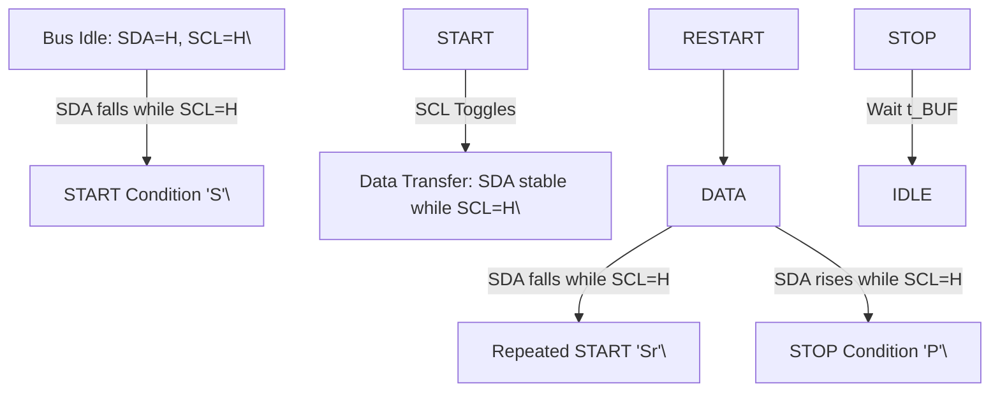

## **12.1 Timing characteristics**

|Symbol|Parameter|Conditions|Min|Typ|Max|Unit|
|---|---|---|---|---|---|---|
|tSCKL|SCK LOW time||50|-|-|ns|
|tSCKH|SCK HIGH time||50|-|-|ns|
|th(SCKH-D)|SCK HIGH to data input hold time|SCK to changing MOSI|25|-|-|ns|
|tsu(D-SCKH)|data input to SCK HIGH set- up time|changing MOSI to SCK|25|-|-|ns|
|th(SCKL-Q)|SCK LOW to data output hold time|SCK to changing MISO|-|-|25|ns|
|t(SCKL-NSSH)|SCK LOW to NSS HIGH time||0|-|-|ns|
|tNSSH|NSS HIGH time|before communication|50|-|-|ns|

**Remark:** To send more bytes in one data stream, the NSS signal must be LOW during
the send process. To send more than one data stream, the NSS signal must be HIGH
between each data stream.

|Symbol|Parameter|Conditions|Fast mode|Col5|Fast mode Plus|Col7|Unit|
|---|---|---|---|---|---|---|---|
| **Symbol**| **Parameter**| **Conditions**|**Min**|**Max**|**Min**|**Max**|**Max**|
|fSCL|SCL clock frequency||0|400|0|1000|kHz|
|tHD;STA|hold time (repeated) START condition|after this period, the first clock pulse is generated|600|-|260|-|ns|
|tSU;STA|set-up time for a repeated START condition||600|-|260|-|ns|
|tSU;STO|set-up time for STOP condition||600|-|260|-|ns|
|tLOW|LOW period of the SCL clock||1300|-|500|-|ns|
|tHIGH|HIGH period of the SCL clock||600|-|260|-|ns|
|tHD;DAT|data hold time||0|900|-|450|ns|

CLRC663 All information provided in this document is subject to legal disclaimers. © NXP B.V. 2018. All rights reserved.
**Product data sheet** **Rev. 4.7 — 12 September 2018**
**COMPANY PUBLIC** **171147** **124 / 171**

**NXP Semiconductors** **CLRC663**

**High performance multi-protocol NFC frontend CLRC663 and CLRC663** _**plus**_

|Symbol|Parameter|Conditions|Fast mode|Col5|Fast mode Plus|Col7|Unit|
|---|---|---|---|---|---|---|---|
|**Symbol**|**Parameter**|**Conditions**|**Min**|**Max**|**Min**|**Max**|**Max**|
|tSU;DAT|data set-up time||100|-|-|-|ns|
|tr|rise time|SCL signal|20|300|-|120|ns|
|tf|fall time|SCL signal|20|300|-|120|ns|
|tr|rise time|SDA and SCL signals|20|300|-|120|ns|
|tf|fall time|SDA and SCL signals|20|300|-|120|ns|
|tBUF|bus free time between a STOP and START condition||1.3|-|0.5|-|μs|

你好。我是资深硬件工程师。针对提供的 $I^2C$ 总线时序图（Figure 35），我已完成严谨的分析。以下是基于事实挖掘与工程推理的解析结果。

**1. 【总览信息】**
本图定义了 $I^2C$ 总线在标准模式（Standard-mode）与快速模式（Fast-mode）下的物理层信号时序要求及协议关键状态（Start, Stop, Repeated Start）的判定条件。

**2. 【核心组成部件】**
| 部件/信号 | 定义 | 功能 |
| :--- | :--- | :--- |
| **SDA** | Serial Data Line | 双向串行数据线，用于传输地址和数据位。 |
| **SCL** | Serial Clock Line | 时钟线，由主设备产生，用于同步数据传输。 |
| **S / Sr** | Start / Repeated Start | 启动/重复启动条件，用于获取总线控制权或切换读写方向。 |
| **P** | Stop Condition | 停止条件，用于释放总线控制权。 |

**3. 【数据流向与交互】**

**A. 关键时序参数定义表（事实挖掘）**
| 参数符号 | 定义描述 | 涉及信号 | 备注 |
| :--- | :--- | :--- | :--- |
| $t_f$ | 下降时间 (Fall Time) | SDA / SCL | 信号从高电平跳变至低电平的时间 |
| $t_r$ | 上升时间 (Rise Time) | SDA / SCL | 信号从低电平跳变至高电平的时间 |
| $t_{LOW}$ | SCL 低电平周期 | SCL | 时钟低电平维持时间 |
| $t_{HIGH}$ | SCL 高电平周期 | SCL | 时钟高电平维持时间 |
| $t_{HD;STA}$ | Start 条件保持时间 | SDA $\rightarrow$ SCL | SDA下降后至SCL下降前的间隔 |
| $t_{SU;STA}$ | Start/Sr 条件建立时间 | SCL $\rightarrow$ SDA | SCL高电平维持至SDA下降前的间隔 |
| $t_{HD;DAT}$ | 数据保持时间 | SCL $\rightarrow$ SDA | SCL上升沿至SDA改变电平的间隔 |
| $t_{SU;DAT}$ | 数据建立时间 | SDA $\rightarrow$ SCL | SDA改变电平至SCL上升沿的间隔 |
| $t_{SU;STO}$ | Stop 条件建立时间 | SCL $\rightarrow$ SDA | SCL上升沿至SDA上升沿的间隔 |
| $t_{BUF}$ | 总线空闲时间 | P $\rightarrow$ S | Stop条件结束至下一个Start条件开始的间隔 |
| $t_{SP}$ | 脉冲抑制时间 (Spike Suppression) | SCL | SCL上的窄脉冲过滤时间 |

**B. 状态机交互逻辑 (Mermaid)**

**4. 【功能总结性陈述】**

**事实描述：**
1. **信号同步特性**：数据线 SDA 的电平跳变必须在 SCL 为低电平时进行；在 SCL 为高电平时，SDA 必须保持稳定（除非触发 S 或 P 条件）。
2. **异步控制条件**：Start (S)、Repeated Start (Sr) 和 Stop (P) 条件均在 SCL 维持高电平期间通过 SDA 的跳变来定义。
3. **硬件滤波机制**：图中明确标注了 $t_{SP}$ 参数，用于定义 SCL 信号上的尖峰抑制（Spike Suppression）时间。
4. **数值定义**：所有具体的时间数值（如 $\mu s$ 或 $ns$）在原图中**未标明**。

**工程推论：**
1. **\[工程推论\] 总线拓扑结构**：由于图中定义了明确的上升时间 $t_r$ 和下降时间 $t_f$，且 $I^2C$ 协议惯例，可推断该总线采用了**开漏（Open-Drain）输出加外部上拉电阻**的电路结构，其电平跳变速度受 RC 时间常数影响。
2. **\[工程推论\] 数据采样时机**：根据 $t_{SU;DAT}$ 和 $t_{HD;DAT}$ 的定义，接收端必须在 SCL 的**上升沿之后、下降沿之前**（即 SCL 高电平期间）对 SDA 进行采样。
3. **\[工程推论\] 鲁棒性设计**：$t_{SP}$ 的存在表明硬件接口在 SCL 输入端集成了一个简单的低通滤波器或数字去抖电路，用以过滤掉短于 $t_{SP}$ 的高频噪声，防止误触发时钟边沿。
4. **\[工程推论\] 协议兼容性**：标注“fast and standard mode”且包含 $t_{BUF}$ 定义，意味着该设备支持在不同速率间切换，且必须保证足够的总线释放时间以确保所有从设备同步复位状态机。

|Col1|Col2|tr tBUF|
|---|---|---|
||||
||||
||||

CLRC663 All information provided in this document is subject to legal disclaimers. © NXP B.V. 2018. All rights reserved.
**Product data sheet** **Rev. 4.7 — 12 September 2018**
**COMPANY PUBLIC** **171147** **125 / 171**

**NXP Semiconductors** **CLRC663**

**High performance multi-protocol NFC frontend CLRC663 and CLRC663** _**plus**_
