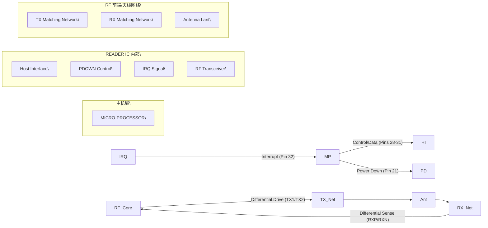

# **13 Application information**

A typical application diagram using a complementary antenna connection to the
CLRC663 is shown in the following figure.

The antenna tuning and RF part matching is described in the application note \[1\] and \[2\].

**1. 【总览信息】**
该图片展示了一个 RFID/NFC 阅读器芯片（READER IC）的典型天线匹配电路及外围支撑电路方案。

**2. 【核心组成部件】**
*   **控制核心**：MICRO-PROCESSOR（微处理器），作为 Host 端负责指令下发与数据处理。
*   **核心芯片**：READER IC，集成 RF 收发、调制解调及 Host 接口。
*   **时钟源**：27.12 MHz 晶体振荡器及其负载电容。
*   **天线匹配网络**：
    *   **发射路径 (TX)**：由 L0（电感）、C1（电容）、Ra（电阻）及 C0/C2（滤波/匹配电容）组成。
    *   **接收路径 (RX)**：由 RXP/RXN 输入端、匹配电阻（R1-R4）及耦合电容（CRXP/CRXN）组成。
    *   **天线单元**：Lant（天线电感）。
*   **电源系统**：多路独立供电（VDD, PVDD, TVDD, AVDD, DVDD）及相应的去耦电容。

**3. 【数据流向与交互】**

**3.1 逻辑与信号交互拓扑**

**3.2 引脚定义事实表**
| 引脚编号 | 信号名称 | 属性 | 连接对象/数值 |
| :--- | :--- | :--- | :--- |
| 7 | DVDD | 电源 | 接去耦电容 $\rightarrow$ GND |
| 8 | VDD | 电源 | 未标明 |
| 9 | AVDD | 电源 | 接去耦电容 $\rightarrow$ GND |
| 12 | RXP | 模拟输入 | 接收正相端 $\rightarrow$ R3/R4/CRXP 网络 |
| 13 | RXN | 模拟输入 | 接收负相端 $\rightarrow$ R1/R2/CRXN 网络 |
| 14 | VMID | 模拟参考 | 中点电压 $\rightarrow$ Cvmid $\rightarrow$ GND |
| 15 | TX2 | 模拟输出 | 发射负相端 $\rightarrow$ L0 $\rightarrow$ C1 $\rightarrow$ Ra |
| 16 | TVSS | 地 | 天线地 $\rightarrow$ C0/C2/GND |
| 17 | TX1 | 模拟输出 | 发射正相端 $\rightarrow$ L0 $\rightarrow$ C1 $\rightarrow$ Ra |
| 18 | TVDD | 电源 | 未标明 |
| 19 | XTAL1 | 时钟输入 | 27.12 MHz 晶振 $\rightarrow$ 负载电容 $\rightarrow$ GND |
| 20 | XTAL2 | 时钟输出 | 27.12 MHz 晶振 $\rightarrow$ 负载电容 $\rightarrow$ GND |
| 21 | PDOWN | 控制输入 | 来自 Micro-processor |
| 25 | PVDD | 电源 | 未标明 |
| 28-31 | host interface | 数字接口 | 与 Micro-processor 双向/单向连接 |
| 32 | IRQ | 中断输出 | 至 Micro-processor |
| 33 | VSS | 地 | 系统地 (GND) |

**4. 【功能总结性陈述】**

**事实描述**
1.  **时钟系统**：电路采用一个 27.12 MHz 的外部晶体振荡器，并配置了两颗负载电容。
2.  **电源结构**：系统采用多轨供电方案，包含数字电（DVDD）、模拟电（AVDD）和天线相关电源（TVDD, PVDD），其中 DVDD 和 AVDD 明确配备了去耦电容。
3.  **RF 结构**：
    *   发射端（TX1/TX2）为差分输出结构，通过电感 L0 和电容 C1 组成匹配网络，最终通过 Ra 连接至天线 Lant。
    *   接收端（RXP/RXN）采用差分输入结构，通过电阻网络和耦合电容（CRXP/CRXN）与天线回路连接。
    *   VMID 引脚为接收端提供中点参考电位。

**工程推论**
1.  **\[工程推论\] 工作频率**：由于采用了 27.12 MHz 晶振，该芯片极大概率工作在 13.56 MHz（$27.12 \div 2$），这是典型的 NFC/HF RFID 标准频率。
2.  **\[工程推论\] 功率隔离**：采用 TVDD、PVDD、AVDD、DVDD 四路独立电源，旨在将高功率的 TX 驱动噪声、敏感的模拟接收噪声以及数字开关噪声在电源层级进行物理隔离，以提高接收灵敏度。
3.  **\[工程推论\] 天线匹配**：TX 路径中的 L0、C1、C0、C2 构成了低通滤波或阻抗匹配网络，用于滤除高次谐波并确保最大功率传输至天线 $L_{ant}$。
4.  **\[工程推论\] 接收架构**：RXP/RXN 的差分结构配合 VMID 中点电压，表明内部采用了差分放大器，用于抑制共模干扰并提高弱信号检测能力。

