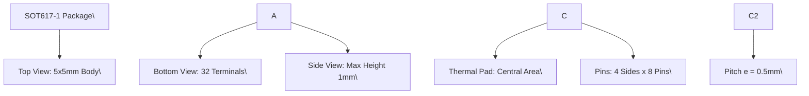

# **14 Package outline**

你好。我是资深硬件工程师。针对这张 SOT617-1 (HVQFN32) 封装图纸，我将严格按照你的规范进行精准解析。

**1. 【总览信息】**
本图片为 HVQFN32（塑料热增强极薄四方扁平无引脚封装）的机械尺寸规格图（Package Outline），型号为 SOT617-1。

**2. 【核心组成部件】**
*   **封装主体 (Package Body)**：$5 \times 5 \text{ mm}$ 的塑料材质主体，采用极薄设计。
*   **端子 (Terminals)**：共 32 个无引脚端子，分布在封装四边。
*   **热焊盘 (Exposed Thermal Pad)**：位于底部的中心区域（尺寸由 $D_h$ 和 $E_h$ 定义），用于散热。
*   **第一引脚标识区 (Terminal 1 Index Area)**：位于顶视图左上角及底视图左下角的阴影区域，用于确定芯片方向。

**3. 【数据流向与交互】**
由于本图为机械规格图，其“交互”体现为物理布局与公差定义。

**物理布局拓扑：**

**关键尺寸参数表 (单位: mm)：**

| 符号 | 定义 | 最小值 (Min) | 标称/最大值 (Max) | 备注 |
| :--- | :--- | :--- | :--- | :--- |
| $A$ | 总高度 | 未标明 | $1.00$ | 最大高度 |
| $A_1$ | 底部间隙/脱模高度 | $0.00$ | $0.05$ | - |
| $b$ | 端子宽度 | $0.18$ | $0.30$ | - |
| $c$ | 端子厚度 | $0.20$ | $0.20$ | - |
| $D$ | 封装宽度 | $4.90$ | $5.10$ | 包含公差 |
| $D_h$ | 热焊盘宽度 | $2.95$ | $3.25$ | - |
| $E$ | 封装长度 | $4.90$ | $5.10$ | 包含公差 |
| $E_h$ | 热焊盘长度 | $2.95$ | $3.25$ | - |
| $e$ | 端子间距 (Pitch) | $0.50$ | $0.50$ | 中心距 |
| $e_1 / e_2$ | 端子组间距 | $3.50$ | $3.50$ | - |
| $L$ | 端子长度 | $0.30$ | $0.50$ | - |
| $v$ | 位置公差 | 未标明 | $0.10$ | - |
| $w$ | 宽度公差 | 未标明 | $0.05$ | - |
| $y$ | 平整度公差 | 未标明 | $0.05$ | - |
| $y_1$ | 共面度公差 | 未标明 | $0.10$ | - |

**4. 【功能总结性陈述】**

**事实描述：**
*   该封装遵循 JEDEC MO-220 标准，共有 32 个端子，引脚间距 (Pitch) 为 $0.5\text{mm}$。
*   封装外形尺寸为 $5 \times 5\text{mm}$，最大高度限制在 $1\text{mm}$ 以内。
*   底部具有一个尺寸约为 $3 \times 3\text{mm}$ 的中心热焊盘。
*   图纸明确指出塑料或金属凸起（$\text{protrusions}$）在每边最大 $0.075\text{mm}$ 范围内不计入总尺寸。

**工程推论：**
*   **\[工程推论\]** 鉴于其标注为“Thermal Enhanced”且拥有大面积底部暴露焊盘（$D_h \times E_h$），该芯片在 PCB 设计时必须将中心焊盘连接至地平面（GND Plane）并布置足够的过孔（Thermal Vias），否则在实际运行中极易因散热不足导致热失效。
*   **\[工程推论\]** $0.5\text{mm}$ 的细间距（Pitch）意味着该器件需要较高精度的 SMT 贴片工艺，且在设计钢网（Stencil）时需严格控制开孔比例，以防止相邻引脚间出现 solder bridge（焊桥）短路现象。
*   **\[工程推论\]** $A_{max}=1\text{mm}$ 的极薄设计表明该器件面向的应用场景是对 Z 轴高度敏感的紧凑型电子产品（如智能手机、可穿戴设备或薄型模块）。

|Col1|v M|C|
|---|---|---|
|| w M|C|
||||

|Col1|Col2|Col3|Col4|Col5|
|---|---|---|---|---|
||||||
||||||
||||||
||||||

|UNIT|A(1) max.|A1|b|c|D(1)|Dh|E(1)|Eh|e|e1|e2|L|v|w|y|
|---|---|---|---|---|---|---|---|---|---|---|---|---|---|---|---|
|mm|1|0.05 0.00|0.30 0.18|0.2|5.1 4.9|3.25 2.95|5.1 4.9 3 2|.25 .95|0.5|3.5|3.5|0.5 0.3|0.1|0.05|0.05 0|

|OUTLINE VERSION|REFERENCES|Col3|Col4|Col5|EUROPEA PROJECTI|N ISSUE DATE ON|
|---|---|---|---|---|---|---|
|**OUTLINE** **VERSION**|**IEC**|**JEDEC**|**JEITA**||||
|SOT617-1|- - -|MO-220|- - -|||~~01-08-08~~ 02-10-18|

CLRC663 All information provided in this document is subject to legal disclaimers. © NXP B.V. 2018. All rights reserved.
**Product data sheet** **Rev. 4.7 — 12 September 2018**
**COMPANY PUBLIC** **171147** **129 / 171**

**NXP Semiconductors** **CLRC663**

**High performance multi-protocol NFC frontend CLRC663 and CLRC663** _**plus**_
