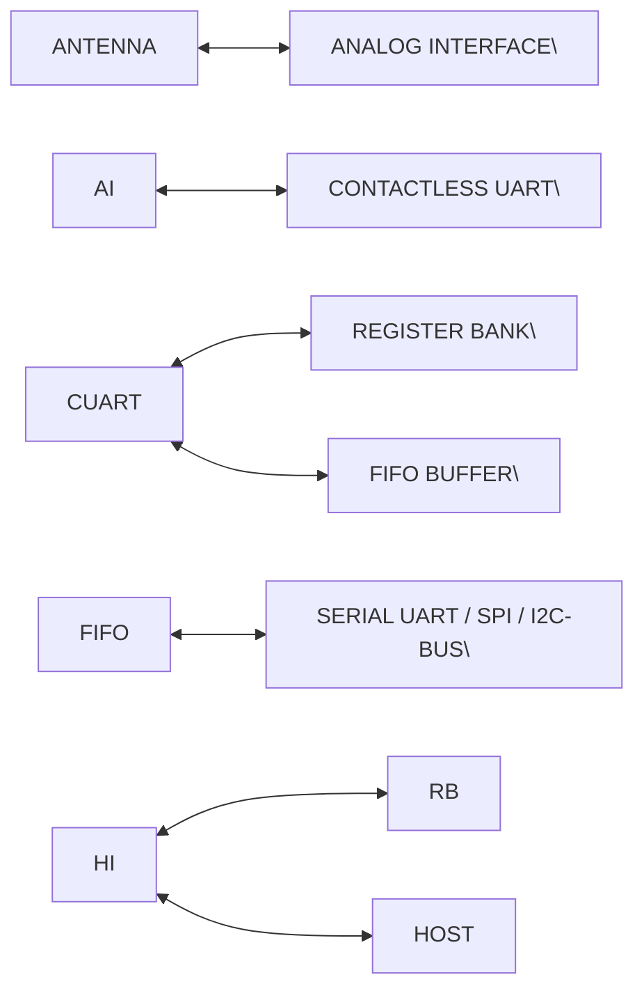

# **5 Block diagram**

The analog interface handles the modulation and demodulation of the antenna signals for
the contactless interface.

The contactless UART manages the protocol dependency of the contactless interface
settings managed by the host.

The FIFO buffer ensures fast and convenient data transfer between host and the
contactless UART.

The register bank contains the settings for the analog and digital functionality.

**1. 【总览信息】**
本图为 CLRC663 芯片的简化功能框图，定义了从天线（Antenna）端到主机（Host）端的数据转换与通信路径。

**2. 【核心组成部件】**
*   **ANALOG INTERFACE**：模拟接口，连接外部天线。
*   **CONTACTLESS UART**：非接触式通用异步收发传输器，处理射频端数据。
*   **FIFO BUFFER**：先进先出缓冲区，用于数据暂存。
*   **REGISTER BANK**：寄存器组，用于存储配置参数或状态。
*   **SERIAL UART / SPI / I2C-BUS**：主机接口模块，支持三种串行通信协议。
*   **ANTENNA**：外部物理天线接口。
*   **HOST**：外部主控设备。

**3. 【数据流向与交互】**

**3.1 模块拓扑连接关系**

**3.2 接口交互定义**
| 接口端点 | 连接对象 | 交互性质 | 标注协议/类型 |
| :--- | :--- | :--- | :--- |
| ANTENNA | ANALOG INTERFACE | 双向 | 未标明 (射频模拟信号) |
| ANALOG INTERFACE | CONTACTLESS UART | 双向 | 未标明 |
| CONTACTLESS UART | REGISTER BANK | 双向 | 内部总线 |
| CONTACTLESS UART | FIFO BUFFER | 双向 | 内部数据流 |
| FIFO BUFFER | SERIAL UART/SPI/I2C | 双向 | 内部数据流 |
| REGISTER BANK | SERIAL UART/SPI/I2C | 双向 | 配置/状态访问 |
| SERIAL UART/SPI/I2C | HOST | 双向 | UART / SPI / I2C |

**4. 【功能总结性陈述】**

**事实描述**：
CLRC663 实现了从射频天线到数字主机的完整链路。其内部通过 $\text{Analog Interface} \rightarrow \text{Contactless UART} \rightarrow \text{FIFO Buffer} \rightarrow \text{Host Interface}$ 的路径进行数据传输。该芯片提供三种可选的主机通信协议（UART, SPI, I2C），且其内部的寄存器组（Register Bank）可被非接触式 UART 和主机接口双向访问。

**工程推论**：
*   \[工程推论\] **协议转换机制**：$\text{Contactless UART}$ 模块在此充当了射频链路层协议（如 ISO/IEC 14443）与内部数字总线之间的桥梁，负责将调制/解调后的模拟比特流转换为可处理的数字帧。
*   \[工程推论\] **异步速率匹配**：$\text{FIFO Buffer}$ 的存在表明射频端（Air Interface）的传输速率与主机端（Host Bus）的采样/处理速率不一致，需通过缓冲区防止数据在高速总线传输或低速射频接收时发生溢出或丢失。
*   \[工程推论\] **配置架构**：$\text{Register Bank}$ 与主机接口及 $\text{Contactless UART}$ 均有连接，意味着主机通过 SPI/I2C/UART 写入寄存器来配置射频参数（如载波频率、调制深度），而 $\text{Contactless UART}$ 则根据这些配置执行具体的物理层操作。

CLRC663 All information provided in this document is subject to legal disclaimers. © NXP B.V. 2018. All rights reserved.
**Product data sheet** **Rev. 4.7 — 12 September 2018**
**COMPANY PUBLIC** **171147** **6 / 171**

**NXP Semiconductors** **CLRC663**

**High performance multi-protocol NFC frontend CLRC663 and CLRC663** _**plus**_
