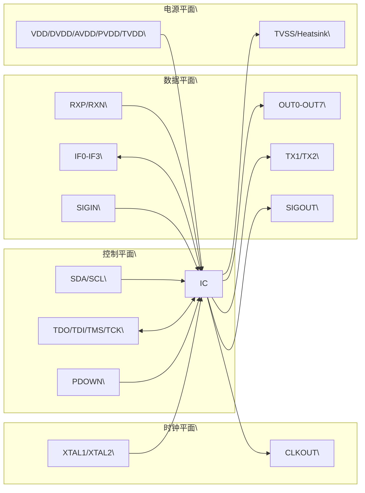

# **6 Pinning information**

**1. 【总览信息】**
该图片为一款采用 **HVQFN32 (SOT617-1)** 封装的集成电路（IC）管脚定义图（Pinning Configuration），展示了芯片的物理引脚排列及其对应的信号功能。

**2. 【核心组成部件】**
根据管脚定义，该器件由以下功能模块组成：
*   **电源管理模块**：包含多组电源输入（VDD, DVDD, AVDD, PVDD, TVDD）及地线（TVSS, VSS/Heatsink）。
*   **通信接口模块**：
    *   **I2C 接口**：SDA, SCL。
    *   **调试/测试接口**：TDO, TDI, TMS, TCK（标准 JTAG 信号）。
*   **时钟系统**：外部晶振接口（XTAL1, XTAL2）及时钟输出（CLKOUT）。
*   **信号输入/输出（I/O）**：
    *   **通用/多功能输出**：OUT0 至 OUT7。
    *   **接口信号**：IF0 至 IF3 及接口选择位 IFSEL0/1。
    *   **模拟/差分信号**：SIGIN, SIGOUT, RXP, RXN, TX1, TX2。
*   **控制与状态**：电源管理控制（PDOWN）及中断请求（IRQ）。
*   **散热基板**：中心热焊盘（heatsink），电气连接至 VSS。

**3. 【数据流向与交互】**

**管脚功能详细定义表**
| 引脚编号 | 信号名称 | 类型 | 描述/关联功能 |
| :--- | :--- | :--- | :--- |
| 1 | TDO/OUT0 | 双用/输出 | JTAG 数据输出 / 通用输出 0 |
| 2 | TDI/OUT1 | 双用/输出 | JTAG 数据输入 / 通用输出 1 |
| 3 | TMS/OUT2 | 双用/输出 | JTAG 模式选择 / 通用输出 2 |
| 4 | TCK/OUT3 | 双用/输出 | JTAG 时钟 / 通用输出 3 |
| 5 | SIGIN/OUT7 | 双用/输入/输出 | 信号输入 / 通用输出 7 |
| 6 | SIGOUT | 输出 | 信号输出 |
| 7 | DVDD | 电源 | 数字电压电源 |
| 8 | VDD | 电源 | 主电压电源 |
| 9 | AVDD | 电源 | 模拟电压电源 |
| 10 | AUX1 | I/O | 辅助信号 1 |
| 11 | AUX2 | I/O | 辅助信号 2 |
| 12 | RXP | 输入 | 差分接收正端 |
| 13 | RXN | 输入 | 差分接收负端 |
| 14 | VMID | 电源/参考 | 中点电压/参考电压 |
| 15 | TX2 | 输出 | 发送信号 2 |
| 16 | TVSS | 地 | 模拟/发射端地 |
| 17 | TX1 | 输出 | 发送信号 1 |
| 18 | TVDD | 电源 | 模拟/发射端电源 |
| 19 | XTAL1 | 输入/输出 | 晶振输入 1 |
| 20 | XTAL2 | 输入/输出 | 晶振输入 2 |
| 21 | PDOWN | 输入 | 电源下电控制 |
| 22 | CLKOUT/OUT6 | 输出 | 时钟输出 / 通用输出 6 |
| 23 | SCL | 输入 | I2C 时钟线 |
| 24 | SDA | 双向 | I2C 数据线 |
| 25 | PVDD | 电源 | 功率电源 |
| 26 | IFSEL0/OUT4 | 双用/输出 | 接口选择 0 / 通用输出 4 |
| 27 | IFSEL1/OUT5 | 双用/输出 | 接口选择 1 / 通用输出 5 |
| 28 | IF0 | I/O | 接口信号 0 |
| 29 | IF1 | I/O | 接口信号 1 |
| 30 | IF2 | I/O | 接口信号 2 |
| 31 | IF3 | I/O | 接口信号 3 |
| 32 | IRQ | 输出 | 中断请求 |
| Center | heatsink | 地 | VSS 连接（见 Note 1） |

**逻辑连接关系图 (Mermaid)**

**4. 【功能总结性陈述】**

**事实描述**：
该器件采用 32 引脚 HVQFN 封装，具备高度复杂的电源域划分（分为数字、模拟、功率、发射端四类电源）。集成有标准 I2C 通信接口和 JTAG 调试接口。其 I/O 资源丰富，包含 8 路可配置输出（OUT0-OUT7）以及差分接收对（RXP/RXN）。中心散热焊盘在电气上与 VSS 相连。

**工程推论**：
1. \[工程推论\] **混合信号特性**：由于 DVDD、AVDD、TVDD 及 PVDD 的独立存在，该芯片极大概率是一个高性能混合信号器件（如 ADC/DAC 或高速收发器），旨在通过物理隔离电源域来降低数字噪声对模拟信号的干扰。
2. \[工程推论\] **接口可重构性**：`IFSEL0/1` 与 `OUT4/5` 共享引脚，且与 `IF0-IF3` 协同工作，推测该器件支持多种接口协议切换（例如在 SPI、并行总线或自定义协议之间切换）。
3. \[工程推论\] **高速差分传输**：RXP/RXN 的定义暗示其具备处理低压差分信号的能力，结合 TX1/TX2，该芯片可能用于某种物理层（PHY）通信协议。
4. \[工程推论\] **散热需求**：中心焊盘明确标注为 heatsink 且连接 VSS，表明芯片在工作时有较大的功耗（热量），需通过 PCB 铺铜进行强制散热。

