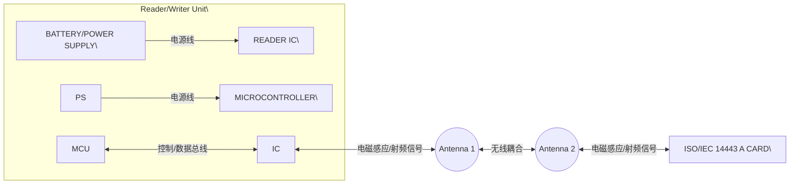
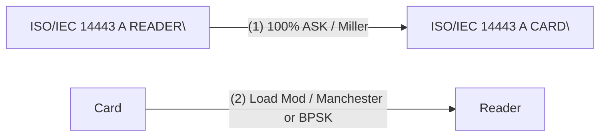
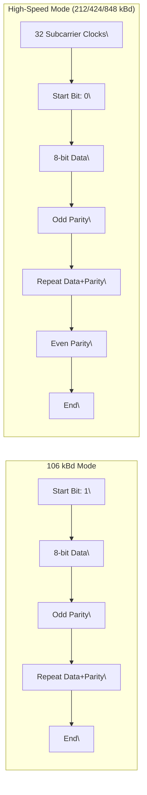
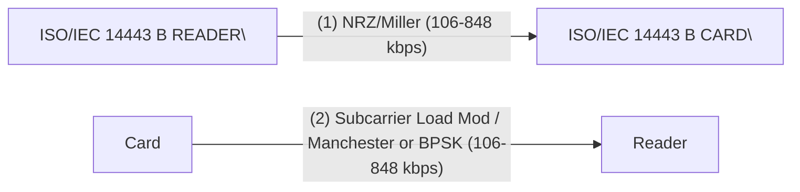
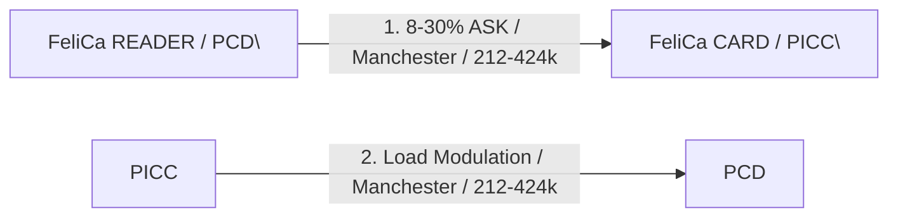
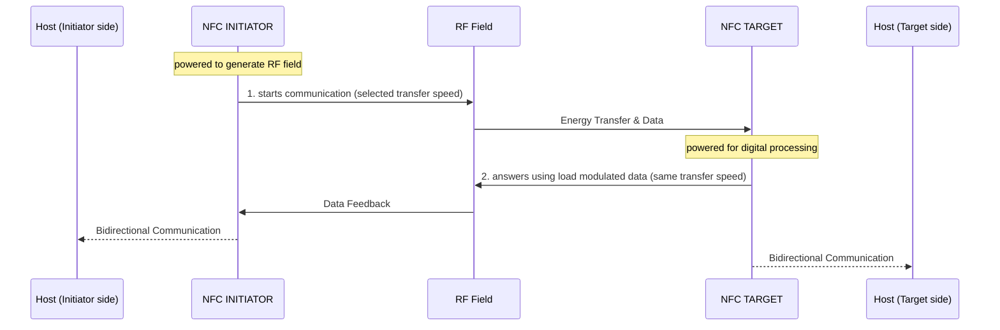

## **7.3 Contactless interface unit**

The contactless interface unit of the CLRC663 supports the following read/write operating
modes:

**•** ISO/IEC14443 type A and MIFARE Classic

**•** ISO/IEC14443B

**•** FeliCa

**•** ISO/IEC15693/ICODE

**•** ICODE EPC UID

**•** ISO/IEC 18000-3 mode 3/ EPC Class-1 HF

你好，我是资深硬件工程师。针对这张名为 "Figure 4. Read/write mode" 的硬件逻辑架构图，我的分析如下：

**1. 【总览信息】**
该图定义了一个基于 ISO/IEC 14443 A 标准的非接触式读写器（Reader/Writer）与智能卡（Card）之间的硬件交互系统架构。

**2. 【核心组成部件】**
图纸将系统分为两个主要实体：**读写器 (reader/writer)** 和 **卡片 (ISO/IEC 14443 A CARD)**。

| 实体 | 组成部件 | 功能描述 |
| :--- | :--- | :--- |
| **读写器 (reader/writer)** | BATTERY/POWER SUPPLY | 为系统提供电力供应。 |
| | MICROCONTROLLER | 系统主控单元，负责逻辑控制。 |
| | READER IC | 专门用于处理射频通信的读写芯片。 |
| **卡片 (Card)** | ISO/IEC 14443 A CARD | 符合 ISO/IEC 14443 A 标准的被动式/主动式标签或智能卡。 |

**3. 【数据流向与交互】**

**3.1 内部物理连接与逻辑流转**

**3.2 接口定义表**
| 交互链路 | 传输介质 | 协议/标准 | 备注 |
| :--- | :--- | :--- | :--- |
| MCU $\leftrightarrow$ Reader IC | 导线 (未标明具体总线) | 未标明 | 负责指令下发与数据采集 |
| Reader IC $\leftrightarrow$ Card | 无线电磁波 (通过天线) | ISO/IEC 14443 A | 实现非接触式数据交换 |
| Power Supply $\rightarrow$ MCU/IC | 导线 | 未标明 (电压/电流值未标明) | 供电通路 |

---

**4. 【功能总结性陈述】**

**事实描述**：
1. **系统组成**：读写端由电源、微控制器 (MCU) 和专用的 Reader IC 组成，并通过天线与符合 ISO/IEC 14443 A 标准的卡片进行双向通信。
2. **拓扑结构**：MCU 与 Reader IC 处于同一控制域，Reader IC 作为射频前端，直接驱动天线与外部卡片进行交互。
3. **通信标准**：明确指定了被端设备遵循 ISO/IEC 14443 A 标准。

**工程推论**：
1. \[工程推论\] **通信频率**：由于明确标注为 ISO/IEC 14443 A，该系统工作的中心频率必然为 $13.56\text{ MHz}$（HF 高频段）。
2. \[工程推论\] **耦合方式**：图中两个椭圆符号代表天线线圈，其交互方式为近场电磁感应耦合（Inductive Coupling）。
3. \[工程推论\] **接口协议**：虽然图中未标明 MCU 与 Reader IC 的连接方式，但基于行业通用设计，此处极大概率采用 $\text{I}^2\text{C}$ 或 $\text{SPI}$ 串行通信接口。
4. \[工程推论\] **供电模式**：卡片端未见独立电源，推论该卡片为被动式（Passive），其运行能量由 Reader IC 通过天线产生的射频场感应供电。

A typical system using the CLRC663 is using a microcontroller to implement the higher
levels of the contactless communication protocol and a power supply (battery or external
supply).

### **7.3.1 Communication mode for ISO/IEC 14443 type A and for MIFARE Classic**

The physical level of the communication is shown in the following figure:

你好，我是资深硬件工程师。针对您提供的 ISO/IEC 14443 Type A 通信链路图，我已完成精准解析。

**1. 【总览信息】**
本图定义了符合 ISO/IEC 14443 Type A 标准及 MIFARE Classic 协议的读写模式下，读写器（Reader）与卡片（Card）之间的物理层通信规格与数据交互链路。

**2. 【核心组成部件】**
*   **ISO/IEC 14443 A READER**：通信发起端，负责提供能量场并执行读写指令。
*   **ISO/IEC 14443 A CARD**：通信响应端，被动或半被动接收能量并返回数据。

**3. 【数据流向与交互】**

**3.1 通信参数定义表**
| 数据方向 | 路径标识 | 调制方式 (Modulation) | 编码方式 (Coding) | 传输速率 (Transfer Speed) | 引脚/物理介质 |
| :--- | :---: | :--- | :--- | :--- | :--- |
| Reader $\rightarrow$ Card | (1) | 100% ASK | Miller Coded | 106 kbit/s $\sim$ 848 kbit/s | 未标明 |
| Card $\rightarrow$ Reader | (2) | Subcarrier Load Modulation | Manchester Coded 或 BPSK | 106 kbit/s $\sim$ 848 kbit/s | 未标明 |

**3.2 链路拓扑图 (Mermaid)**

---

**4. 【功能总结性陈述】**

**事实描述**
*   **协议标准**：系统严格遵循 ISO/IEC 14443 Type A 标准，并兼容 MIFARE Classic 读写模式。
*   **下行链路 (Reader $\rightarrow$ Card)**：采用 100% 幅移键控（ASK）结合 Miller 编码，速率范围为 106 至 848 kbit/s。
*   **上行链路 (Card $\rightarrow$ Reader)**：采用子载波负载调制（Subcarrier Load Modulation），支持曼彻斯特编码（Manchester Coded）或二进制相移键控（BPSK），速率范围同样为 106 至 848 kbit/s。
*   **对称性**：上下行链路在传输速率规格上保持一致（106 $\sim$ 848 kbit/s）。

**工程推论**
*   **\[工程推论\]** 下行链路采用 100% ASK 调制，这意味着在逻辑“0”或特定同步位时载波会被完全关断，这为卡片端的包络检波器提供了极高的信噪比，有利于实现快速的同步和唤醒。
*   **\[工程推论\]** 上行链路采用“负载调制（Load Modulation）”，确认该卡片为无源或半无源设备，其通过改变自身阻抗来影响读写器天线电流，从而实现信息的反向传输。
*   **\[工程推论\]** 传输速率在 106 kbit/s 至 848 kbit/s 之间波动，推测系统支持标准的速率协商机制（Bit Rate Negotiation），可根据信道质量在 $106 \times 2^n$ 的倍数级速率间切换。
*   **\[工程推论\]** 上行链路支持 BPSK 调制，暗示该硬件设计能够支持更高数据吞吐量或在电磁环境更复杂的情况下提供更强的抗干扰能力。

The physical parameters are described in the following table:

|Communication direction|Signal type|Transfer speed|Col4|Col5|Col6|
|---|---|---|---|---|---|
| **Communication** **direction**| **Signal type**|**106 kbit/s**|**212 kbit/s**|**424 kbit/s**|**848 kbit/s**|
|Reader to card (send data from the CLRC663 to a card) fc = 13.56 MHz|reader side modulation|100 % ASK|100% ASK|100% ASK|100% ASK|
|Reader to card (send data from the CLRC663 to a card) fc = 13.56 MHz|bit encoding|modified Miller encoding|modified Miller encoding|modified Miller encoding|modified Miller encoding|
|Reader to card (send data from the CLRC663 to a card) fc = 13.56 MHz|bit rate \[kbit/s\]|fc / 128|fc / 64|fc / 32|fc / 16|

CLRC663 All information provided in this document is subject to legal disclaimers. © NXP B.V. 2018. All rights reserved.
**Product data sheet** **Rev. 4.7 — 12 September 2018**
**COMPANY PUBLIC** **171147** **13 / 171**

**NXP Semiconductors** **CLRC663**

**High performance multi-protocol NFC frontend CLRC663 and CLRC663** _**plus**_

|Communication direction|Signal type|Transfer speed|Col4|Col5|Col6|
|---|---|---|---|---|---|
|**Communication** **direction**|**Signal type**|**106 kbit/s**|**212 kbit/s**|**424 kbit/s**|**848 kbit/s**|
|Card to reader (CLRC663 receives data from a card)|card side modulation|subcarrier load modulation|subcarrier load modulation|subcarrier load modulation|subcarrier load modulation|
|Card to reader (CLRC663 receives data from a card)|subcarrier frequency|fc / 16|fc / 16|fc / 16|fc / 16|
|Card to reader (CLRC663 receives data from a card)|bit encoding|Manchester encoding|BPSK|BPSK|BPSK|

The CLRC663 connection to a host is required to manage the complete ISO/IEC 14443
type A and MIFARE Classic communication protocol. The following figure shows the data
coding and framing according to ISO/IEC 14443 type A and MIFARE Classic.

你好，我是资深硬件工程师。针对这张关于 ISO/IEC 14443 A 数据编码与分帧的物理层时序图，分析结果如下：

**1. 【总览信息】**
本图定义了 ISO/IEC 14443 A 标准在不同波特率（106 kBd 及 212/424/848 kBd）下的数据帧结构与位同步时序。

**2. 【核心组成部件】**
*   **Start Bit (起始位)**：用于标识数据帧开始的同步位。
*   **8-bit data (数据位)**：承载实际信息的 8 位数据字节。
*   **Odd Parity (奇校验位)**：每个数据字节后的单位校验，用于检测单比特错误。
*   **Even Parity (偶校验位)**：仅出现在高波特率帧尾，用于全帧校验。
*   **Burst of 32 subcarrier clocks (子载波时钟突发)**：高波特率模式下的前导同步信号。

**3. 【数据流向与交互】**

**帧结构对比表**
| 参数/组件 | 106 kBd 模式 | 212/424/848 kBd 模式 |
| :--- | :--- | :--- |
| **前导同步** | 无 | 32 个子载波时钟突发 (Burst) |
| **起始位数值** | $1$ | $0$ |
| **字节负载** | 8-bit data | 8-bit data |
| **字节校验** | 奇校验 (Odd Parity) | 奇校验 (Odd Parity) |
| **帧尾校验** | 未标明 | 偶校验 (Even Parity) |

**数据传输序列 (Mermaid 逻辑流)**

**4. 【功能总结性陈述】**

**事实描述**
*   **低速模式 (106 kBd)**：数据帧由一个值为 `1` 的起始位引导，随后是若干个“8位数据 + 1位奇校验”的组合。
*   **高速模式 (212/424/848 kBd)**：数据帧在起始位之前包含 32 个子载波时钟突发信号；起始位的值为 `0`；每个字节后紧跟一个奇校验位；在整个数据帧的末尾增加了一个偶校验位。

**工程推论**
*   **\[工程推论\]** 高速模式中引入的“32个子载波时钟突发”旨在为接收端提供足够的时钟边沿，以实现物理层 PLL（锁相环）的快速锁定和位同步，以应对高波特率带来的更窄位宽。
*   **\[工程推论\]** 起始位从 `1`（106 kBd）变为 `0`（高速），是为了让硬件解码器在物理层能够通过起始位的电平状态快速区分当前通信所采用的波特率模式。
*   **\[工程推论\]** 高速模式采用“字节级奇校验 + 帧级偶校验”的双重校验机制，说明在高波特率下信号噪声干扰增加，单字节校验不足以保证整个数据包的完整性，因此引入帧尾偶校验作为额外的冗余检查。

The internal CRC coprocessor calculates the CRC value based on ISO/IEC 14443 A part
3 and handles parity generation internally according to the transfer speed.

### **7.3.2 ISO/IEC14443 type B functionality**

The physical level of the communication is shown in the following figure:

你好，我是资深硬件工程师。针对您提供的“ISO/IEC 14443 type B communication diagram”图片，我已完成精准解析。

**1. 【总览信息】**
本图定义了基于 ISO/IEC 14443 B 标准的读卡器（Reader）与智能卡（Card）之间的双向通信物理层调制方式与传输速率。

**2. 【核心组成部件】**
*   **ISO/IEC 14443 B READER**：通信发起端，负责提供激励场并接收卡片反馈。
*   **ISO/IEC 14443 B CARD**：通信响应端，采用无源或主动响应机制。

**3. 【数据流向与交互】**

| 通信路径 | 方向 | 调制/编码方式 | 传输速率范围 | 备注 |
| :--- | :--- | :--- | :--- | :--- |
| **路径 (1)** | Reader $\rightarrow$ Card | NRZ, Miller coded | $106\text{ kbit/s} \sim 848\text{ kbit/s}$ | 下行链路 |
| **路径 (2)** | Card $\rightarrow$ Reader | Subcarrier Load Modulation (Manchester Coded 或 BPSK) | $106\text{ kbit/s} \sim 848\text{ kbit/s}$ | 上行链路 |

**数据流转逻辑 (Mermaid):**

**4. 【功能总结性陈述】**

**事实描述**：
*   **标准协议**：该硬件交互严格遵循 ISO/IEC 14443 Type B 标准。
*   **非对称调制**：下行（Reader $\rightarrow$ Card）采用 NRZ 和 Miller 编码；上行（Card $\rightarrow$ Reader）采用子载波负载调制（Subcarrier Load Modulation），并支持曼彻斯特（Manchester）或 BPSK 两种编码形式。
*   **速率一致性**：双向通信的传输速率范围均定义在 $106\text{ kbit/s}$ 至 $848\text{ kbit/s}$ 之间。

**工程推论**：
*   **\[工程推论\] 供电机制**：由于上行链路明确标注为“Subcarrier Load Modulation（子载波负载调制）”，可推断该卡片（Card）为无源器件，通过调制读卡器产生的 RF 载波幅度或相位来传输数据，而非通过独立电源发送射频信号。
*   **\[工程推论\] 速率自适应**：传输速率提供一个区间（$106 \sim 848\text{ kbit/s}$）而非固定值，表明系统支持位速率切换（Bit Rate Switching）机制，允许读卡器与卡片在握手阶段协商最优传输速率。
*   **\[工程推论\] 兼容性设计**：上行链路提供 Manchester 和 BPSK 两种选择，旨在兼容不同性能等级的卡片或满足不同环境下的抗干扰需求（BPSK 通常比曼彻斯特编码在高速率下更稳定）。

The physical parameters are described in the following table:

CLRC663 All information provided in this document is subject to legal disclaimers. © NXP B.V. 2018. All rights reserved.
**Product data sheet** **Rev. 4.7 — 12 September 2018**
**COMPANY PUBLIC** **171147** **14 / 171**

**NXP Semiconductors** **CLRC663**

**High performance multi-protocol NFC frontend CLRC663 and CLRC663** _**plus**_

|Communication direction|Signal type|Transfer speed|Col4|Col5|Col6|
|---|---|---|---|---|---|
| **Communication** **direction**| **Signal type**|**106 kbit/s**|**212 kbit/s**|**424 kbit/s**|**848 kbit/s**|
|Reader to card (send data from the CLRC663 to a card) fc = 13.56 MHz|reader side modulation|10 % ASK|10 % ASK|10 % ASK|10 % ASK|
|Reader to card (send data from the CLRC663 to a card) fc = 13.56 MHz|bit encoding|NRZ|NRZ|NRZ|NRZ|
|Reader to card (send data from the CLRC663 to a card) fc = 13.56 MHz|bit rate \[kbit/s\]|128 / fc|64 / fc|32 / fc|16 / fc|
|Card to reader (CLRC663 receives data from a card)|card side modulation|subcarrier load modulation|subcarrier load modulation|subcarrier load modulation|subcarrier load modulation|
|Card to reader (CLRC663 receives data from a card)|subcarrier frequency|fc / 16|fc / 16|fc / 16|fc / 16|
|Card to reader (CLRC663 receives data from a card)|bit encoding|BPSK|BPSK|BPSK|BPSK|

The CLRC663 connected to a host is required to manage the complete ISO/IEC 14443 B
protocol. The following figure shows the ISO/IEC 14443B SOF and EOF.

**1.【总览信息】**
该图片定义了符合 **ISO/IEC 14443 B** 标准的帧起始（Start of Frame, SOF）与帧结束（End of Frame, EOF）的时序序列格式。

**2.【核心组成部件】**
*   **UNMODULATED (SUB) CARRIER**：未调制的（子）载波，作为物理层的基础信号。
*   **SOF Sequence**：帧起始同步序列，用于通知接收端数据传输的开始。
*   **EOF Sequence**：帧结束同步序列，用于通知接收端数据传输的终止。
*   **DATA / LAST CHARACTER**：实际传输的有效载荷数据及其最后一个字符。

**3.【数据流向与交互】**

**3.1 帧结构时序逻辑**
| 阶段 | 序列顺序 | 逻辑电平/状态 | 时序参数 (单位) | 组成描述 |
| :--- | :--- | :--- | :--- | :--- |
| **SOF (起始)** | 载波 $\rightarrow$ 同步区 $\rightarrow$ 标志位 $\rightarrow$ 数据 | $\text{Carrier} \rightarrow 10 \times \text{"0"} \rightarrow 2 \times \text{"1"} \rightarrow \text{DATA}$ | $9.44\ \mu\text{s}$ | 10个连续0 + 2个连续1 |
| **EOF (结束)** | 数据 $\rightarrow$ 同步区 $\rightarrow$ 载波 | $\text{Last Char} \rightarrow 10 \times \text{"0"} \rightarrow \text{Carrier}$ | $9.44\ \mu\text{s}$ | 10个连续0 |

**3.2 信号状态转移图 (ASCII)**
**SOF 流程：**
`\[未调制载波\]` $\xrightarrow{}$ `\["0" x 10\]` $\xrightarrow{}$ `\["1" x 2\]` $\xrightarrow{}$ `\[DATA payload\]`

**EOF 流程：**
`\[LAST CHARACTER\]` $\xrightarrow{}$ `\["0" x 10\]` $\xrightarrow{}$ `\[未调制载波\]`

**4.【功能总结性陈述】**

**事实描述**：
1.  **基础时钟**：该协议的最小单位时间（Bit Period）定义为 $9.44\ \mu\text{s}$。
2.  **SOF 特征**：由 10 个连续的逻辑 “0” 紧跟 2 个连续的逻辑 “1” 组成，随后进入数据段。
3.  **EOF 特征**：由最后一个字符后接 10 个连续的逻辑 “0” 组成，随后恢复为未调制载波。
4.  **标准遵循**：明确标注遵循 ISO/IEC 14443 B 标准。

**工程推论**：
1.  **\[工程推论\] 波特率计算**：基于单位时间 $9.44\ \mu\text{s}$，可推算出其标称比特率约为 $1 / 9.44\ \mu\text{s} \approx 105.93\ \text{kbps}$，这与 ISO 14443 标准中定义的 $106\ \text{kbps}$ 基准速率完全一致。
2.  **\[工程推论\] 同步机制**：SOF 和 EOF 中连续的 10 个 “0” 序列在物理层上提供了足够的时钟边缘，用于接收端（Reader/Tag）的锁相环（PLL）或时钟恢复电路（Clock Recovery）进行同步，以消除晶振偏差导致的累计相位误差。
3.  **\[工程推论\] 帧定界逻辑**：SOF 中由 “0” 到 “1” 的跳变（$10 \times \text{"0"} \rightarrow 2 \times \text{"1"}$）被设计为独特的同步字（Sync Word），用于在噪声环境下精准识别数据帧的起始边界，防止将随机噪声误判为数据。

### **7.3.3 FeliCa functionality**

The FeliCa mode is the general reader/writer to card communication scheme according
to the FeliCa specification. The communication on a physical level is shown in the
following figure:

**【总览信息】**
本图为 FeliCa 读写通信架构图，定义了 FeliCa 读卡器 (PCD) 与 FeliCa 卡片 (PICC) 之间的物理层通信参数。

**【核心组成部件】**
*   **FeliCa READER (PCD)**：近场通信设备（Proximity Coupling Device），负责发起通信并提供电磁场。
*   **FeliCa CARD (PICC)**：近场集成电路卡（Proximity Integrated Circuit Card），响应 PCD 的请求。

**【数据流向与交互】**

| 通信方向 | 调制方式 (Modulation) | 编码方式 (Coding) | 波特率 (Baudrate) |
| :--- | :--- | :--- | :--- |
| **PCD $\rightarrow$ PICC** | 8-30 % ASK | Manchester Coded | 212 to 424 kbaud |
| **PICC $\rightarrow$ PCD** | Load modulation | Manchester Coded | 212 to 424 kbaud |

**数据流逻辑图：**

**【功能总结性陈述】**

**事实描述**：
1. **双向通信**：系统采用点对点通信，由 PCD 发起，PICC 响应。
2. **调制方案差异**：下行链路（PCD $\rightarrow$ PICC）采用 8-30% 的幅移键控 (ASK)；上行链路（PICC $\rightarrow$ PCD）采用负载调制 (Load modulation)。
3. **统一编码与速率**：双向链路均采用曼彻斯特编码 (Manchester Coded)，且支持 212 kbps 至 424 kbps 的波特率范围。

**工程推论**：
1. \[工程推论\] **能量传输机制**：PCD 采用 ASK 调制且作为发射端，表明该系统采用感应耦合方式，PCD 在传输数据的同时为无源的 PICC 提供工作电源。
2. \[工程推论\] **低功耗设计**：PICC 采用负载调制而非主动发射，确认了 PICC 为无源或半无源设备，通过改变自身阻抗来影响 PCD 的载波幅度实现数据回传。
3. \[工程推论\] **时钟同步与抗干扰**：全链路采用曼彻斯特编码，旨在确保信号具有自同步能力（每个比特周期内必有一次跳变），从而消除直流分量并提高在噪声环境下的时钟恢复可靠性。
4. \[工程推论\] **兼容性设计**：波特率定义为一个区间（212 to 424 kbaud），表明协议支持根据设备能力进行速率协商或兼容不同标准的 FeliCa 终端。

The physical parameters are described in the following table:

CLRC663 All information provided in this document is subject to legal disclaimers. © NXP B.V. 2018. All rights reserved.
**Product data sheet** **Rev. 4.7 — 12 September 2018**
**COMPANY PUBLIC** **171147** **15 / 171**

**NXP Semiconductors** **CLRC663**

**High performance multi-protocol NFC frontend CLRC663 and CLRC663** _**plus**_

|Communication direction|Signal type|Transfer speed FeliCa|FeliCa higher transfer speeds|
|---|---|---|---|
| **Communication** **direction**| **Signal type**|**212 kbit/s**|**424 kbit/s**|
|Reader to card (send data from the CLRC663 to a card) fc = 13.56 MHz|reader side modulation|8 % to 30 % ASK|8 % to 30 % ASK|
|Reader to card (send data from the CLRC663 to a card) fc = 13.56 MHz|bit encoding|Manchester encoding|Manchester encoding|
|Reader to card (send data from the CLRC663 to a card) fc = 13.56 MHz|bit rate|fc/64|fc/32|
|Card to reader (CLRC663 receives data from a card)|card side load modulation|Load modulation|Load modulation|
|Card to reader (CLRC663 receives data from a card)|bit encoding|Manchester encoding|Manchester encoding|

The CLRC663 needs to be connected to a dedicated host to be able to support the
complete FeliCa protocol.

#### **7.3.3.1 FeliCa framing and coding**

|Preamble (Hex.)|Col2|Col3|Col4|Col5|Col6|Sync (Hex.)|Col8|Len|n-Data|Col11|Col12|Col13|CRC|Col15|
|---|---|---|---|---|---|---|---|---|---|---|---|---|---|---|
|00|00|00|00|00|00|B2|4D||||||||

To enable the FeliCa communication a 6 byte preamble (00h, 00h, 00h, 00h, 00h, 00h)
and 2 bytes sync bytes (B2h, 4Dh) are sent to synchronize the receiver.

The following Len byte indicates the length of the sent data bytes plus the LEN byte itself.

The CRC calculation is done according to the FeliCa definitions with the MSB first.

To transmit data on the RF interface, the host controller has to send the Len- and databytes to the CLRC663's FIFO-buffer. The preamble and the sync bytes are generated by
the CLRC663 automatically and must not be written to the FIFO by the host controller.
The CLRC663 performs internally the CRC calculation and adds the result to the data
frame.

### **7.3.4 ISO/IEC15693 functionality**

The physical parameters are described in the following table:

|Communication direction|Signal type|Transfer speed|Col4|
|---|---|---|---|
| **Communication** **direction**| **Signal type**|**fc / 8192 kbit/s**|**fc / 512 kbit/s**|
|Reader to label (send data from the CLRC663 to a card)|reader side modulation|10 % to 30 % ASK or 100 % ASK|10 % to 30 % ASK 90 % to 100 % ASK|
|Reader to label (send data from the CLRC663 to a card)|bit encoding|1/256|1/4|
|Reader to label (send data from the CLRC663 to a card)|data rate|1.66 kbit/s|26.48 kbit/s|

CLRC663 All information provided in this document is subject to legal disclaimers. © NXP B.V. 2018. All rights reserved.
**Product data sheet** **Rev. 4.7 — 12 September 2018**
**COMPANY PUBLIC** **171147** **16 / 171**

**NXP Semiconductors** **CLRC663**

**High performance multi-protocol NFC frontend CLRC663 and CLRC663** _**plus**_

|Communication direction|Signal type|Transfer speed|Col4|Col5|Col6|
|---|---|---|---|---|---|
| **Communication** **direction**| **Signal type**|**6.62 (6.67) kbit/s **|**13.24 kbit/s\[1\]**|**26.48** **(26.69) kbit/s**|**52.96 kbit/s**|
|Label to reader (CLRC663 receives data from a card) fc = 13.56 MHz|card side modulation|not supported|not supported|single (dual) subcarrier load modulation ASK|single subcarrier load modulation ASK|
|Label to reader (CLRC663 receives data from a card) fc = 13.56 MHz|bit length (μs)|-|-|37.76 (37.46)|18.88|
|Label to reader (CLRC663 receives data from a card) fc = 13.56 MHz|bit encoding|-|-|Manchester coding|Manchester coding|
||subcarrier frequency \[MHz\]|-|-|fc / 32 (fc / 28)|fc / 32|

\[1\] Fast inventory (page) read command only (ICODE proprietary command).

你好，我是资深硬件工程师。针对这张 ISO/IEC 15693 标准的时序图，我将严格按照你的规范进行解析。

**1. 【总览信息】**
该图片定义了 ISO/IEC 15693 标准模式下，从读写器（Reader）到标签（Label）的数据编码物理层时序规范。

**2. 【核心组成部件】**
*   **调制信号**：脉冲调制载波（Pulse Modulated Carrier）。
*   **时间索引轴**：一个从 $0$ 到 $255$ 的离散时间单位序列。
*   **时间参数集**：包含微秒（$\mu\text{s}$）级的脉冲宽度和毫秒（$\text{ms}$）级的总周期。

**3. 【数据流向与交互】**

**数据传输链路：**

**时序参数事实表：**

| 参数名称 | 标注数值 | 物理含义 | 备注 |
| :--- | :--- | :--- | :--- |
| 短脉冲宽度 | $\sim 9.44\text{ \mu s}$ | 载波中断/调制脉冲的宽度 | 对应图中最窄的凹陷部分 |
| 基准单位时间 | $\sim 18.88\text{ \mu s}$ | 单个索引单位的持续时间 | 对应图中的脉冲周期/间隔 |
| 总帧时长 | $\sim 4,833\text{ ms}$ | 从索引 $0$ 到 $255$ 的全周期时长 | 覆盖整个 256 单位序列 |
| 索引范围 | $0 \dots 255$ | 离散的时间槽位 (Time Slots) | 共 256 个单位 |

**4. 【功能总结性陈述】**

**事实描述：**
1. 该时序遵循 ISO/IEC 15693 标准，采用脉冲调制载波实现 Reader $\rightarrow$ Label 的通信。
2. 信号在时间轴上被划分为 256 个等分单位（索引 $0$ 至 $255$）。
3. 调制特征表现为在特定的索引位置（如图中索引 $225$ 处）产生宽度约为 $9.44\text{ \mu s}$ 的载波中断脉冲。
4. 整个 256 单位的循环周期约为 $4.833\text{ ms}$。

**工程推论：**
1. **\[工程推论\] 关于波特率的计算**：计算 $\frac{4.833\text{ ms}}{256 \text{ units}} \approx 18.878\text{ \mu s}$。该结果与图中标注的 $\sim 18.88\text{ \mu s}$ 完全吻合，由此可推断该协议的基准时钟周期（Bit Period）即为 $18.88\text{ \mu s}$。
2. **\[工程推论\] 关于调制方式**：短脉冲宽度 $9.44\text{ \mu s}$ 恰好是基准周期 $18.88\text{ \mu s}$ 的 $1/2$。这表明该标准采用了基于 $\frac{1}{2}$ 周期偏移或特定占空比的脉冲位置/宽度调制（PWM/PPM），用于区分逻辑电平或同步帧起始。
3. **\[工程推论\] 关于数据长度**：索引 $0-255$ 恰好对应 $8 \text{ bits} \times 32$ 或 $1 \text{ byte} \times 256$ 的结构，暗示该标准模式下的单帧物理层长度为 256 个单位时间。

### **7.3.5 EPC-UID/UID-OTP functionality**

The physical parameters are described in the following table:

|Communication direction|Signal type|Transfer speed|Col4|
|---|---|---|---|
| **Communication** **direction**| **Signal type**|**26.48 kbit/s**|**52.96 kbit/s**|
|Reader to card (send data from the CLRC663 to a card)|reader side modulation|10 % to 30 % ASK||
|Reader to card (send data from the CLRC663 to a card)|bit encoding|RTZ||
|Reader to card (send data from the CLRC663 to a card)|bit length|37.76 μs||
|Card to reader (CLRC663 receives data from a card)|card side modulation||single subcarrier load modulation|
|Card to reader (CLRC663 receives data from a card)|bit length||18.88 μs|
|Card to reader (CLRC663 receives data from a card)|bit encoding||Manchester coding|

CLRC663 All information provided in this document is subject to legal disclaimers. © NXP B.V. 2018. All rights reserved.
**Product data sheet** **Rev. 4.7 — 12 September 2018**
**COMPANY PUBLIC** **171147** **17 / 171**

**NXP Semiconductors** **CLRC663**

**High performance multi-protocol NFC frontend CLRC663 and CLRC663** _**plus**_

Data coding and framing according to EPC global 13.56 MHz ISM (industrial, scientific
and medical) Band Class 1 Radio Frequency Identification Tag Interface Specification
(Candidate Recommendation, Version 1.0.0).

### **7.3.6 ISO/IEC 18000-3 mode 3/ EPC Class-1 HF functionality**

The ISO/IEC 18000-3 mode 3/ EPC Class-1 HF is not described in this document. For a
detailed explanation of the protocol, refer to the ISO/IEC 18000-3 mode 3/ EPC Class-1
HF standard.

#### **7.3.6.1 Data encoding ICODE**

The ICODE protocols have mainly three different methods of data encoding:

**•** "1" out of "4" coding scheme

**•** "1" out of "256" coding scheme

**•** "Return to Zero" (RZ) coding scheme

Data encoding for all three coding schemes is done by the ICODE generator.

The supported EPC Class-1 HF modes are:

**•** 2 pulse for 424 kbit subcarrier

**•** 4 pulse for 424 kbit subcarrier

**•** 2 pulse for 848 kbit subcarrier

**•** 4 pulse for 848 kbit subcarrier

### **7.3.7 ISO/IEC 18092 mode**

The CLRC663 supports Passive Initiator Communication mode at the transfer speeds
106 kbit/s, 212 kbit/s and 424 kbit/s as defined in the ISO/IEC 18092 standard.

**•** Passive communication mode means that the target answers to an initiator command
in a load modulation scheme. The initiator is active in terms of generating the RF field.

**•** Initiator: generates RF field at 13.56 MHz and starts the ISO/IEC 18092
communication.

**•** Target: responds to initiator command either in a load modulation scheme in Passive
communication mode or using a self-generated and self-modulated RF field for Active
Communication mode.

#### **7.3.7.1 Passive communication mode**

Passive communication mode means that the target answers to an initiator command in
a load modulation scheme. The initiator is active meaning generating the RF field.

CLRC663 All information provided in this document is subject to legal disclaimers. © NXP B.V. 2018. All rights reserved.
**Product data sheet** **Rev. 4.7 — 12 September 2018**
**COMPANY PUBLIC** **171147** **18 / 171**

**NXP Semiconductors** **CLRC663**

**High performance multi-protocol NFC frontend CLRC663 and CLRC663** _**plus**_

这份硬件分析报告严格基于所提供的图片内容，确保事实与推论完全分离。

**1. 【总览信息】**
本图定义了 NFC（近场通信）在**被动通信模式（Passive communication mode）**下的系统架构、物理交互逻辑及数据传输流程。

**2. 【核心组成部件】**
| 部件名称 | 标注功能/特性 | 外部接口 |
| :--- | :--- | :--- |
| **NFC INITIATOR** | 负责启动通信，需外部供电以产生 RF 场 | $\leftrightarrow$ host |
| **NFC TARGET** | 响应通信，由 RF 场提供数字处理电源 | $\leftrightarrow$ host |
| **RF Field** | 介于 Initiator 与 Target 之间的载波信号（波形图表示） | 未标明（物理媒介） |

**3. 【数据流向与交互】**

**3.1 逻辑时序与交互流 (Mermaid)**

**3.2 通信参数映射**
| 交互步骤 | 发起方 $\rightarrow$ 接收方 | 传输机制 | 速率约束 |
| :--- | :--- | :--- | :--- |
| 步骤 1 | Initiator $\rightarrow$ Target | RF 场调制 | 选定的传输速率 (selected transfer speed) |
| 步骤 2 | Target $\rightarrow$ Initiator | 负载调制 (load modulated data) | 与步骤 1 相同的传输速率 (same transfer speed) |

---

**4. 【功能总结性陈述】**

**事实描述**：
- **供电机制**：NFC Initiator 必须由外部供电以产生 RF 场；NFC Target 则利用该 RF 场获取数字处理所需的电能。
- **通信流程**：通信由 Initiator 启动，并在选定的速率下发送信号；Target 随后使用负载调制（Load Modulation）技术以相同速率进行响应。
- **拓扑结构**：两个 NFC 实体均分别连接至各自的 Host 终端，且支持双向通信。

**工程推论**：
- **\[工程推论\]** 由于 Target 端标注为“powered for digital processing”且整体模式为“Passive”，可推断 Target 内部集成了整流桥和电压调节电路（Energy Harvesting），将 Initiator 产生的 13.56MHz（标准 NFC 频率）感应电流转换为直流电。
- **\[工程推论\]** “Load modulated data” 表明 Target 并不主动产生射频载波，而是通过改变自身天线的阻抗（加载）来影响 Initiator 端的载波幅度或相位，从而实现数据回传。
- **\[工程推论\]** 通信速率在发起端设定且响应端必须匹配（same transfer speed），说明该协议在物理层采用了同步或半双工的主从同步机制。

|Communication 106 kbit/s direction|212 kbit/s|424 kbit/s|
|---|---|---|
|Initiator → target According to ISO/IE 14443A 100 % ASK, Modifie Coded|C    d Miller According to FeliCa, 8 % to 30 % ASK Manchester Coded|C    d Miller According to FeliCa, 8 % to 30 % ASK Manchester Coded|
|Target → initiator According to ISO/IE 14443A subcarrier lo modulation, Manche Coded|C   ad  ster According to FeliCa, > 12 % ASK Manchester Coded|C   ad  ster According to FeliCa, > 12 % ASK Manchester Coded|

The contactless UART of CLRC663 and a dedicated host controller are required to
handle the ISO/IEC 18092 passive initiator protocol.

#### **7.3.7.2 ISO/IEC 18092 framing and coding**

The ISO/IEC 18092 framing and coding in Passive communication mode is defined in the
ISO/IEC 18092 standard.

|Transfer speed Framing|and Coding|
|---|---|
|106 kbit/s According scheme|to the ISO/IEC 14443 type A and MIFARE|
|212 kbit/s According|to the FeliCa scheme|
|424 kbit/s According|to the FeliCa scheme|

#### **7.3.7.3 ISO/IEC 18092 protocol support**

The ISO/IEC 18092 protocol is not described in this document. For a detailed explanation
of the protocol, refer to the ISO/IEC 18092 standard.
