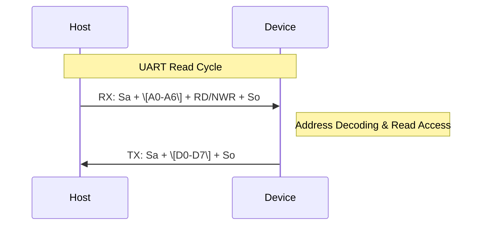
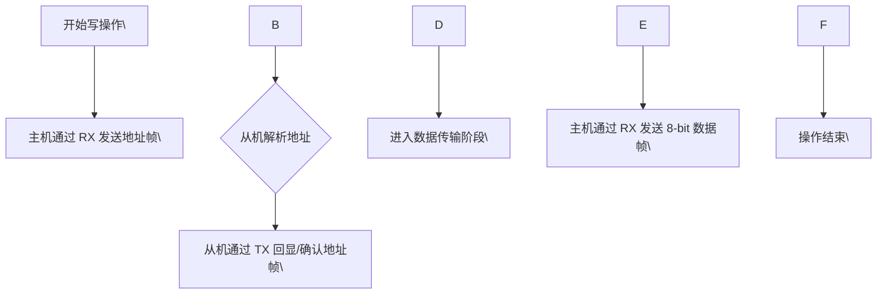
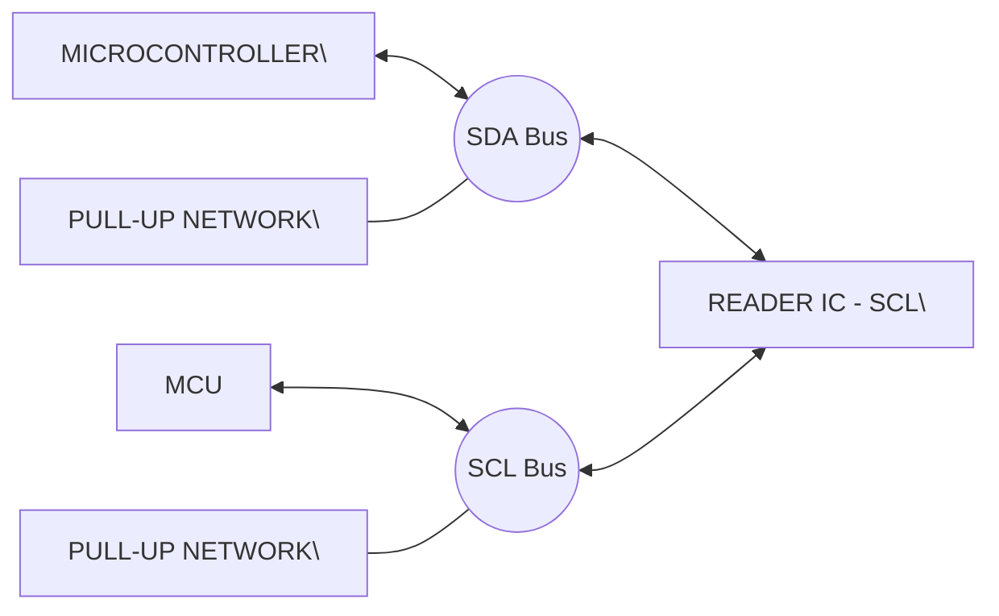
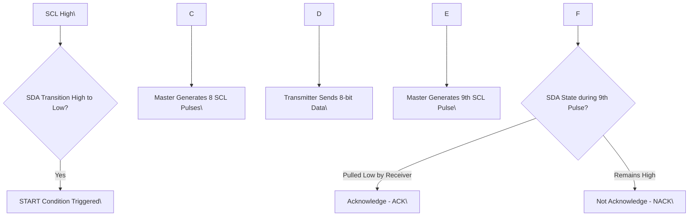
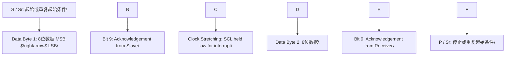
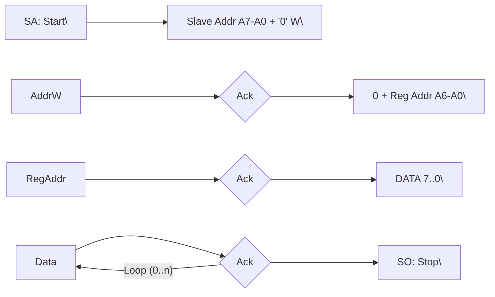
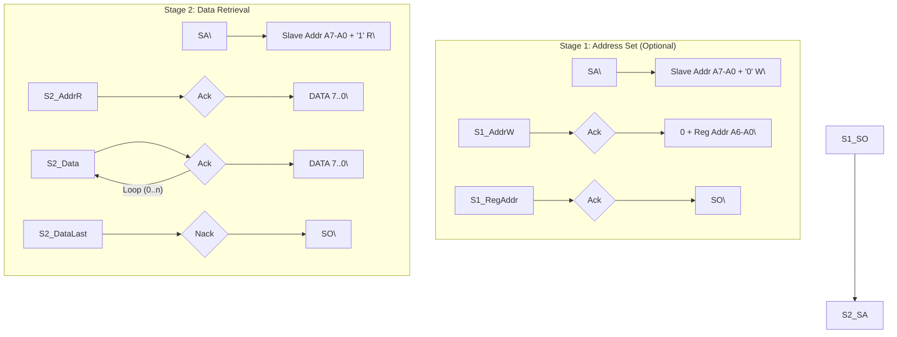
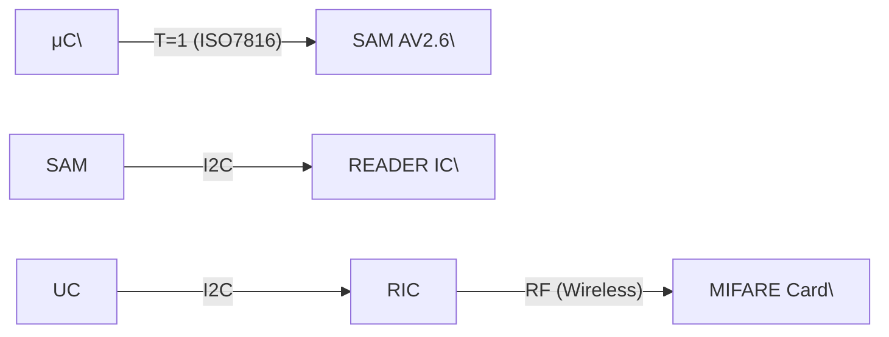
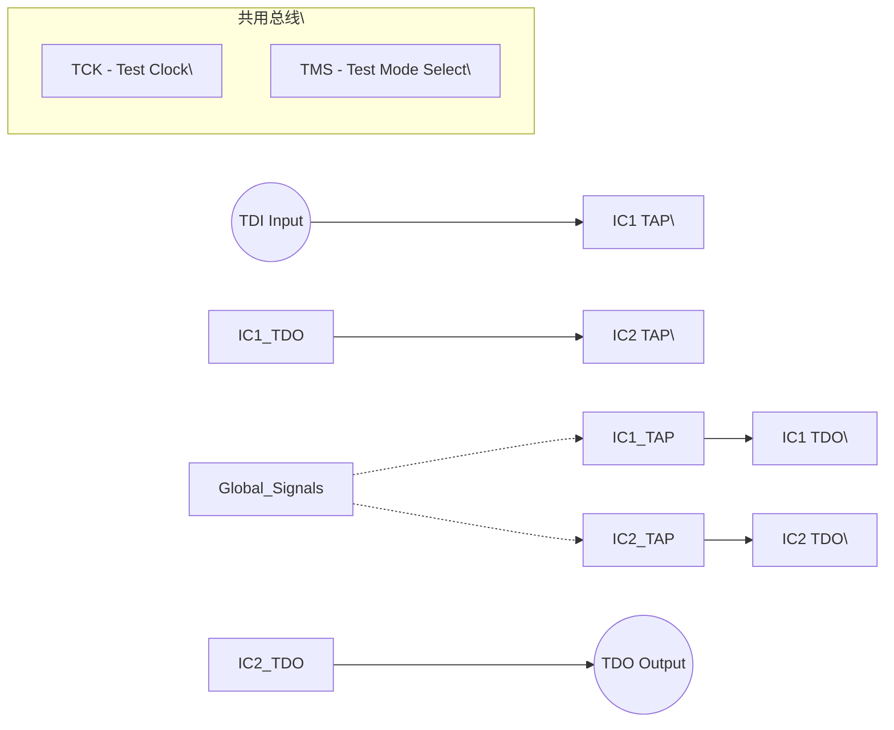

## **7.4 Host interfaces**


CLRC663 All information provided in this document is subject to legal disclaimers. © NXP B.V. 2018. All rights reserved.
**Product data sheet** **Rev. 4.7 — 12 September 2018**
**COMPANY PUBLIC** **171147** **19 / 171**


**NXP Semiconductors** **CLRC663**

**High performance multi-protocol NFC frontend CLRC663 and CLRC663** _**plus**_

### **7.4.1 Host interface configuration**

The CLRC663 supports direct interfacing of various hosts as the SPI, I \[2\] C, I \[2\] CL and
serial UART interface type. The CLRC663 resets its interface and checks the current
host interface type automatically having performed a power-up or resuming from power
down. The CLRC663 identifies the host interface by the means of the logic levels on
the control pins after the Cold Reset Phase. This is done by a combination of fixed
pin connections.The following table shows the possible configurations defined by
IFSEL1,IFSEL0:

|Pin|Pin Symbol|UART|SPI|I2C|I2C-L|
|---|---|---|---|---|---|
|28|IF0|RX|MOSI|ADR1|ADR1|
|29|IF1|n.c.|SCK|SCL|SCL|
|30|IF2|TX|MISO|ADR2|SDA|
|31|IF3|PAD_VDD|NSS|SDA|ADR2|
|26|IFSEL0|VSS|VSS|PAD_VDD|PAD_VDD|
|27|IFSEL1|VSS|PAD_VDD|VSS|PAD_VDD|


### **7.4.2 SPI interface**

#### **7.4.2.1 General**


1. 【总览信息】：本图展示了宿主设备（Host）通过 SPI 接口与 Reader IC 建立通信的物理引脚连接关系。

2. 【核心组成部件】：
   - **READER IC**：目标集成电路，具备多功能接口引脚（IF0-IF3）。
   - **Host (宿主)**：SPI 主设备（由图注 "Connection to host" 明确）。

3. 【数据流向与交互】：

| 信号名称 | 方向 (Host $\rightarrow$ IC) | Reader IC 引脚 | 信号功能描述 |
| :--- | :---: | :---: | :--- |
| **SCK** | $\rightarrow$ | IF1 | 串行时钟信号 |
| **MOSI** | $\rightarrow$ | IF0 | 主出从入数据线 (Master Out Slave In) |
| **MISO** | $\leftarrow$ | IF2 | 主入从出数据线 (Master In Slave Out) |
| **NSS** | $\rightarrow$ | IF3 | 片选信号 (Negative Slave Select) |

**逻辑连接拓扑 (ASCII)：**
```text
\[ Host \] --- SCK ---> \[ IF1 (READER IC) \]
\[ Host \] --- MOSI---> \[ IF0 (READER IC) \]
\[ Host \] <--- MISO--- \[ IF2 (READER IC) \]
\[ Host \] --- NSS ---> \[ IF3 (READER IC) \]
```

4. 【功能总结性陈述】：
   - **事实描述**：
     - 该电路采用标准的 4 线 SPI 接口协议。
     - Reader IC 的接口定义为 IF0 至 IF3，分别对应 MOSI, SCK, MISO, NSS。
     - 时钟信号 (SCK) 和片选信号 (NSS) 均由 Host 端驱动。
     - 供电电压、通信频率、SPI 模式（CPOL/CPHA）在图中未标明。

   - **工程推论**：
     - \[工程推论\] 由于 Reader IC 使用了 "IF0, IF1..." 这种通用命名而非直接命名为 "SPI_MOSI" 等，推测该 IC 的这些引脚具有**多功能复用（Pin Multiplexing）**特性，可通过内部寄存器配置为 SPI 模式或其他接口模式（如 I2C 或 UART）。
     - \[工程推论\] 根据 NSS (Negative Slave Select) 的命名，该接口采用低电平有效逻辑，符合标准的 SPI Slave 设备行为。


The CLRC663 acts as a slave during the SPI communication. The SPI clock SCK has to
be generated by the master. Data communication from the master to the slave uses the
Line MOSI. Line MISO is used to send data back from the CLRC663 to the master.

A serial peripheral interface (SPI compatible) is supported to enable high-speed
communication to a host. The implemented SPI compatible interface is according to a
standard SPI interface. The SPI compatible interface can handle data speed of up to
10 Mbit/s. In the communication with a host, CLRC663 acts as a slave receiving data
from the external host for register settings and to send and receive data relevant for the
communication on the RF interface.

NSS (Not Slave Select) enables or disables the SPI interface. When NSS is logical high,
the interface is disabled and reset. Between every SPI command, the NSS must go to
logical high to be able to start the next command read or write.

On both data lines (MOSI, MISO) each data byte is sent by MSB first. Data on MOSI
line shall be stable on rising edge of the clock line (SCK) and is allowed to change on


CLRC663 All information provided in this document is subject to legal disclaimers. © NXP B.V. 2018. All rights reserved.
**Product data sheet** **Rev. 4.7 — 12 September 2018**
**COMPANY PUBLIC** **171147** **20 / 171**


**NXP Semiconductors** **CLRC663**

**High performance multi-protocol NFC frontend CLRC663 and CLRC663** _**plus**_


falling edge. The same is valid for the MISO line. Data is provided by the CLRC663 on
the falling edge and is stable on the rising edge.The polarity of the clock is low at SPI
idle.

#### **7.4.2.2 Read data**

To read out data from the CLRC663 by using the SPI compatible interface, the following
byte order has to be used.

The first byte that is sent defines the mode (LSB bit) and the address.

|Col1|byte 0|byte 1|byte 2|byte 3 to n-1|byte n|byte n+1|
|---|---|---|---|---|---|---|
|MOSI|address 0|address 1|address 2|……..|address n|00h|
|MISO|X|data 0|data 1|……..|data n - 1|data n|


**Remark:** The Most Significant Bit (MSB) has to be sent first.

#### **7.4.2.3 Write data**

To write data to the CLRC663 using the SPI interface, the following byte order has to
be used. It is possible to write more than one byte by sending a single address byte
(see.8.5.2.4).

The first send byte defines both, the mode itself and the address byte.

|Col1|byte 0|byte 1|byte 2|3 to n-1|byte n|byte n + 1|
|---|---|---|---|---|---|---|
|MOSI|address 0|data 0|data 1|……..|data n - 1|data n|
|MISO|X|X|X|……..|X|X|


**Remark:** The Most Significant Bit (MSB) has to be sent first.

#### **7.4.2.4 Address byte**

The address byte has to fulfill the following format:

The LSB bit of the first byte defines the used mode. To read data from the CLRC663,
the LSB bit is set to logic 1. To write data to the CLRC663, the LSB bit has to be cleared.
The bits 6 to 0 define the address byte.

NOTE: When writing the sequence \[address byte\]\[data0\]\[data1\]\[data2\]..., \[data0\] is
written to address \[address byte\], \[data1\] is written to address \[address byte + 1\] and

\[data2\] is written to \[address byte + 2\].

Exception: This auto increment of the address byte is not performed if data is written to
the FIFO address

|7|6|5|4|3|2|1|0|
|---|---|---|---|---|---|---|---|
|address 6|address 5|address 4|address 3|address 2|address 1|address 0|1 (read)<br>0 (write)|
|MSB|||||||LSB|


CLRC663 All information provided in this document is subject to legal disclaimers. © NXP B.V. 2018. All rights reserved.
**Product data sheet** **Rev. 4.7 — 12 September 2018**
**COMPANY PUBLIC** **171147** **21 / 171**


**NXP Semiconductors** **CLRC663**

**High performance multi-protocol NFC frontend CLRC663 and CLRC663** _**plus**_

#### **7.4.2.5 Timing Specification SPI**

The timing condition for SPI interface is as follows:


|Symbol|Parameter|Min|Typ|Max|Unit|
|---|---|---|---|---|---|
|tSCKL|SCK LOW time|50|-|-|ns|
|tSCKH|SCK HIGH time|50|-|-|ns|
|th(SCKH-D)|SCK HIGH to data input hold time|25|-|-|ns|
|tsu(D-SCKH)|data input to SCK HIGH set-up time|25|-|-|ns|
|th(SCKL-Q)|SCK LOW to data output hold time|-|-|25|ns|
|t(SCKL-NSSH)|SCK LOW to NSS HIGH time|0|-|-|ns|
|tNSSH|NSS HIGH time|50|-|-|ns|


你好。我是资深硬件工程师，现针对提供的 SPI 通信时序图进行专业解析。

**1. 【总览信息】**
本图定义了设备与主机之间通过 SPI（Serial Peripheral Interface）接口进行同步串行通信的时序约束与信号交互逻辑。

**2. 【核心组成部件】**
*   **SCK (Serial Clock)**：串行时钟信号，由主机提供，用于同步数据传输。
*   **MOSI (Master Out Slave In)**：主机输出、从机输入的数据线。
*   **MISO (Master In Slave Out)**：从机输出、主机输入的数据线。
*   **NSS (Not Slave Select)**：从机选择信号（片选），低电平有效。

**3. 【数据流向与交互】**

**时序参数定义表**
| 参数符号 | 定义 | 逻辑参考点 |
| :--- | :--- | :--- |
| $t_{NSSH}$ | NSS 高电平维持时间 | $\text{NSS High} \rightarrow \text{NSS Low}$ (启动间隔) |
| $t_{SCKL}$ | SCK 低电平脉宽 | $\text{SCK Low}$ 持续时间 |
| $t_{SCKH}$ | SCK 高电平脉宽 | $\text{SCK High}$ 持续时间 |
| $t_{su(D-SCKH)}$ | 数据建立时间 (Setup Time) | $\text{MOSI 有效} \rightarrow \text{SCK 上升沿}$ |
| $t_{h(SCKH-D)}$ | 数据保持时间 (Hold Time) | $\text{SCK 上升沿} \rightarrow \text{MOSI 改变}$ |
| $t_{h(SCKL-Q)}$ | 输出数据保持时间 | $\text{SCK 下降沿} \rightarrow \text{MISO 改变}$ |
| $t_{(SCKL-NSSH)}$ | 传输结束至 NSS 撤销延迟 | $\text{最后一个 SCK 下降沿} \rightarrow \text{NSS High}$ |

**信号交互逻辑图 (ASCII)**
```text
Host (Master)                      Slave (Device)
      |                                  |
      |--- NSS Low (Select) ------------>| \[激活从机\]
      |                                  |
      |--- SCK $\uparrow$ (Sample) <------| \[从机采样 MOSI\]
      |--- MOSI (MSB...LSB) ------------>| \[数据流入\]
      |                                  |
      |<-- MISO (MSB...LSB) -------------| \[数据流出\]
      |--- SCK $\downarrow$ (Shift) <-----| \[从机更新 MISO\]
      |                                  |
      |--- NSS High (Deselect) --------->| \[结束通信/复位\]
```

**4. 【功能总结性陈述】**

**事实描述**：
1.  **传输顺序**：数据传输采用 MSB（最高有效位）优先顺序，结束于 LSB（最低有效位）。
2.  **极性与相位**：
    *   $\text{NSS}$ 为低电平有效。
    *   $\text{MOSI}$ 的采样发生在 $\text{SCK}$ 的上升沿（由 $t_{su(D-SCKH)}$ 和 $t_{h(SCKH-D)}$ 定义）。
    *   $\text{MISO}$ 的切换发生在 $\text{SCK}$ 的下降沿（由 $t_{h(SCKL-Q)}$ 定义）。
3.  **边界约束**：通信开始前需满足 $t_{NSSH}$ 的最小间隔，通信结束后在最后一个 $\text{SCK}$ 下降沿与 $\text{NSS}$ 拉高之间存在 $t_{(SCKL-NSSH)}$ 的延迟。

**工程推论**：
1.  \[工程推论\] 根据 $\text{SCK}$ 空闲电平为低且在上升沿采样、下降沿切换的特性，该接口严格符合 **SPI Mode 0 (CPOL=0, CPHA=0)** 标准。
2.  \[工程推论\] $t_{NSSH}$ 参数的存在表明该设备内部可能包含一个依赖于 $\text{NSS}$ 电平跳变的同步状态机，必须保证足够的脱选时间以确保内部逻辑正确复位。
3.  \[工程推论\] MISO 的输出在 $\text{SCK}$ 下降沿后立即变化，这意味着主机必须在 $\text{SCK}$ 的上升沿采集 MISO，以获得最大的建立时间裕量。


**Remark:** To send more bytes in one data stream, the NSS signal must be LOW during
the send process. To send more than one data stream, the NSS signal must be HIGH
between each data stream.

### **7.4.3 RS232 interface**

#### **7.4.3.1 Selection of the transfer speeds**

The internal UART interface is compatible to an RS232 serial interface. The levels
supplied to the pins are between VSS and PVDD. To achieve full compatibility of the
voltage levels to the RS232 specification, an RS232 level shifter is required.

Table 21 describes examples for different transfer speeds and relevant register settings.
The resulting transfer speed error is less than 1.5 % for all described transfer speeds.
The default transfer speed is 115.2 kbit/s.


CLRC663 All information provided in this document is subject to legal disclaimers. © NXP B.V. 2018. All rights reserved.
**Product data sheet** **Rev. 4.7 — 12 September 2018**
**COMPANY PUBLIC** **171147** **22 / 171**


**NXP Semiconductors** **CLRC663**

**High performance multi-protocol NFC frontend CLRC663 and CLRC663** _**plus**_


To change the transfer speed, the host controller has to write a value for the new transfer
speed to the register SerialSpeedReg. The bits BR_T0 and BR_T1 define factors to set
the transfer speed in the SerialSpeedReg.

Table 20 describes the settings of BR_T0 and BR_T1.


|BR_T0|0|1|2|3|4|5|6|7|
|---|---|---|---|---|---|---|---|---|
|factor BR_T0|1|1|2|4|8|16|32|64|
|range BR_T1|1 to 32|33 to 64|33 to 64|33 to 64|33 to 64|33 to 64|33 to 64|33 to 64|


|Transfer speed (kbit/s)|Serial SpeedReg|Transfer speed accuracy (%)|
|---|---|---|
|<br>**Transfer speed (kbit/s)**|**(Hex.)**|**(Hex.)**|
|7.2|FA|-0.25|
|9.6|EB|0.32|
|14.4|DA|-0.25|
|19.2|CB|0.32|
|38.4|AB|0.32|
|57.6|9A|-0.25|
|115.2|7A|-0.25|
|128|74|-0.06|
|230.4|5A|-0.25|
|460.8|3A|-0.25|
|921.6|1C|1.45|
|1228.8|15|0.32|


The selectable transfer speeds as shown are calculated according to the following
formulas:

if BR_T0 = 0: transfer speed = 27.12 MHz / (BR_T1 + 1)
if BR_T0 > 0: transfer speed = 27.12 MHz / (BR_T1 + 33)/2 \[(BR_T0\] \[-\] \[1)\]

**Remark:** Transfer speeds above 1228.8 kBits/s are not supported.

#### **7.4.3.2 Framing**

|Bit|Length|Value|
|---|---|---|
|Start bit (Sa)|1 bit|0|
|Data bits|8 bit|Data|
|Stop bit (So)|1 bit|1|


**Remark:** For data and address bytes, the LSB bit has to be sent first. No parity bit is
used during transmission.


CLRC663 All information provided in this document is subject to legal disclaimers. © NXP B.V. 2018. All rights reserved.
**Product data sheet** **Rev. 4.7 — 12 September 2018**
**COMPANY PUBLIC** **171147** **23 / 171**


**NXP Semiconductors** **CLRC663**

**High performance multi-protocol NFC frontend CLRC663 and CLRC663** _**plus**_


**Read data:** To read out data using the UART interface, the flow described below has to
be used. The first send byte defines both the mode itself and the address. The Trigger on
pin IF3 has to be set, otherwise no read of data is possible.


|Mode|byte 0|byte 1|
|---|---|---|
|RX|address|-|
|TX|-|data 0|


**1. 【总览信息】**
该图片为一个 UART 读取（UART Read）操作的时序图，描述了主机通过 RX 线发送地址和指令，设备通过 TX 线返回数据的完整交互过程。

**2. 【核心组成部件】**
*   **RX (Receive Line)**：用于接收从主机发送的控制序列（起始位 $\rightarrow$ 地址 $\rightarrow$ 读写指令 $\rightarrow$ 停止位）。
*   **TX (Transmit Line)**：用于向主机发送请求的数据（起始位 $\rightarrow$ 数据位 $\rightarrow$ 停止位）。
*   **ADDRESS (Bus/Representation)**：与 RX 线同步的并行地址表达形式，用于直观显示当前传输的地址值。
*   **DATA (Bus/Representation)**：与 TX 线同步的并行数据表达形式，用于直观显示当前传输的数据值。

**3. 【数据流向与交互】**

**3.1 帧格式定义表**
| 信号线 | 阶段 | 字段名称 | 长度 (Bits) | 逻辑定义/内容 |
| :--- | :--- | :--- | :--- | :--- |
| **RX** | 指令阶段 | $\text{S}_{\text{a}}$ | 1 | Start bit (起始位) |
| **RX** | 指令阶段 | $\text{A0} \sim \text{A6}$ | 7 | Address bits (地址位) |
| **RX** | 指令阶段 | $\text{RD/NWR}$ | 1 | Read/Write Command (读/写指令位) |
| **RX** | 指令阶段 | $\text{S}_{\text{o}}$ | 1 | Stop bit (停止位) |
| **TX** | 响应阶段 | $\text{S}_{\text{a}}$ | 1 | Start bit (起始位) |
| **TX** | 响应阶段 | $\text{D0} \sim \text{D7}$ | 8 | Data bits (数据位) |
| **TX** | 响应阶段 | $\text{S}_{\text{o}}$ | 1 | Stop bit (停止位) |

**3.2 交互时序流转图 (Mermaid)**


**4. 【功能总结性陈述】**

**事实描述**
*   **操作类型**：明确标注为 "UART Read"。
*   **指令帧结构**：RX 线的传输顺序为 $\text{S}_{\text{a}} \rightarrow \text{A0-A6} \rightarrow \text{RD/NWR} \rightarrow \text{S}_{\text{o}}$。
*   **数据帧结构**：TX 线的传输顺序为 $\text{S}_{\text{a}} \rightarrow \text{D0-D7} \rightarrow \text{S}_{\text{o}}$。
*   **同步关系**：`ADDRESS` 总线在时间轴上与 RX 的 $\text{A0-A6}$ 字段对齐；`DATA` 总线在时间轴上与 TX 的 $\text{D0-D7}$ 字段对齐。
*   **时间参数**：波特率、采样时钟、建立/保持时间等具体数值在图中【未标明】。

**工程推论**
*   **\[工程推论\] 协议特性**：虽然标注为 "UART"，但其采用“7位地址 + 1位读写标志”的结构极像 $\text{I}^2\text{C}$ 协议的寻址方式。这表明该设备可能实现了一种自定义的、基于异步串口物理层的寻址协议，而非标准的点对点 UART 传输。
*   **\[工程推论\] 总线表示法**：图中的 `ADDRESS` 和 `DATA` 粗线并非实际的物理并行总线，而是为了方便工程师阅读而将串行流（Serial Stream）在逻辑上展开的示意表示。
*   **\[工程推论\] 响应时序**：TX 线的起始位 $\text{S}_{\text{a}}$ 在 RX 线停止位 $\text{S}_{\text{o}}$ 之后立即触发，说明设备在接收完指令帧后立即进入响应状态，没有明显的处理等待周期（Turn-around time）。


**Write data:**


To write data to the CLRC663 using the UART interface, the following sequence has to
be used.

The first send byte defines both, the mode itself and the address.

|Mode|byte 0|byte 1|
|---|---|---|
|RX|address 0|data 0|
|TX||address 0|


CLRC663 All information provided in this document is subject to legal disclaimers. © NXP B.V. 2018. All rights reserved.
**Product data sheet** **Rev. 4.7 — 12 September 2018**
**COMPANY PUBLIC** **171147** **24 / 171**


**NXP Semiconductors** **CLRC663**

**High performance multi-protocol NFC frontend CLRC663 and CLRC663** _**plus**_


**1. 【总览信息】**
本图展示了一个基于 UART 接口实现的硬件写操作（Write Operation）的时序逻辑图，包含了地址传输、地址确认（回显）以及数据传输三个阶段。

**2. 【核心组成部件】**
*   **RX 信号线**：接收端输入线，用于主机向从机发送指令（地址和数据）。
*   **TX 信号线**：发送端输出线，用于从机向主机反馈确认信息。
*   **内部状态总线（示意线）**：图中顶部和中间的横条，分别表示当前逻辑操作处于“ADDRESS（地址）”阶段还是“DATA（数据）”阶段。

**3. 【数据流向与交互】**

**3.1 帧格式定义**
| 帧类型 | 组成顺序 (由左至右) | 位宽/定义 | 极性 (RX/TX) |
| :--- | :--- | :--- | :--- |
| **地址帧 (Address Frame)** | $\text{Sa} \rightarrow \text{A0}\dots\text{A6} \rightarrow \text{RD/NWR} \rightarrow \text{So}$ | $1\text{bit(Start)} + 7\text{bits(Addr)} + 1\text{bit(R/W)} + 1\text{bit(Stop)}$ | RX: 低电平有效 / TX: 高电平有效 |
| **数据帧 (Data Frame)** | $\text{Sa} \rightarrow \text{D0}\dots\text{D7} \rightarrow \text{So}$ | $1\text{bit(Start)} + 8\text{bits(Data)} + 1\text{bit(Stop)}$ | RX: 低电平有效 |

**3.2 交互逻辑流转**


**4. 【功能总结性陈述】**

**事实描述**
*   **信号极性**：RX 线在空闲状态下为高电平，有效脉冲为低电平；TX 线在空闲状态下为低电平，有效脉冲为高电平。
*   **传输协议**：
    1.  **第一阶段**：RX 线上出现 $\text{Sa} \rightarrow \text{A0-A6} \rightarrow \text{RD/NWR} \rightarrow \text{So}$ 序列。
    2.  **第二阶段**：TX 线上同步（或随后）出现相同的 $\text{Sa} \rightarrow \text{A0-A6} \rightarrow \text{RD/NWR} \rightarrow \text{So}$ 序列。
    3.  **第三阶段**：RX 线上在经过一段间隔后，发送 $\text{Sa} \rightarrow \text{D0-D7} \rightarrow \text{So}$ 序列。
*   **参数细节**：地址长度为 7 位，数据长度为 8 位。

**工程推论**
*   **\[工程推论\] 回显机制**：TX 线完整复制了 RX 线的地址帧，这表明该硬件采用了“地址回显（Address Echo）”确认机制。主机必须在 TX 线收到匹配的地址帧后，才会触发随后的数据帧发送，以确保通信目标的正确性。
*   **\[工程推论\] 协议混合特征**：该时序虽然标记为 UART（异步串行），但在逻辑结构上（7位地址 + 1位读写位）高度模仿了 $\text{I}^2\text{C}$ 协议。这是一种将 $\text{I}^2\text{C}$ 的寻址逻辑映射到异步串口物理层上的定制协议。
*   **\[工程推论\] 物理层实现**：RX 和 TX 的逻辑电平完全相反（RX 为低有效，TX 为高有效），极大概率是因为两端采用了不同的驱动电路（例如一端是开漏加拉高，另一端是推挽输出）或中间经过了反相器。


**Remark:** Data can be sent before address is received.

### **7.4.4 I \[2\] C-bus interface**

#### **7.4.4.1 General**

An Inter IC (I \[2\] C) bus interface is supported to enable a low cost, low pin count serial bus
interface to the host. The implemented I \[2\] C interface is mainly implemented according to
the NXP Semiconductors I \[2\] C interface specification, rev. 3.0, June 2007. The CLRC663
can act as a slave receiver or slave transmitter in standard mode, fast mode and fast
mode plus.

The following features defined by the NXP Semiconductors I \[2\] C interface specification,
rev. 3.0, June 2007 are not supported:

**•** The CLRC663 I2C interface does not stretch the clock

**•** The CLRC663 I2C interface does not support the general call. This means that the
CLRC663 does not support a software reset

**•** The CLRC663 does not support the I2C device ID

**•** The implemented interface can only act in slave mode. Therefore no clock generation
and access arbitration is implemented in the CLRC663.

**•** High-speed mode is not supported by the CLRC663


你好，我是资深硬件工程师。针对这张硬件原理示意图，我的精准解析如下：

**1. 【总览信息】**
本图定义了一个基于 $\text{I}^2\text{C}$ 总线协议的微控制器（Microcontroller）与读卡芯片（Reader IC）之间的硬件接口连接拓扑。

**2. 【核心组成部件】**
| 部件名称 | 标识/类型 | 功能描述 |
| :--- | :--- | :--- |
| **微控制器** | MICROCONTROLLER | 总线控制器/主设备端 |
| **读卡芯片** | READER IC | 总线从设备端 |
| **上拉网络 1** | PULL-UP NETWORK | 为 SDA 信号线提供高电平偏置 |
| **上拉网络 2** | PULL-UP NETWORK | 为 SCL 信号线提供高电平偏置 |

**3. 【数据流向与交互】**

**信号连接映射表**
| 信号线名称 | 起点 (Microcontroller) | 终点 (Reader IC) | 辅助电路 | 传输方向 |
| :--- | :--- | :--- | :--- | :--- |
| **SDA** | 未标明引脚号 | SDA | Pull-up Network | 双向 ($\leftrightarrow$) |
| **SCL** | 未标明引脚号 | SCL | Pull-up Network | 双向 ($\leftrightarrow$) |

**逻辑连接拓扑 (Mermaid)**


**4. 【功能总结性陈述】**

**事实描述**：
该电路采用标准的 $\text{I}^2\text{C}$ 物理层结构。由一个微控制器通过两条双向信号线（SDA 数据线和 SCL 时钟线）与一个读卡 IC 相连。两条信号线均分别连接至独立的上拉网络（Pull-up Network），确保在无驱动状态下信号保持高电平。

**工程推论**：
1. **\[工程推论\]** 由于采用了 $\text{I}^2\text{C}$ 架构且连接对象为 Reader IC，该微控制器在逻辑上极大概率充当 $\text{I}^2\text{C}$ Master（主设备），而 Reader IC 充当 Slave（从设备），负责响应指令并返回读取到的数据。
2. **\[工程推论\]** 图中明确标注的 Pull-up Network 表明该接口采用了开漏（Open-Drain）或开集电极（Open-Collector）输出配置，这是 $\text{I}^2\text{C}$ 协议实现线与（Wired-AND）逻辑和多主设备冲突检测的必要硬件条件。
3. **\[工程推论\]** 该电路未显示 VCC 和 GND 的具体连接，但上拉网络必须连接至系统电源（VCC）才能发挥作用。


The voltage level on the I2C pins is not allowed to be higher than PVDD.

SDA is a bidirectional line, connected to a positive supply voltage via a pull-up resistor.
Both lines SDA and SCL are set to HIGH level if no data is transmitted. Data on the I \[2\] Cbus can be transferred at data rates of up to 400 kbit/s in fast mode, up to 1 Mbit/s in the
fast mode+.

If the I \[2\] C interface is selected, a spike suppression according to the I \[2\] C interface
specification on SCL and SDA is automatically activated.


CLRC663 All information provided in this document is subject to legal disclaimers. © NXP B.V. 2018. All rights reserved.
**Product data sheet** **Rev. 4.7 — 12 September 2018**
**COMPANY PUBLIC** **171147** **25 / 171**


**NXP Semiconductors** **CLRC663**

**High performance multi-protocol NFC frontend CLRC663 and CLRC663** _**plus**_


For timing requirements, refer to Table 254.

#### **7.4.4.2 I \[2\] C Data validity**

Data on the SDA line shall be stable during the HIGH period of the clock. The HIGH state
or LOW state of the data line shall only change when the clock signal on SCL is LOW.


1. 【总览信息】：该图为 $\text{I}^2\text{C}$ 总线在传输单个数据位（Bit transfer）时的时序逻辑定义图。

2. 【核心组成部件】：
   - **SDA (Serial Data)**：串行数据线，用于传输实际的数据位。
   - **SCL (Serial Clock)**：串行时钟线，用于同步数据传输的采样时机。

3. 【数据流向与交互】：

| 阶段 | SCL 状态 | SDA 状态/行为 | 逻辑含义 |
| :--- | :--- | :--- | :--- |
| **准备阶段** | 低电平 $\rightarrow$ 高电平 | 在 SCL 上升沿之前必须完成状态切换 | 准备数据采样 |
| **采样阶段** | 高电平 (High) | 保持稳定 (Stable) | **Data Valid**：此时接收端采样 SDA 的电平 |
| **切换阶段** | 高电平 $\rightarrow$ 低电平 | SCL 回到低电平后方可改变 | **Change Allowed**：允许更新下一个数据位 |

**数据交互状态机 (ASCII Flow):**
`SCL Low` $\xrightarrow{\text{SDA Change}}$ `SCL High (SDA Stable/Sampled)` $\xrightarrow{\text{SCL Low}}$ `SDA Change` $\dots$

4. 【功能总结性陈述】：
   - **事实描述**：
     - 图中明确定义了 $\text{I}^2\text{C}$ 总线数据位的有效性条件：当 SCL 为高电平时，SDA 必须保持稳定（data line stable; data valid）。
     - 图中明确定义了数据线的变更时机：只有当 SCL 为低电平时，才允许 SDA 改变状态（change of data allowed）。
     - 具体的时间参数（如 $t_{SU;DAT}$ 建立时间、$t_{HD;DAT}$ 保持时间）在图中未标明。

   - **工程推论**：
     - \[工程推论\] 该时序设计旨在消除竞争冒险。通过强制要求在 SCL 高电平期间 SDA 保持稳定，确保接收端在时钟高电平期间能够采样到确定的逻辑电平（0 或 1），从而避免由于信号上升/下降沿导致的采样错误。
     - \[工程推论\] 这种“低电平改变，高电平采样”的机制是同步串行通信的标准做法，将时钟边沿作为触发信号，将时钟电平作为稳定窗口。


#### **7.4.4.3 I \[2\] C START and STOP conditions**

To handle the data transfer on the I \[2\] C-bus, unique START (S) and STOP (P) conditions
are defined.

A START condition is defined with a HIGH-to-LOW transition on the SDA line while SCL
is HIGH.

A STOP condition is defined with a LOW-to-HIGH transition on the SDA line while SCL is
HIGH.

The master always generates the START and STOP conditions. The bus is considered to
be busy after the START condition. The bus is considered to be free again a certain time
after the STOP condition.

The bus stays busy if a repeated START (Sr) is generated instead of a STOP condition.
In this respect, the START (S) and repeated START (Sr) conditions are functionally
identical. Therefore, the S symbol will be used as a generic term to represent both the
START and repeated START (Sr) conditions.


1. 【总览信息】：该图定义了双线串行通信协议中起始条件（START condition）与停止条件（STOP condition）的时序逻辑。

2. 【核心组成部件】：
   - **SDA (Serial Data)**：串行数据线，用于传输数据位及控制信号。
   - **SCL (Serial Clock)**：串行时钟线，用于同步数据传输。

3. 【数据流向与交互】：

   **时序逻辑状态表**

| 条件名称 | 符号 | SCL 状态 | SDA 变化方向 | 触发定义 |
| :--- | :---: | :---: | :---: | :--- |
| START condition | S | 高电平 (High) | 高 $\rightarrow$ 低 ($\text{H} \rightarrow \text{L}$) | 当 SCL 为高时，SDA 由高电平跳变为低电平 |
| STOP condition | P | 高电平 (High) | 低 $\rightarrow$ 高 ($\text{L} \rightarrow \text{H}$) | 当 SCL 为高时，SDA 由低电平跳变为高电平 |
| 数据传输周期 | - | 脉冲切换 | 随 SCL 同步变化 | SCL 在低电平期间 SDA 允许变化，高电平期间 SDA 保持稳定 |

   **逻辑时序流转 (ASCII)**
   ```text
   \[空闲状态\] -> \[S: SDA↓ while SCL=H\] -> \[数据传输: SCL脉冲 + SDA变化\] -> \[P: SDA↑ while SCL=H\] -> \[空闲状态\]
   ```

4. 【功能总结性陈述】：
   - **事实描述**：
     - 图片明确定义了两种特殊控制状态：起始条件（S）和停止条件（P）。
     - 起始条件要求 SCL 保持高电平的同时 SDA 产生下降沿。
     - 停止条件要求 SCL 保持高电平的同时 SDA 产生上升沿。
     - 在 S 和 P 之间存在 SCL 的时钟脉冲及 SDA 的电平跳变，且图中使用了断裂线（//）表示该过程包含多个重复周期。
     - 具体电压电平、时钟频率、建立时间（Setup Time）及保持时间（Hold Time）均未标明。

   - **工程推论**：
     - \[工程推论\] 该时序特征与 $\text{I}^2\text{C}$ (Inter-Integrated Circuit) 协议的标准定义完全一致。
     - \[工程推论\] 这种设计允许在同一组总线上通过 SDA 的非同步跳变（在 SCL 高电平期间）来区分“数据位”与“控制指令”，从而在无需额外片选线（CS）的情况下实现总线仲裁和设备寻址。
     - \[工程推论\] 信号线在空闲时处于高电平，结合其典型的 $\text{I}^2\text{C}$ 应用，推测物理层采用了开漏输出（Open-Drain）配合上拉电阻的电路结构。


#### **7.4.4.4 I \[2\] C byte format**

Each byte has to be followed by an acknowledge bit. Data is transferred with the
MSB first, see Figure 18. The number of transmitted bytes during one data transfer is
unrestricted but shall fulfill the read/write cycle format.


CLRC663 All information provided in this document is subject to legal disclaimers. © NXP B.V. 2018. All rights reserved.
**Product data sheet** **Rev. 4.7 — 12 September 2018**
**COMPANY PUBLIC** **171147** **26 / 171**


**NXP Semiconductors** **CLRC663**

**High performance multi-protocol NFC frontend CLRC663 and CLRC663** _**plus**_

#### **7.4.4.5 I \[2\] C Acknowledge**

An acknowledge at the end of one data byte is mandatory. The acknowledge-related
clock pulse is generated by the master. The transmitter of data, either master or slave,
releases the SDA line (HIGH) during the acknowledge clock pulse. The receiver shall pull
down the SDA line during the acknowledge clock pulse so that it remains stable LOW
during the HIGH period of this clock pulse.

The master can then generate either a STOP (P) condition to stop the transfer, or a
repeated START (Sr) condition to start a new transfer.

A master-receiver shall indicate the end of data to the slave- transmitter by not
generating an acknowledge on the last byte that was clocked out by the slave. The slavetransmitter shall release the data line to allow the master to generate a STOP (P) or
repeated START (Sr) condition.


**1. 【总览信息】**
该图展示了 $\text{I}^2\text{C}$ 总线在一次数据传输周期中的起始条件（START condition）定义以及第九个时钟周期中的应答/非应答（ACK/NACK）机制。

**2. 【核心组成部件】**
| 部件名称 | 信号定义 | 功能描述 |
| :--- | :--- | :--- |
| **SCL FROM MASTER** | 时钟线 (Serial Clock) | 由主设备提供，同步数据的采样与切换。 |
| **DATA OUTPUT BY TRANSMITTER** | 数据线-发送端 (SDA-Tx) | 由发送方驱动，用于传输 8-bit 数据位。 |
| **DATA OUTPUT BY RECEIVERER** | 数据线-接收端 (SDA-Rx) | 由接收方驱动，用于在第 9 个时钟周期反馈应答状态。 |

**3. 【数据流向与交互】**

**3.1 协议时序阶段映射表**
| 阶段 | SCL 状态 | SDA 控制方 | 逻辑行为/触发条件 | 备注 |
| :--- | :--- | :--- | :--- | :--- |
| **START** | 高 $\rightarrow$ 低 | Transmitter | SDA 在 SCL 为高电平时由高变低 | 触发起始条件 $\text{S}$ |
| **DATA** | 脉冲 1 $\sim$ 8 | Transmitter | 传输 8 位数据 | 每个 SCL 脉冲对应 1 bit |
| **ACK/NACK** | 脉冲 9 | Receiver | $\text{Low} \rightarrow \text{Acknowledge}$ / $\text{High} \rightarrow \text{Not Acknowledge}$ | 接收方控制 SDA 电平 |

**3.2 交互逻辑流转 (Mermaid)**


**4. 【功能总结性陈述】**

**事实描述**：
1. **起始条件**：图中明确定义 $\text{S}$ (START condition) 为 $\text{SCL}$ 保持高电平时，$\text{SDA}$ 从高电平跳变为低电平。
2. **数据长度**：一次完整的传输包含 8 个数据时钟脉冲（标号 1-8）和 1 个专用的应答时钟脉冲（标号 9）。
3. **应答逻辑**：在第 9 个时钟脉冲期间，若 $\text{SDA}$ 被拉低则定义为 `acknowledge`；若 $\text{SDA}$ 保持高电平则定义为 `not acknowledge`。
4. **参数数值**：图中未标明具体电压电平、时钟频率及建立/保持时间。

**工程推论**：
1. \[工程推论\] 根据 $\text{SDA}$ 线在“not acknowledge”状态下保持高电平且无需发送方驱动的特征，可以推断 $\text{I}^2\text{C}$ 总线采用了**开漏输出（Open-Drain）配合上拉电阻**的电路结构。
2. \[工程推论\] 在第 9 个时钟周期，发送方（Transmitter）必须释放对 $\text{SDA}$ 线的控制权（将其置为高阻态），否则接收方（Receiver）无法通过将线拉低来产生 `acknowledge` 信号。
3. \[工程推论\] 该时序图描述的是一个标准的半双工通信过程，其中主设备控制时钟，从设备在特定时间窗内通过单比特反馈确认数据接收状态。


**【总览信息】**
该图片为 $\text{I}^2\text{C}$ 总线数据传输的时序图，详细展示了从起始条件到停止条件的一个完整多字节传输周期，并重点标注了从机通过拉低时钟线实现“时钟拉伸（Clock Stretching）”的机制。

**【核心组成部件】**
| 部件/信号线 | 功能描述 | 状态/特征 |
| :--- | :--- | :--- |
| **SDA (数据线)** | 传输数据位及起始/停止信号 | 顶端波形，支持 MSB 优先传输 |
| **SCL (时钟线)** | 同步传输时钟 | 底端波形，由主机驱动，但可被从机拉低 |
| **Master (主机)** | 流程控制方 | 产生 $S$、$P$ 信号并驱动 $SCL$ (隐含) |
| **Slave (从机)** | 数据响应方 | 提供 $ACK$ 信号，并能在中断处理期间持有 $SCL$ 为低电平 |

**【数据流向与交互】**

**1. 传输时序序列 (Sequence of Events)**


**2. 信号位定义表 (Fact-based)**
| 阶段 | SCL 状态 | SDA 状态/行为 | 标注说明 |
| :--- | :--- | :--- | :--- |
| **Start** | 高 $\rightarrow$ 低 (在 $S$ 区域) | 高 $\rightarrow$ 低 | $S$ or $Sr$ |
| **Data Transfer** | 周期性脉冲 (1-8) | 逻辑电平 (MSB $\rightarrow$ LSB) | 传输 8 bits 数据 |
| **ACK 1** | 第 9 个脉冲 | 低电平 | acknowledgement signal from slave |
| **Stretching** | **持续低电平** | 未标明 | clock line held low while interrupts are serviced |
| **Data Transfer 2** | 周期性脉冲 (1-8) | 逻辑电平 | 传输第 2 个字节 |
| **ACK 2** | 第 9 个脉冲 | 低电平 | acknowledgement signal from receiver |
| **Stop** | 低 $\rightarrow$ 高 (在 $Sr/P$ 区域) | 低 $\rightarrow$ 高 | $Sr$ or $P$ |

**【功能总结性陈述】**

**事实描述**：
1. **传输格式**：采用 8 位数据 + 1 位应答（ACK）的帧结构。
2. **同步机制**：数据在 $SCL$ 的时钟驱动下传输，且起始条件（$S$）和停止条件（$P$）通过 $SDA$ 在 $SCL$ 高电平期间的跳变来定义。
3. **特殊行为**：在第一个字节传输完成且从机产生中断后，$SCL$ 线被强制保持在低电平，直到中断服务完成（interrupts are serviced）才恢复后续时钟脉冲。

**工程推论**：
1. \[工程推论\] 图中展示的 $SCL$ 低电平延长现象是典型的 **$\text{I}^2\text{C}$ 时钟拉伸（Clock Stretching）** 机制。这表明该从机设备具备流控能力，用于在处理速度低于主机传输速度时（如执行内部 I/O 写入或中断处理）强制主机等待。
2. \[工程推论\] 鉴于第一个字节后由从机提供 $ACK$，且随后继续传输数据，该场景极大概率是一个 **主机向从机写入数据（Master Write）** 的操作流程。
3. \[工程推论\] 这种机制确保了在异步处理环境下，数据传输的鲁棒性，防止由于从机缓冲区溢出或处理延迟导致的数据丢失。


#### **7.4.4.6 I \[2\] C 7-bit addressing**

During the I \[2\] C-bus addressing procedure, the first byte after the START condition is used
to determine which slave will be selected by the master.

Alternatively the I \[2\] C address can be configured in the EEPROM. Several address
numbers are reserved for this purpose. During device configuration, the designer has to
ensure, that no collision with these reserved addresses in the system is possible. Check
the corresponding I \[2\] C specification for a complete list of reserved addresses.


CLRC663 All information provided in this document is subject to legal disclaimers. © NXP B.V. 2018. All rights reserved.
**Product data sheet** **Rev. 4.7 — 12 September 2018**
**COMPANY PUBLIC** **171147** **27 / 171**


**NXP Semiconductors** **CLRC663**

**High performance multi-protocol NFC frontend CLRC663 and CLRC663** _**plus**_


For all CLRC663 devices, the upper 5 bits of the device bus address are reserved by
NXP and set to 01010(bin). The remaining 2 bits (ADR_2, ADR_1) of the slave address
can be freely configured by the customer in order to prevent collisions with other I \[2\] C
devices by using the interface pins (refer to Table 15) or the value of the I \[2\] C address
EEPROM register (refer to Table 37).


1. 【总览信息】：该图定义了在启动过程（START procedure）之后发送的第一个字节的位域结构。

2. 【核心组成部件】：
- **Slave Address（从机地址）**：占用 7 个比特位（Bit 6 至 Bit 0）。
- **R/$\overline{W}$（读/写标志位）**：占用 1 个比特位，位于最低有效位（LSB）。

3. 【数据流向与交互】：

| 位偏移 (Bit Index) | 名称 | 描述 | 极性/属性 |
| :--- | :--- | :--- | :--- |
| Bit 6 (MSB) | slave address | 从机地址高位 | 逻辑值 |
| Bit 5 | slave address | 从机地址 | 逻辑值 |
| Bit 4 | slave address | 从机地址 | 逻辑值 |
| Bit 3 | slave address | 从机地址 | 逻辑值 |
| Bit 2 | slave address | 从机地址 | 逻辑值 |
| Bit 1 | slave address | 从机地址 | 逻辑值 |
| Bit 0 | slave address | 从机地址低位 | 逻辑值 |
| LSB | R/$\overline{W}$ | 读/写操作选择 | $\overline{W}$ 表示低电平有效或写操作 |

**数据结构拓扑：**
`\[START Procedure\]` $\rightarrow$ `\[Slave Address (7-bits)\]` $\rightarrow$ `\[R/W Bit (1-bit)\]`

4. 【功能总结性陈述】：
- **事实描述**：该字节由 7 位从机地址和 1 位读写控制位组成，总长度为 8 位。最高有效位（MSB）起始于 Bit 6，最低有效位（LSB）为 R/$\overline{W}$ 位。该字节紧跟在 START 过程之后发送。
- **工程推论**：
    - \[工程推论\] 该字节结构（7位地址 + 1位读写位）以及“START procedure”的描述，完全符合 $\text{I}^2\text{C}$ (Inter-Integrated Circuit) 协议的标准地址帧格式。
    - \[工程推论\] $\text{R}/\overline{\text{W}}$ 符号中的上划线通常表示该位在逻辑 0 时执行“写”操作，逻辑 1 时执行“读”操作。


#### **7.4.4.7 I \[2\] C-register write access**


To write data from the host controller via I \[2\] C to a specific register of the CLRC663, the
following frame format shall be used.

The read/write bit shall be set to logic 0.

The first byte of a frame indicates the device address according to the I \[2\] C rules. The
second byte indicates the register address followed by up to n-data bytes. In case the
address indicates the FIFO, in one frame all n-data bytes are written to the FIFO register
address. This enables for example a fast FIFO access.

#### **7.4.4.8 I \[2\] C-register read access**

To read out data from a specific register address of the CLRC663, the host controller
shall use the procedure:

First a write access to the specific register address has to be performed as indicated in
the following frame:

The first byte of a frame indicates the device address according to the I \[2\] C rules. The
second byte indicates the register address. No data bytes are added.

The read/write bit shall be logic 0.

Having performed this write access, the read access starts. The host sends the device
address of the CLRC663. As an answer to this device address, the CLRC663 responds
with the content of the addressed register. In one frame n-data bytes could be read
using the same register address. The address pointing to the register is incremented
automatically (exception: FIFO register address is not incremented automatically).
This enables a fast transfer of register content. The address pointer is incremented
automatically and data is read from the locations \[address\], \[address+1\], \[address+2\]...

\[address+(n-1)\]

In order to support a fast FIFO data transfer, the address pointer is not incremented
automatically in case the address is pointing to the FIFO.

The read/write bit shall be set to logic 1.


CLRC663 All information provided in this document is subject to legal disclaimers. © NXP B.V. 2018. All rights reserved.
**Product data sheet** **Rev. 4.7 — 12 September 2018**
**COMPANY PUBLIC** **171147** **28 / 171**


**NXP Semiconductors** **CLRC663**

**High performance multi-protocol NFC frontend CLRC663 and CLRC663** _**plus**_


你好，我是资深硬件工程师。针对提供的“Figure 22. Register read and write access”协议图，我已完成精准解析。

**1. 【总览信息】**
该图定义了前端 IC（Frontend IC）通过 I2C 总线进行寄存器读写操作的标准通信时序协议。

**2. 【核心组成部件】**
*   **Master（主设备）**：负责发起起始信号（SA）、停止信号（SO）、发送设备地址、寄存器地址及写入数据。
*   **Slave（前端 IC）**：负责响应应答信号（Ack/Nack）及在读周期中提供寄存器数据。
*   **I2C Slave Address (A7-A0)**：用于唯一标识目标设备的 7 位或 8 位地址。
*   **Frontend IC Register Address (A6-A0)**：用于指定 IC 内部寄存器位置的 7 位地址。
*   **DATA \[7..0\]**：8 位数据字节。

**3. 【数据流向与交互】**

**A. 写入周期 (Write Cycle) 逻辑流**


**B. 读取周期 (Read Cycle) 逻辑流**


**C. 字段定义表**
| 字段名称 | 位宽 (Bit) | 发送方 | 详细描述 |
| :--- | :--- | :--- | :--- |
| Slave Address | A7-A0 | Master | 设备物理地址 |
| R/W Bit | 1 bit | Master | 0 为 Write, 1 为 Read |
| Register Address | 8 bit | Master | 高位固定为 '0' + 7位地址 (A6-A0) |
| DATA | 8 bit | M/S | 读写的数据负载 |
| Ack | 1 bit | Slave/Master | 应答信号 (Active Low) |
| Nack | 1 bit | Master | 非应答信号，用于终止读取 |

---

**4. 【功能总结性陈述】**

**事实描述**
*   **写入机制**：采用 `SA -> Slave Addr(W) -> Reg Addr -> Data(s) -> SO` 序列，支持单字节或多字节（0..n）连续写入。
*   **读取机制**：采用“组合格式”（Combined Format）。首先通过写入周期指定寄存器地址（可选），随后发起一个新的起始信号，通过 `Slave Addr(R)` 读取数据。
*   **地址结构**：寄存器地址被定义为 8 位，其中最高位（MSB）固定为 `0`，有效地址位为 `A6-A0`。
*   **终止条件**：读取操作在最后一个数据字节后由 Master 发送 `Nack` 信号，随后发送 `SO` 停止信号。

**工程推论**
*   **\[工程推论\] 内部地址指针机制**：读取周期中“若前次访问为同一寄存器地址则 Stage 1 为 Optional”的描述，表明该前端 IC 内部维护了一个**地址指针寄存器**。一旦设定，指针将保持在该位置直到被重新写入或复位。
*   **\[工程推论\] 自动递增功能**：在写入和读取周期中均出现 `0..n` 的循环结构，推断该 IC 支持**寄存器地址自动递增（Auto-increment）**，允许 Master 在一次通信会话中高效地读写连续的内存块。
*   **\[工程推论\] 地址空间限制**：由于寄存器地址最高位固定为 `0` 且仅使用 `A6-A0`，该器件的寄存器寻址空间最大为 $2^7 = 128$ 个字节。


#### **7.4.4.9 I \[2\] CL-bus interface**


The CLRC663 provides an additional interface option for connection of a SAM. This
logical interface fulfills the I \[2\] C specification, but the rise/fall timings will not be compliant
to the I \[2\] C standard. The I \[2\] CL interface uses standard I/O pads, and the communication
speed is limited to 5 MBaud. The protocol itself is equivalent to the fast mode protocol of
I \[2\] C. The SCL levels are generated by the host in push/pull mode. The RC663 does not
stretch the clock. During the high period of SCL, the status of the line is maintained by a
bus keeper.

The address is 01010xxb, where the last two bits of the address can be defined by the
application. The definition of these bits can be done by two options. With a pin, where
the higher bit is fixed to 0 or the configuration can be defined via EEPROM. Refer to the
EEPROM configuration in Section 7.7.

|Parameter|Min|Max|Unit|
|---|---|---|---|
|fSCL|0|5|MHz|
|tHD;STA|80|-|ns|
|tLOW|100|-|ns|
|tHIGH|100|-|ns|
|tSU;SDA|80|-|ns|
|tHD;DAT|0|50|ns|
|tSU;DAT|0|20|ns|
|tSU;STO|80|-|ns|
|tBUF|200|-|ns|


CLRC663 All information provided in this document is subject to legal disclaimers. © NXP B.V. 2018. All rights reserved.
**Product data sheet** **Rev. 4.7 — 12 September 2018**
**COMPANY PUBLIC** **171147** **29 / 171**


**NXP Semiconductors** **CLRC663**

**High performance multi-protocol NFC frontend CLRC663 and CLRC663** _**plus**_


The pull-up resistor is not required for the I \[2\] CL interface. Instead, a on chip buskeeper
is implemented in the CLRC663 for SDA of the I \[2\] CL interface. This protocol is intended
to be used for a point-to-point connection of devices over a short distance and does
not support a bus capability.The driver of the pin must force the line to the desired
logic voltage. To avoid that two drivers are pushing, the line at the same time following
regulations must be fulfilled:

SCL: As there is no clock stretching, the SCL is always under control of the Master.

SDA: The SDA line is shared between master and slave. Therefore the master and the
slave must have the control over the own driver enable line of the SDA pin. The following
rules must be followed:

**•** In the idle phase, the SDA line is driven high by the master

**•** In the time between start and stop condition, the SDA line is driven by master or slave
when SCL is low. If SCL is high, the SDA line is not driven by any device

**•** To keep the value on the SDA line a on chip, buskeeper structure is implemented for
the line

### **7.4.5 SAM interface**

#### **7.4.5.1 SAM functionality**

The CLRC663 implements a dedicated I2C or SPI interface to integrate a MIFARE SAM
(Secure Access Module) in a very convenient way into applications (e.g. a proximity
reader).

The SAM can be connected to the microcontroller to operate like a cryptographic
coprocessor. For any cryptographic task, the microcontroller requests an operation from
the SAM, receives the answer and sends it over a host interface (e.g. I2C, SPI) interface
to the connected reader IC.

The MIFARE SAM supports an optimized method to integrate the SAM in a very
efficient way to reduce the protocol overhead. In this system configuration, the SAM is
integrated between the microprocessor and the reader IC, connected by one interface
to the reader IC and by another interface to the microcontroller. In this application, the
microcontroller accesses the SAM using the T=1 protocol and the SAM accesses the
reader IC using an I2C interface. The I2C SAM address is always defined by EEPROM
register. Default value is 0101100. As the SAM is directly communicating with reader IC,
the communication overhead is reduced. In this configuration, a performance boost of up
to 40 % can be achieved for a transaction time.

The MIFARE SAM supports applications using MIFARE product-based cards. For multiapplication purposes, an architecture connecting the microcontroller additionally directly
to the reader IC is recommended. This is possible by connecting the CLRC663 on
one interface (SAM Interface SDA, SCL) with the MIFARE SAM AV2.6 (P5DF081XX/
T1AR1070) and by connecting the microcontroller to the S2C or SPI interface.


CLRC663 All information provided in this document is subject to legal disclaimers. © NXP B.V. 2018. All rights reserved.
**Product data sheet** **Rev. 4.7 — 12 September 2018**
**COMPANY PUBLIC** **171147** **30 / 171**


**NXP Semiconductors** **CLRC663**

**High performance multi-protocol NFC frontend CLRC663 and CLRC663** _**plus**_


**【总览信息】**
该图展示了一个集成 MIFARE SAM（安全访问模块）的 RFID 阅读器硬件架构，用于实现与 MIFARE 卡片的安全通信。

**【核心组成部件】**
*   **$\mu\text{C}$ (Microcontroller)**：主控制器，负责系统调度与整体逻辑控制。
*   **SAM AV2.6 (Secure Access Module)**：安全访问模块，用于存储密钥及执行加密运算。
*   **READER IC**：射频前端芯片，负责物理层的 RF 信号调制与解调。
*   **MIFARE Card**：外部被动式射频识别卡片（目标端）。

**【数据流向与交互】**



**接口定义表：**

| 交互端点 | 物理接口/协议 | 数据流向 | 描述 |
| :--- | :--- | :--- | :--- |
| $\mu\text{C} \rightarrow \text{SAM AV2.6}$ | T=1 | 单向/双向 | 主控与安全模块间的指令传输 |
| $\text{SAM AV2.6} \rightarrow \text{READER IC}$ | I2C | 双向 | 安全模块与射频芯片间的直接交互 |
| $\mu\text{C} \rightarrow \text{READER IC}$ | I2C | 双向 | 主控对射频芯片的配置与控制 |
| $\text{READER IC} \rightarrow \text{MIFARE Card}$ | RF (无线) | 双向 | 射频电磁耦合通信 |

**【功能总结性陈述】**

**事实描述**：
1. 系统由主控 $\mu\text{C}$、SAM AV2.6 和 READER IC 三者构成闭环控制结构。
2. $\mu\text{C}$ 与 SAM 之间采用 T=1 协议连接；$\mu\text{C}$ 与 READER IC 之间采用 I2C 接口连接。
3. SAM AV2.6 具有直接通过 I2C 接口与 READER IC 通信的能力，无需全部经过 $\mu\text{C}$ 中转。
4. READER IC 通过无线射频接口与 NXP MIFARE 系列卡片进行交互。

**工程推论**：
1. \[工程推论\] **T=1 协议**：此处 T=1 指的是 ISO/IEC 7816-3 标准中的传输协议，表明 SAM AV2.6 在物理形式上可能被当作一个智能卡（Smart Card）芯片集成在电路板上。
2. \[工程推论\] **安全卸载机制**：SAM 与 READER IC 之间独立的 I2C 链路旨在实现“安全通道”。这意味着敏感的加密密钥或认证令牌可以在 SAM 和 READER IC 之间直接传递，避免明文密钥经过 $\mu\text{C}$ 内存，从而降低被侧信道攻击或软件漏洞截获的风险。
3. \[工程推论\] **系统角色分配**：$\mu\text{C}$ 在此架构中扮演“协调员”角色（负责业务逻辑和状态机），而 SAM 扮演“金库”角色（负责密钥管理），READER IC 扮演“翻译官”角色（负责协议转换和信号传输）。


#### **7.4.5.2 SAM connection**

The CLRC663 provides an interface to connect a SAM dedicated to the CLRC663. Both
interface options of the CLRC663, I \[2\] C, I \[2\] CL or SPI can be used for this purpose. The
interface option of the SAM itself is configured by a host command sent from the host to
the SAM.

The I \[2\] CL interface is intended to be used as connection between two ICs over a short
distance. The protocol fulfills the I \[2\] C specification, but does support a single device
connected to the bus only.

The SPI block for SAM connection is identical with the SPI host interface block.

The pins used for the SAM SPI are described in the following table:

|SPI functionality|PIN|
|---|---|
|MISO|SDA2|
|SCL|SCL2|
|MOSI|IFSEL1|
|NSS|IFSEL0|


### **7.4.6 Boundary scan interface**

The CLRC663 provides a boundary scan interface according to the IEEE 1149.1. This
interface allows testing interconnections without using physical test probes. This is done
by test cells, assigned to each pin, which override the functionality of this pin.

To be able to program the test cells, the following commands are supported:


|Value<br>(decimal)|Command|Parameter in|Parameter out|
|---|---|---|---|
|0|bypass|-|-|
|1|preload|data (24)|-|
|2|sample|-|data (24)|
|3|ID code (default)|-|data (32)|
|4|USER code|-|data (32)|
|5|Clamp|-|-|


CLRC663 All information provided in this document is subject to legal disclaimers. © NXP B.V. 2018. All rights reserved.
**Product data sheet** **Rev. 4.7 — 12 September 2018**
**COMPANY PUBLIC** **171147** **31 / 171**


**NXP Semiconductors** **CLRC663**

**High performance multi-protocol NFC frontend CLRC663 and CLRC663** _**plus**_


|Value<br>(decimal)|Command|Parameter in|Parameter out|
|---|---|---|---|
|6|HIGH Z|-|-|
|7|extest|data (24)|data (24)|
|8|interface on/off|interface (1)|-|
|9|register access read|address (7)|data (8)|
|10|register access write|address (7) - data (8)|-|


The Standard IEEE 1149.1 describes the four basic blocks necessary to use this
interface: Test Access Port (TAP), TAP controller, TAP instruction register, TAP data
register;

#### **7.4.6.1 Interface signals**

The boundary scan interface implements a four line interface between the chip and the
environment. There are three Inputs: Test Clock (TCK); Test Mode Select (TMS); Test
Data Input (TDI) and one output Test Data Output (TDO). TCK and TMS are broadcast
signals, TDI to TDO generate a serial line called Scan path.

Advantage of this technique is that independent of the numbers of boundary scan
devices the complete path can be handled with four signal lines.

The signals TCK, TMS are directly connected with the boundary scan controller. Because
these signals are responsible for the mode of the chip, all boundary scan devices in one
scan path will be in the same boundary scan mode.

#### **7.4.6.2 Test Clock (TCK)**

The TCK pin is the input clock for the module. If this clock is provided, the test logic
is able to operate independent of any other system clocks. In addition, it ensures that
multiple boundary scan controllers that are daisy-chained together can synchronously
communicate serial test data between components. During normal operation, TCK
is driven by a free-running clock. When necessary, TCK can be stopped at 0 or 1 for
extended periods of time. While TCK is stopped at 0 or 1, the state of the boundary scan
controller does not change and data in the Instruction and Data Registers is not lost.

The internal pull-up resistor on the TCK pin is enabled. This assures that no clocking
occurs if the pin is not driven from an external source.

#### **7.4.6.3 Test Mode Select (TMS)**

The TMS pin selects the next state of the boundary scan controller. TMS is sampled on
the rising edge of TCK. Depending on the current boundary scan state and the sampled
value of TMS, the next state is entered. Because the TMS pin is sampled on the rising
edge of TCK, the IEEE Standard 1149.1 expects the value on TMS to change on the
falling edge of TCK.

Holding TMS high for five consecutive TCK cycles drives the boundary scan controller
state machine to the Test-Logic-Reset state. When the boundary scan controller enters
the Test-Logic-Reset state, the Instruction Register (IR) resets to the default instruction,
IDCODE. Therefore, this sequence can be used as a reset mechanism.

The internal pull-up resistor on the TMS pin is enabled.


CLRC663 All information provided in this document is subject to legal disclaimers. © NXP B.V. 2018. All rights reserved.
**Product data sheet** **Rev. 4.7 — 12 September 2018**
**COMPANY PUBLIC** **171147** **32 / 171**


**NXP Semiconductors** **CLRC663**

**High performance multi-protocol NFC frontend CLRC663 and CLRC663** _**plus**_

#### **7.4.6.4 Test Data Input (TDI)**

The TDI pin provides a stream of serial information to the IR chain and the DR chains.
TDI is sampled on the rising edge of TCK and, depending on the current TAP state and
the current instruction, presents this data to the proper shift register chain. Because the
TDI pin is sampled on the rising edge of TCK, the IEEE Standard 1149.1 expects the
value on TDI to change on the falling edge of TCK.

The internal pull-up resistor on the TDI pin is enabled.

#### **7.4.6.5 Test Data Output (TDO)**

The TDO pin provides an output stream of serial information from the IR chain or the
DR chains. The value of TDO depends on the current TAP state, the current instruction,
and the data in the chain being accessed. In order to save power when the port is not
being used, the TDO pin is placed in an inactive drive state when not actively shifting out
data. Because TDO can be connected to the TDI of another controller in a daisy-chain
configuration, the IEEE Standard 1149.1 expects the value on TDO to change on the
falling edge of TCK.

#### **7.4.6.6 Data register**

According to the IEEE1149.1 standard, there are two types of data register defined:
bypass and boundary scan

The bypass register enable the possibility to bypass a device when part of the scan
path.Serial data is allowed to be transferred through a device from the TDI pin to the
TDO pin without affecting the operation of the device.

The boundary scan register is the scan-chain of the boundary cells. The size of this
register is dependent on the command.

#### **7.4.6.7 Boundary scan cell**

The boundary scan cell opens the possibility to control a hardware pin independent of its
normal use case. Basically the cell can only do one of the following: control, output and
input.


你好。我是资深硬件工程师，针对这张“Boundary scan cell path structure”硬件原理图，我已完成精准分析。

**【总览信息】**
本图展示了基于 IEEE 1149.1 (JTAG) 标准的两个集成电路（IC1 和 IC2）的边界扫描（Boundary Scan）链式拓扑结构。

**【核心组成部件】**
| 部件名称 | 数量 | 功能描述 |
| :--- | :--- | :--- |
| **IC (Integrated Circuit)** | 2 | 待测的目标集成电路（IC1, IC2）。 |
| **LOGIC** | 2 | IC 内部的核心功能逻辑电路。 |
| **Boundary scan cell** | 多个 | 位于核心逻辑与物理引脚之间的扫描单元，用于截获或驱动引脚信号。 |
| **TAP (Test Access Port)** | 2 | 测试访问端口控制器，用于解析指令并控制扫描链。 |

**【数据流向与交互】**

**1. 信号连接拓扑 (Mermaid)**


**2. 接口引脚定义**
| 信号名称 | 类型 | 连接方式 | 作用 |
| :--- | :--- | :--- | :--- |
| **TDI** | 输入 $\rightarrow$ 输出 | 串行级联 (Daisy-chain) | 测试数据输入 $\rightarrow$ IC1 $\rightarrow$ IC2 |
| **TDO** | 输入 $\rightarrow$ 输出 | 串行级联 (Daisy-chain) | 测试数据输出 $\leftarrow$ IC2 $\leftarrow$ IC1 |
| **TCK** | 输入 | 并行分发 (Broadcast) | 为所有 TAP 及其扫描链提供同步时钟 |
| **TMS** | 输入 | 并行分发 (Broadcast) | 控制 TAP 状态机的状态跳转 |

---

**【功能总结性陈述】**

**事实描述：**
1. **拓扑结构**：TDI 和 TDO 构成了串行链路，数据流向为 `TDI $\rightarrow$ IC1 $\rightarrow$ IC2 $\rightarrow$ TDO`。
2. **同步机制**：TCK 和 TMS 信号在物理层面上通过并行总线同时馈送到 IC1 和 IC2 的 TAP 模块。
3. **扫描位置**：Boundary scan cell 部署在核心 LOGIC 与外部 I/O 引脚的物理路径之间。
4. **控制逻辑**：每个 IC 包含一个独立的 TAP 模块，用于接收 TCK/TMS 并管理内部扫描链。

**工程推论：**
1. \[工程推论\] 根据 TDI/TDO 的级联方式，该电路实现了典型的 JTAG 扫描链，允许测试设备通过单一接口顺序地对多个 IC 内部的边界扫描寄存器进行移位操作（Shift）。
2. \[工程推论\] 边界扫描单元（Boundary scan cell）的位置表明其支持“采样（Sample）”和“强制（Force）”模式，这意味着可以在不运行 IC 核心逻辑的情况下，直接对 PCB 走线进行开路/短路检测。
3. \[工程推论\] 由于 TCK 和 TMS 是并行分发的，所有级联的 IC 在同一时钟周期内同步跳转状态机，这保证了多芯片环境下指令执行的同步性。


|IC1|Col2|Col3|Col4|Col5|Col6|IC2|Col8|Col9|Col10|Col11|
|---|---|---|---|---|---|---|---|---|---|---|
||||||||||||
||||||||||||
|||LOGIC||||||LOGIC|||
||||||||||||
||||||||||||
||||||TDO<br>TDI||||||
||TAP|TAP|TAP|TAP|TAP|TAP|TAP|TAP|TAP|TAP|


#### **7.4.6.8 Boundary scan path**

|TAP|Col2|TAP|
|---|---|---|
|TCK|TCK|TCK|
|TCK|||


This chapter shows the boundary scan path of the CLRC663.


CLRC663 All information provided in this document is subject to legal disclaimers. © NXP B.V. 2018. All rights reserved.
**Product data sheet** **Rev. 4.7 — 12 September 2018**
**COMPANY PUBLIC** **171147** **33 / 171**


**NXP Semiconductors** **CLRC663**

**High performance multi-protocol NFC frontend CLRC663 and CLRC663** _**plus**_

|Number (decimal)|Cell|Port|Function|
|---|---|---|---|
|23|BC_1|-|Control|
|22|BC_8|CLKOUT|Bidir|
|21|BC_1|-|Control|
|20|BC_8|SCL2|Bidir|
|19|BC_1|-|Control|
|18|BC_8|SDA2|Bidir|
|17|BC_1|-|Control|
|16|BC_8|IFSEL0|Bidir|
|15|BC_1|-|Control|
|14|BC_8|IFSEL1|Bidir|
|13|BC_1|-|Control|
|12|BC_8|IF0|Bidir|
|11|BC_1|-|Control|
|10|BC_8|IF1|Bidir|
|9|BC_1|-|Control|
|8|BC_8|IF2|Bidir|
|7|BC_1|IF2|Output2|
|6|BC_4|IF3|Bidir|
|5|BC_1|-|Control|
|4|BC_8|IRQ|Bidir|
|3|BC_1|-|Control|
|2|BC_8|SIGIN|Bidir|
|1|BC_1|-|Control|
|0|BC_8|SIGOUT|Bidir|


Refer to the CLRC663 BSDL file.

#### **7.4.6.9 Boundary Scan Description Language (BSDL)**

All of the boundary scan devices have a unique boundary structure which is necessary to
know for operating the device. Important components of this language are:

**•** available test bus signal

**•** compliance pins

**•** command register

**•** data register

**•** boundary scan structure (number and types of the cells, their function and the
connection to the pins.)

The CLRC663 is using the cell BC_8 for the IO-Lines. The I \[2\] C Pin is using a BC_4 cell.
For all pad enable lines, the cell BC1 is used.


CLRC663 All information provided in this document is subject to legal disclaimers. © NXP B.V. 2018. All rights reserved.
**Product data sheet** **Rev. 4.7 — 12 September 2018**
**COMPANY PUBLIC** **171147** **34 / 171**


**NXP Semiconductors** **CLRC663**

**High performance multi-protocol NFC frontend CLRC663 and CLRC663** _**plus**_


The manufacturer's identification is 02Bh.

**•** attribute IDCODEISTER of CLRC663: entity is "0001" and -- version

**•** "0011110010000010b" and -- part number (3C82h)

**•** "00000010101b" and -- manufacturer (02Bh)

**•** "1b"; -- mandatory

The user code data is coded as followed:

**•** product ID (3 bytes)

**•** version

These four bytes are stored as the first four bytes in the EEPROM.

#### **7.4.6.10 Non-IEEE1149.1 commands**


Interface on/off

With this command, the host/SAM interface can be deactivated and the Read and Write
command of the boundary scan interface is activated. (Data = 1). With Update-DR, the
value is taken over.


Register Access Read

At Capture-DR, the actual address is read and stored in the DR. Shifting the DR is
shifting in a new address. With Update-DR, this address is taken over into the actual
address.


Register Access Write

At the Capture-DR, the address and the data is taken over from the DR. The data is
copied into the internal register at the given address.
