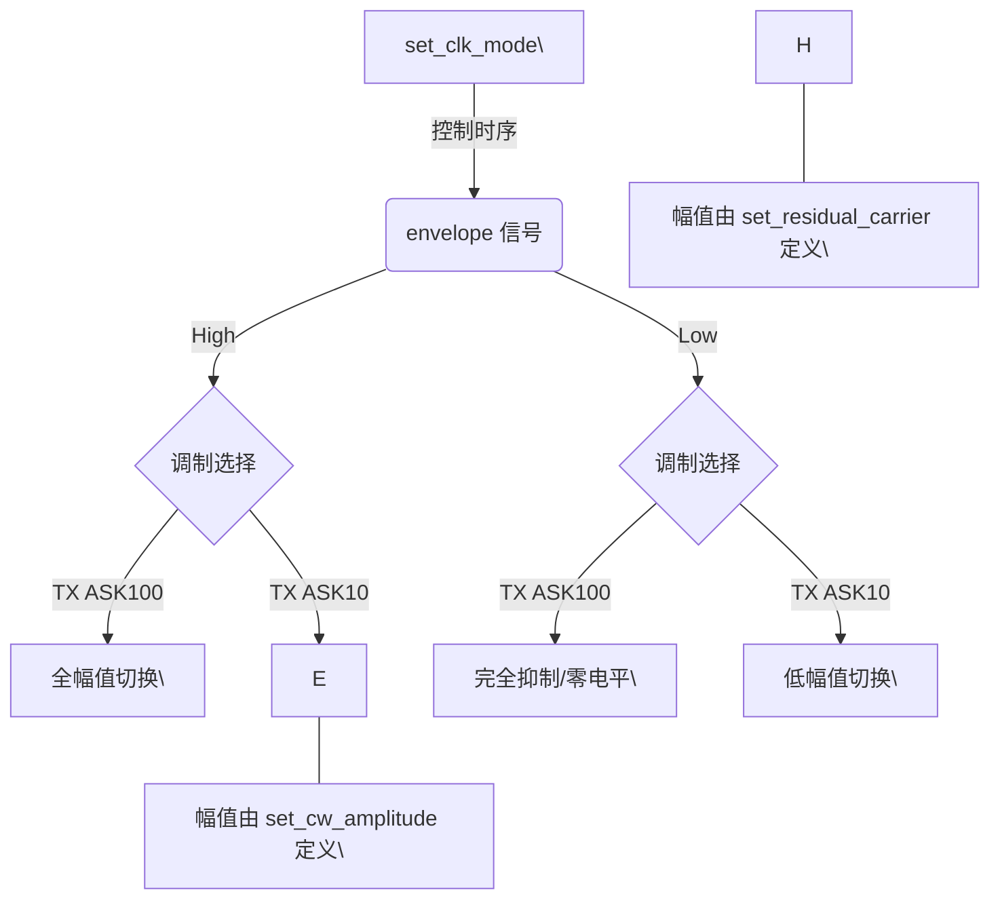
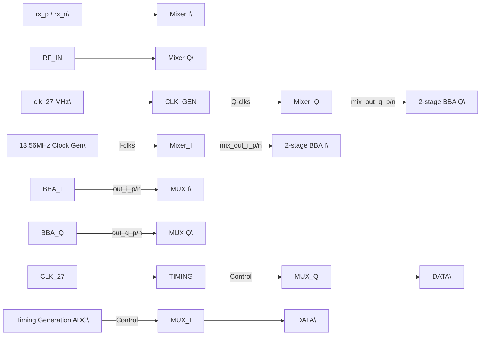
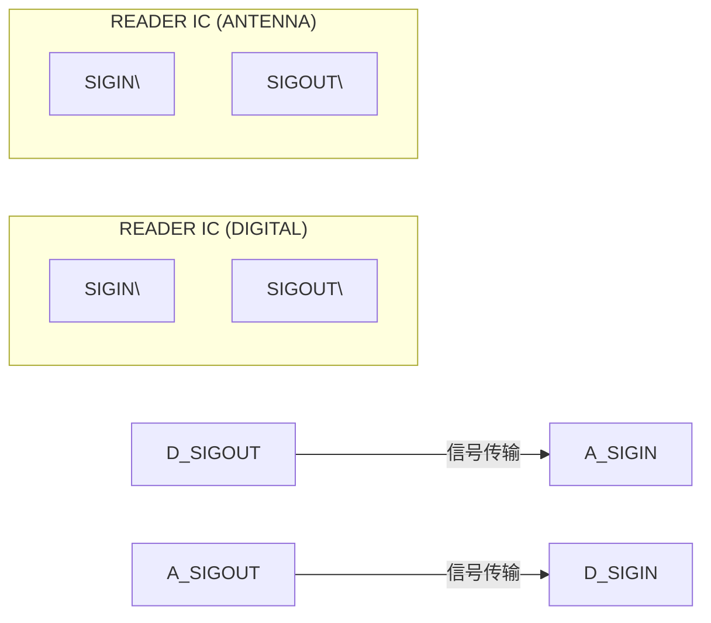
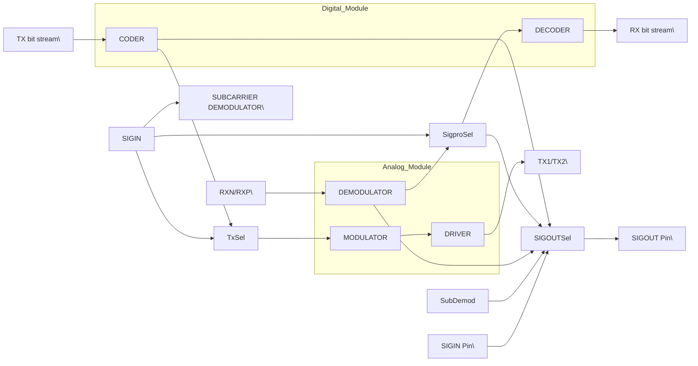

## **7.6 Analog interface and contactless UART**

### **7.6.1 General**

The integrated contactless UART supports the external host online with framing and
error checking of the protocol requirements up to 848 kbit/s. An external circuit can be
connected to the communication interface pins SIGIN and SIGOUT to modulate and
demodulate the data.

The contactless UART handles the protocol requirements for the communication
schemes in co-operation with the host. The protocol handling itself generates bit- and
byte-oriented framing and handles error detection like Parity and CRC according to the
different contactless communication schemes.

The size, the tuning of the antenna, and the supply voltage of the output drivers have an
impact on the achievable field strength. The operating distance between reader and card
depends additionally on the type of card used.

### **7.6.2 TX transmitter**

The signal delivered on pin TX1 and pin TX2 is the 13.56 MHz carrier modulated by an
envelope signal for energy and data transmission. It can be used to drive an antenna
directly, using a few passive components for matching and filtering, see Section 13. The
signal on TX1 and TX2 can be configured by the register DrvMode, see Section 8.8.1.

The modulation index can be set by the TxAmp.

Following figure shows the general relations during modulation

这份硬件时序图详细描述了两种不同幅移键控（ASK）调制模式在包络信号控制下的行为及其相关的配置参数。

**1. 【总览信息】**
本图定义了 $\text{TX ASK100}$ 与 $\text{TX ASK10}$ 两种调制模式在 $\text{envelope}$ 信号控制下的幅值响应关系及配置寄存器/参数的映射逻辑。

**2. 【核心组成部件】**
*   **控制信号 $\text{envelope}$**：调制包络控制线，决定载波的开启/抑制状态。
*   **输出通道 $\text{TX ASK100}$**：100% 幅移键控输出通道（全抑制模式）。
*   **输出通道 $\text{TX ASK10}$**：10% 幅移键控输出通道（残余载波模式）。
*   **配置参数**：
    *   `set_clk_mode`：影响 $\text{envelope}$ 信号的低电平周期/时序。
    *   `set_cw_amplitude`：定义信号的高电平峰值幅值。
    *   `set_residual_carrier`：定义 $\text{TX ASK10}$ 在抑制状态下的残余幅值。

**3. 【数据流向与交互】**

**信号逻辑响应表**
| 控制信号 ($\text{envelope}$) | $\text{TX ASK100}$ 输出状态 | $\text{TX ASK10}$ 输出状态 | 决定因素/参数 |
| :--- | :--- | :--- | :--- |
| **高电平 (High)** | 正常开关切换 (峰值 $\leftrightarrow$ 低) | 正常开关切换 (峰值 $\leftrightarrow$ 低) | 峰值由 `set_cw_amplitude` 定义 |
| **低电平 (Low)** | 信号被完全抑制 (恒定低) | 维持低幅值开关切换 | 低幅值由 `set_residual_carrier` 定义 |
| **电平转换周期** | 未标明 | 未标明 | 周期受 `set_clk_mode` 影响 |

**调制逻辑流转 (Mermaid)**

**4. 【功能总结性陈述】**

**事实描述**：
1. $\text{TX ASK100}$ 在 $\text{envelope}$ 为低电平时，输出被完全切断（电平为 0）。
2. $\text{TX ASK10}$ 在 $\text{envelope}$ 为低电平时，依然保持开关切换行为，但其幅值降低至由 `set_residual_carrier` 定义的水平。
3. 两种模式在 $\text{envelope}$ 为高电平时，均表现为由 `set_cw_amplitude` 定义的高幅值切换。
4. $\text{envelope}$ 的低电平持续时间受 `set_clk_mode` 影响。

**工程推论**：
1. \[工程推论\] $\text{TX ASK100}$ 实际上实现了 OOK (On-Off Keying) 调制，适用于对功耗要求极高或需要完全静默的通信场景。
2. \[工程推论\] $\text{TX ASK10}$ 模式通过保留 $\text{residual carrier}$（残余载波），旨在防止接收端 AGC (自动增益控制) 在信号低电平时因失去参考而漂移，从而提高接收端的同步稳定性。
3. \[工程推论\] `set_clk_mode` 可能对应波特率（Baud Rate）或特定的脉冲宽度调制（PWM）预设，用于定义调制帧的最小单元时间。

Note: When changing the continuous carrier amplitude, the residual carrier amplitude
also changes, while the modulation index remains the same.

CLRC663 All information provided in this document is subject to legal disclaimers. © NXP B.V. 2018. All rights reserved.
**Product data sheet** **Rev. 4.7 — 12 September 2018**
**COMPANY PUBLIC** **171147** **37 / 171**

**NXP Semiconductors** **CLRC663**

**High performance multi-protocol NFC frontend CLRC663 and CLRC663** _**plus**_

The registers Section 8.8 and Section 8.10 control the data rate, the framing during
transmission and the setting of the antenna driver to support the requirements at the
different specified modes and transfer speeds.

|TxClkMode (binary)|Tx1 and TX2 output|Remarks|
|---|---|---|
|000|High impedance|-|
|001|0|output pulled to 0 in any case|
|010|1|output pulled to 1 in any case|
|110|RF high side push|open-drain, only high side (push) MOS supplied with clock, clock parity defined by invtx; low side MOS is off|
|101|RF low side pull|open-drain, only low side (pull) MOS supplied with clock, clock parity defined by invtx; high side MOS is off|
|111|13.56 MHz clock derived from 27.12 MHz quartz divided by 2|push/pull Operation, clock polarity defined by invtx; setting for 10 % modulation|

Register TXamp and the bits for set_residual_carrier define the modulation index:

|set_residual_carrier (decimal)|residual carrier \[%\]|modulation index \[%\]|
|---|---|---|
|0|99|0.5|
|1|98|1.0|
|2|96|2.0|
|3|94|3.1|
|4|91|4.7|
|5|89|5.8|
|6|87|7.0|
|7|86|7.5|
|8|85|8.1|
|9|84|8.7|
|10|83|9.3|
|11|82|9.9|
|12|81|10.5|
|13|80|11.1|
|14|79|11.7|
|15|78|12.4|
|16|77|13.0|
|17|76|13.6|
|18|75|14.3|

CLRC663 All information provided in this document is subject to legal disclaimers. © NXP B.V. 2018. All rights reserved.
**Product data sheet** **Rev. 4.7 — 12 September 2018**
**COMPANY PUBLIC** **171147** **38 / 171**

**NXP Semiconductors** **CLRC663**

**High performance multi-protocol NFC frontend CLRC663 and CLRC663** _**plus**_

|set_residual_carrier (decimal)|residual carrier \[%\]|modulation index \[%\]|
|---|---|---|
|19|74|14.9|
|20|72|16.3|
|21|70|17.6|
|22|68|19.0|
|23|65|21.2|
|24|60|25.0|
|25|55|29.0|
|26|50|33.3|
|27|45|37.9|
|28|40|42.9|
|29|35|48.1|
|30|30|53.8|
|31|25|60.0|

Note: At VDD(TVDD) <5 V and residual carrier settings <50 %, the accuracy of the
modulation index may be low in dependency of the antenna tuning impedance

#### **7.6.2.1 Overshoot protection**

The CLRC663 provides an overshoot protection for 100 % ASK to avoid overshoots
during a PCD communication. Therefore two timers overshoot_t1 and overshoot_t2 can
be used.

During the timer overshoot_t1 runs an amplitude defined by set_cw_amplitude bits is
provided to the output driver. Followed by an amplitude denoted by set_residual_carrier
bits with the duration of overshoot_t2.

CLRC663 All information provided in this document is subject to legal disclaimers. © NXP B.V. 2018. All rights reserved.
**Product data sheet** **Rev. 4.7 — 12 September 2018**
**COMPANY PUBLIC** **171147** **39 / 171**

根据您提供的硬件波形图，我以资深硬件工程师的视角进行精准分析。

**1. 【总览信息】**
本图为一张电压-时间关系波形图（Timing Diagram），用于演示特定配置参数（`overshoot_t1` 和 `overhoot_t2`）对信号脉冲数量及其电平状态的影响。

**2. 【核心组成部件】**
*   **电压轴 (Y-axis)**：量程为 $-1.0\text{V}$ 至 $7.0\text{V}$，标称关键电平为 $0\text{V}$、$3.0\text{V}$ 和 $5.0\text{V}$。
*   **时间轴 (X-axis)**：单位为微秒 ($\mu\text{s}$)，显示时间窗口为 $2.50\mu\text{s}$ 至 $4.10\mu\text{s}$。
*   **信号波形**：由三组不同电平的脉冲序列组成。
*   **配置参数**：图中定义了两个控制变量：`overshoot_t1 = 2d` 和 `overhoot_t2 = 5d`。

**3. 【数据流向与交互】**

根据波形形态与下方 Caption 的对应关系，其逻辑结构解析如下表：

| 阶段 | 脉冲数量 | 电平高度 (V) | 对应参数 | 时间区间 (估算) | 状态描述 |
| :--- | :--- | :--- | :--- | :--- | :--- |
| 初始态 | 0 | $0\text{V}$ | 未标明 | $2.50\mu\text{s} \sim 2.9\mu\text{s}$ | 空闲/低电平 |
| 序列 1 | 2 | $5.0\text{V}$ | `overshoot_t1 = 2d` | $2.9\mu\text{s} \sim 3.1\mu\text{s}$ | 高电平脉冲组 |
| 序列 2 | 5 | $\approx 3.3\text{V}$ | `overhoot_t2 = 5d` | $3.1\mu\text{s} \sim 3.5\mu\text{s}$ | 中电平脉冲组 |
| 序列 3 | 8 | $5.0\text{V}$ | 未标明 | $3.5\mu\text{s} \sim 4.1\mu\text{s}$ | 高电平脉冲组 |

**信号状态转移逻辑 (ASCII Flow):**
`\[0V Idle\]` $\xrightarrow{t1}$ `\[5V Pulse $\times$ 2\]` $\xrightarrow{t2}$ `\[3.3V Pulse $\times$ 5\]` $\xrightarrow{?}$ `\[5V Pulse $\times$ 8\]`

**4. 【功能总结性陈述】**

**事实描述**：
1.  波形呈现出明显的分段特征，电平在 $0\text{V}$、$3.3\text{V}$（近似值）和 $5.0\text{V}$ 之间切换。
2.  参数 `overshoot_t1 = 2d` 严格对应了第一组 $5.0\text{V}$ 电平的 2 个脉冲。
3.  参数 `overhoot_t2 = 5d`（原图拼写为 overhoot）严格对应了第二组 $\approx 3.3\text{V}$ 电平的 5 个脉冲。
4.  整个信号序列在约 $1.6\mu\text{s}$ 的时间窗内完成。

**工程推论**：
1.  **\[工程推论\]**：参数后缀 `d` 极大概率代表 "Decimal"（十进制），表示该参数定义的不是时间长度，而是**脉冲的计数值 (Count)**。
2.  **\[工程推论\]**：由于波形出现了 $3.3\text{V}$ 和 $5.0\text{V}$ 两种高电平，该信号可能属于某种**多电平调制协议**或**电平转换测试波形**。$5.0\text{V}$ 脉冲在 $\approx 3.3\text{V}$ 基础之上被定义为 "Overshoot"（过冲/超额电平），用于触发特定的硬件阈值或进行电压鲁棒性测试。
3.  **\[工程推论\]**：这种通过定义脉冲数量来标识状态的模式，常见于简单的硬件握手协议或特定的非易失性存储器 (NVM) 的编程指令序列。

**NXP Semiconductors** **CLRC663**

**High performance multi-protocol NFC frontend CLRC663 and CLRC663** _**plus**_

#### **7.6.2.2 Bit generator**

The default coding of a data stream is done by using the Bit-Generator. It is activated
when the value of TxFrameCon.DCodeType is set to 0000 (bin). The Bit-Generator
encodes the data stream byte-wise and can apply the following encoding steps to each
data byte.

1. Add a start-bit of specified type at beginning of every byte
2. Add a stop-bit and EGT bits of a specified type. The maximum number of EGT bit is 6,
only full bits are supported
3. Add a parity-bit of a specified type
4. TxLastBits (skips a given number of bits at the end of the last byte in a frame)
5. Encrypt data-bit (MIFARE Classic encryption)

It is not possible to skip more than 8 bit of a single byte!

By default, data bytes are always treated LSB first.

### **7.6.3 Receiver circuitry**

#### **7.6.3.1 General**

The CLRC663 features a versatile quadrature receiver architecture with fully differential
signal input at RXP and RXN. It can be configured to achieve optimum performance for
reception of various 13.56 MHz based protocols.

For all processing units various adjustments can be made to obtain optimum
performance.

#### **7.6.3.2 Block diagram**

The following figure shows the block diagram of the receiver circuitry. The receiving
process includes several steps. First the quadrature demodulation of the carrier signal of
13.56 MHz is done. Several tuning steps in this circuit are possible.

CLRC663 All information provided in this document is subject to legal disclaimers. © NXP B.V. 2018. All rights reserved.
**Product data sheet** **Rev. 4.7 — 12 September 2018**
**COMPANY PUBLIC** **171147** **40 / 171**

根据您提供的硬件波形图，我作为资深硬件工程师，现将其解析如下：

**1. 【总览信息】**
该图片为一张电压-时间（V-t）波形图，用于展示在特定参数配置（$\text{overshoot\_t1} = 0\text{d}$，$\text{overshoot\_t2} = 5\text{d}$）下，信号在 $5\mu\text{s}$ 时间周期内的幅值变化与时序特征。

**2. 【核心组成部件】**
*   **坐标系**：
    *   **纵轴 (Y-axis)**：电压值 (V)，量程为 $-1.0\text{V}$ 至 $7.0\text{V}$。
    *   **横轴 (X-axis)**：时间轴 ($\mu\text{s}$)，量程为 $0$ 至 $5\mu\text{s}$。
*   **被测信号**：一个具有高频翻转特征的数字波形，包含三个明显的电压能级（$0\text{V}$、$ \approx 3.3\text{V}$、$5.0\text{V}$）。
*   **控制参数**（见图注）：
    *   $\text{overshoot\_t1} = 0\text{d}$
    *   $\text{overshoot\_t2} = 5\text{d}$

**3. 【数据流向与交互】**
由于此图为静态波形快照而非逻辑框图，其“交互”体现为电压随时间的状态迁移。以下为波形分段解析表：

| 时间段 ($\mu\text{s}$) | 信号状态/特征 | 电压摆幅 (V) | 备注 |
| :--- | :--- | :--- | :--- |
| $0 \to 1.5$ | 高频脉冲串 | $0\text{V} \to 5.0\text{V}$ | 满幅值翻转 |
| $1.5 \to 3.0$ | 低电平维持 | $\approx 0\text{V}$ | 信号静默期/空闲态 |
| $3.0 \to 3.4$ | 低幅值脉冲串 | $0\text{V} \to \approx 3.3\text{V}$ | 异常或特定电平翻转 |
| $3.4 \to 5.0$ | 高频脉冲串 | $0\text{V} \to 5.0\text{V}$ | 恢复满幅值翻转 |

**4. 【功能总结性陈述】**

**事实描述**：
*   信号最高电平稳定在 $5.0\text{V}$，最低电平稳定在 $0\text{V}$。
*   在 $3.0\mu\text{s}$ 至 $3.4\mu\text{s}$ 期间，信号的最高电平从 $5.0\text{V}$ 下降至约 $3.3\text{V}$。
*   波形在 $1.5\mu\text{s}$ 至 $3.0\mu\text{s}$ 之间处于低电平直线状态。
*   图注明确指定了两个参数 $\text{overshoot\_t1}$ 和 $\text{overshoot\_t2}$ 的数值。

**工程推论**：
*   **\[工程推论\]** 波形中极细的垂直线表明该信号为高频方波（可能为时钟信号或高速数据流），当前的显示缩放比例导致单个脉冲宽度极窄。
*   **\[工程推论\]** 观察 $3.0\mu\text{s}$ 至 $3.4\mu\text{s}$ 的电压跌落（$5\text{V} \to 3.3\text{V}$），这极大概率是在模拟一种“欠幅”或“电平转换”的测试用例，用于验证接收端在非标准电压水平下的逻辑判定能力。
*   **\[工程推论\]** 结合图注中的 $\text{overshoot\_t}$ 参数，此图应出自硬件信号完整性（SI）验证报告。$\text{overshoot\_t1}=0\text{d}$ 可能意味着在第一个时间窗口内禁用了过冲检测或设定过冲时间为0，而 $\text{overshoot\_t2}=5\text{d}$ 可能定义了检测窗口的边界或延迟量。
*   **\[工程推论\]** 信号在 $1.5\mu\text{s}$ 处的突跳以及 $3.0\mu\text{s}$ 处的恢复，符合典型的协议帧间隔（Inter-frame Gap）或同步头触发特征。

**NXP Semiconductors** **CLRC663**

**High performance multi-protocol NFC frontend CLRC663 and CLRC663** _**plus**_

这份硬件电路图是一个典型的射频/基带接收前端（Receiver Frontend）的逻辑框图。以下是基于资深硬件工程师视角的精准解析：

**1. 【总览信息】**
该图片定义了一个基于 I/Q 正交解调结构的接收机电路，用于将差分输入信号 $\text{rx\_p/n}$ 通过 13.56 MHz 混频、基带放大（BBA）及定时控制，最终转换为可供 ADC 采样的数字化数据流。

**2. 【核心组成部件】**

| 部件名称 | 数量 | 关键输入/控制信号 | 核心功能 |
| :--- | :---: | :--- | :--- |
| **I/O Clock Generation** | 1 | $\text{clk\_27 MHz}$ | 将 27 MHz 时钟转换为 13.56 MHz 的 I/Q 正交时钟 ($\text{I-clks}$, $\text{Q-clks}$) |
| **Mixer (混频器)** | 2 | $\text{rx\_p/n}$, $\text{I/Q-clks}$, $\text{fully/quasi-differential}$ | 将射频输入信号下变频至基带（I 路和 Q 路） |
| **2-stage BBA (基带放大器)** | 2 | $\text{rcv\_gain<1:0>}$, $\text{rcv\_hpcf<1:0>}$ | 对混频后的差分信号进行两级放大及高通滤波处理 |
| **Timing Generation ADC** | 1 | $\text{clk\_27 MHz}$ | 生成 ADC 采样定时控制信号及 $\text{Adc\_data\_ready}$ 标志 |
| **Output MUX (选择器)** | 2 | $\text{Timing Generation}$ 控制端 | 根据采样时序切换/输出 $\text{out\_i/q}$ 信号至数据端 |

---

**3. 【数据流向与交互】**

**3.1 信号拓扑结构 (Mermaid)**

**3.2 关键信号定义表**
| 信号名称 | 类型 | 描述 | 备注 |
| :--- | :---: | :--- | :--- |
| $\text{rx\_p / rx\_n}$ | 差分输入 | 射频输入信号 | - |
| $\text{I-clks / Q-clks}$ | 时钟 | 13.56 MHz 正交本地振荡信号 | 由 27 MHz 分频产生 |
| $\text{rcv\_gain<1:0>}$ | 2-bit 总线 | BBA 增益控制 | 决定放大倍数 |
| $\text{rcv\_hpcf<1:0>}$ | 2-bit 总线 | BBA 高通滤波截止频率控制 |- |
| $\text{Adc\_data\_ready}$ | 状态输出 | ADC 数据就绪指示信号 | 由 Timing Generation 产生 |

---

**4. 【功能总结性陈述】**

**事实描述**
*   **架构方案**：采用 I/Q 两路并行处理架构，实现对输入差分信号 $\text{rx\_p/n}$ 的正交解调。
*   **频率特征**：系统主频为 $\text{clk\_27 MHz}$，本地混频频率为 $13.56 \text{ MHz}$。
*   **信号链条**：$\text{RF Input} \rightarrow \text{Mixing} \rightarrow \text{Baseband Amplification (2-stage)} \rightarrow \text{Timing MUX} \rightarrow \text{Digital Data}$。
*   **控制维度**：BBA 模块支持可编程增益 ($\text{rcv\_gain}$) 和高通滤波配置 ($\text{rcv\_hpcf}$)。

**工程推论**
*   **\[工程推论\] 应用场景**：由于出现了 $13.56 \text{ MHz}$ 这一典型频率，该电路极大概率应用于 **NFC (近场通信) 或 RFID (射频识别)** 的接收端。
*   **\[工程推论\] 混频模式**：$\text{fully/quasi-differential}$ 控制端表明混频器支持全差分和准差分两种工作模式，用于在功耗和共模抑制比 (CMRR) 之间进行权衡。
*   **\[工程推论\] 采样机制**：$\text{Timing Generation ADC}$ 驱动的 MUX 表明该系统并非连续采样，而是在特定的相位点对 I/Q 两路信号进行时间片轮询或同步采样，以匹配 ADC 的转换速率。
*   **\[工程推论\] 滤波目的**：$\text{rcv\_hpcf}$ (High Pass Corner Frequency) 的存在是为了滤除混频后产生的直流偏移 (DC Offset) 以及低频干扰，确保基带信号在 ADC 的动态范围内。

The receiver can also be operated in a single ended mode. In this case, the
Rcv_RX_single bit has to be set. In the single ended mode, the two receiver pins RXP
and RXN need to be connected together and will provide a single ended signal to the
receiver circuitry.

When using the receiver in a single ended mode, the receiver sensitivity is decreased
and the achievable reading distance might be reduced, compared to the fully differential
mode.

|Mode|rcv_rx_single|pins RXP and RXN|
|---|---|---|
|Fully differential|0|provide differential signal from differential antenna by separate rx-coupling branches|
|Quasi differential|1|connect RXP and RXN together and provide single ended signal from antenna by a single rx-coupling branch|

The quadrature-demodulator uses two different clocks, Q-clock and I-clock, with a
phase shift of 90° between them. Both resulting baseband signals are amplified, filtered,
digitized and forwarded to a correlation circuitry.

The typical application is intended to implement the Fully differential mode and
will deliver maximum reader/writer distance. The Quasi differential mode can be
used together with dedicated antenna topologies that allow a reduction of matching
components at the cost of overall reading performance.

During low-power card detection the DC levels at the I- and Q-channel mixer outputs
are evaluated. This requires that mixers are directly connected to the ADC. This can be
configured by setting the bit Rx_ADCmode in register Rcv (38h).

### **7.6.4 Active antenna concept**

Two main blocks are implemented in the CLRC663. A digital circuitry, comprising state
machines, coder and decoder logic and an analog circuitry with the modulator and
antenna drivers, receiver and amplification circuitry. For example, the interface between

CLRC663 All information provided in this document is subject to legal disclaimers. © NXP B.V. 2018. All rights reserved.
**Product data sheet** **Rev. 4.7 — 12 September 2018**
**COMPANY PUBLIC** **171147** **41 / 171**

**NXP Semiconductors** **CLRC663**

**High performance multi-protocol NFC frontend CLRC663 and CLRC663** _**plus**_

these two blocks can be configured in the way, that the interfacing signals may be routed
to the pins SIGIN and SIGOUT. The most important use of this topology is the active
antenna concept where the digital and the analog blocks are separated. This opens the
possibility to connect e.g. an additional digital block of another CLRC663 device with a
single analog antenna frontend.

这份硬件解析报告严格遵循事实与推论分离的原则。

**1. 【总览信息】**
该图为“有源天线概念（Active Antenna concept）”的系统级功能框图，描述了数字处理单元与天线前端单元之间的双向信号交互链路。

**2. 【核心组成部件】**
| 部件名称 | 标识/类型 | 功能描述 |
| :--- | :--- | :--- |
| **READER IC (DIGITAL)** | 数字处理芯片 | 负责系统的数字逻辑处理与信号调度。 |
| **READER IC (ANTENNA)** | 天线前端芯片 | 负责天线接口的信号转换与驱动。 |

**3. 【数据流向与交互】**
信号交互采用双向链路结构，具体流向如下：

**交互关系表：**
| 发送端 (Source) | 发送引脚 | 接收端 (Destination) | 接收引脚 |
| :--- | :--- | :--- | :--- |
| READER IC (DIGITAL) | SIGOUT | READER IC (ANTENNA) | SIGIN |
| READER IC (ANTENNA) | SIGOUT | READER IC (DIGITAL) | SIGIN |

**4. 【功能总结性陈述】**
- **事实描述**：
  - 该架构由两个功能分离的 IC 组成：一个专注于数字域（DIGITAL），一个专注于天线域（ANTENNA）。
  - 两者之间通过两组对称的信号线（SIGOUT $\rightarrow$ SIGIN）构建了一个全双工或双向通信闭环。
  - 图表编号为 Figure 29，文档标识符为 001aam307。

- **工程推论**：
  - \[工程推论\] **分布式架构**：采用“Active Antenna”概念意味着将模拟前端（AFE）或功率放大电路从主控 IC 移至靠近天线端。这种设计通常是为了解决长电缆传输导致的信号衰减或失配问题，从而提高读取距离或信号质量。
  - \[工程推论\] **接口性质**：由于 SIGIN/SIGOUT 仅以单线形式标注，且处于数字与天线模块之间，这极可能是经过编码的数字基带信号或差分信号对的简化表示，而非直接的 RF 射频信号。
  - \[工程推论\] **功能分工**：READER IC (DIGITAL) 可能承担协议栈处理、数据解码及系统管理职能；而 READER IC (ANTENNA) 则承担模数转换 (ADC)、数模转换 (DAC) 以及天线阻抗匹配等物理层职能。

The Table 32and Table 33 describe the necessary register configuration for the use case
active antenna concept.

|Register|Value (binary)|Description|
|---|---|---|
|SigOut.SigOutSel|0100|TxEnvelope|
|Rcv.SigInSel|10 11|Receive over SigIn (ISO/IEC14443A) Receive over SigIn (Generic Code)|
|DrvCon.TxSel|00|Low (idle)|

|Register|Value (binary)|Description|
|---|---|---|
|SigOut.SigOutSel|0110 0111|Generic Code (Manchester) Manchester with Subcarrier (ISO/IEC14443A)|
|Rcv.SigInSel|01|Internal|
|DrvCon.TxSel|10|External (SigIn)|
|RxCtrl.RxMultiple|1|RxMultiple on|

The interface between these two blocks can be configured in the way, that the interfacing
signals may be routed to the pins SIGIN and SIGOUT (see Figure 30).

This topology supports, that some parts of the analog part of the CLRC663 may be
connected to the digital part of another device.

The switch SigOutSel in registerSigOut can be used to measure signals. This is
especially important during the design-in phase or for test purposes to check the
transmitted and received data.

However, the most important use of SIGIN/SIGOUT pins is the active antenna concept.
An external active antenna circuit can be connected to the digital circuit of the CLRC663.
SigOutSel has to be configured in that way that the signal of the internal Miller Coder
is sent to SIGOUT pin (SigOutSel = 4). SigInSel has to be configured to receive
Manchester signal with subcarrier from SIGIN pin (SigInSel = 1).

It is possible, to connect a passive antenna to pins TX1, TX2 and RX (via the appropriate
filter and matching circuit) and at the same time an active antenna to the pins SIGOUT
and SIGIN. In this configuration, two RF-parts may be driven (one after another) by a
single host processor.

CLRC663 All information provided in this document is subject to legal disclaimers. © NXP B.V. 2018. All rights reserved.
**Product data sheet** **Rev. 4.7 — 12 September 2018**
**COMPANY PUBLIC** **171147** **42 / 171**

**NXP Semiconductors** **CLRC663**

**High performance multi-protocol NFC frontend CLRC663 and CLRC663** _**plus**_

这是一份针对该硬件原理框图的资深硬件工程师级解析报告。

**1. 【总览信息】**
该图定义了一个集成数字与模拟模块的信号路由系统，核心功能是实现发送（TX）与接收（RX）路径的信号编码/解码、调制/解调，以及通过多路选择器（Mux）实现信号的灵活路由与内部状态监控（SIGOUT）。

---

**2. 【核心组成部件】**
| 部件名称 | 所属模块 | 核心功能 |
| :--- | :--- | :--- |
| **CODER** | DIGITAL MODULE | 将 `TX bit stream` 转换为调制所需的基带信号或控制信号。 |
| **DECODER** | DIGITAL MODULE | 将接收到的模拟/数字信号还原为 `RX bit stream`。 |
| **MODULATOR** | ANALOG MODULE | 对输入信号进行物理层调制。 |
| **DRIVER** | ANALOG MODULE | 信号功率放大或电平转换，驱动输出端 `TX1`, `TX2`。 |
| **DEMODULATOR** | ANALOG MODULE | 对输入端 `RXN`, `RXP` 的差分信号进行解调。 |
| **SUBCARRIER DEMODULATOR** | 独立/中间模块 | 对 `SIGIN` 进行子载波解调，提取包络信息。 |
| **SIGOUTSel\[4:0\]** | 路由逻辑 | 5位宽选择器，将内部10路不同信号路由至 `SIGOUT` 引脚。 |
| **TxCon.TxSel\[1:0\]** | 路由逻辑 | 2位宽选择器，决定进入调制器的信号源。 |
| **Sigpro_in_sel\[1:0\]** | 路由逻辑 | 2位宽选择器，决定进入解码器的信号源。 |

---

**3. 【数据流向与交互】**

**3.1 信号路由映射表**
**表1：SIGOUTSel \[4:0\] 映射关系**
| 索引 (Dec) | 路由信号名称 | 信号来源 |
| :--- | :--- | :--- |
| 0, 1 | tri-state | 来自 CODER 输出端 |
| 2 | LOW | 低电平 (定电平) |
| 3 | HIGH | 高电平 (定电平) |
| 4 | TX envelope | 来自 CODER |
| 5 | TX active | 来自 CODER / 逻辑控制线 |
| 6 | S3C signal | 直接来自 `SIGIN` 引脚 |
| 7 | RX envelope | 来自 SUBCARRIER DEMODULATOR |
| 8 | RX active | 来自 ANALOG MODULE $\rightarrow$ DEMODULATOR |
| 9 | RX bit signal | 来自 `Sigpro_in_sel` 输出 $\rightarrow$ DECODER 路径 |

**表2：TxCon.TxSel \[1:0\] 映射关系**
| 索引 (Dec) | 路由信号名称 | 信号来源 |
| :--- | :--- | :--- |
| 0 | No_nodulation | 未定义/直通 (注：原图疑似 Modulation 误写) |
| 1 | TX envelope | 来自 `SIGOUTSel` 输出路径/CODER |
| 2 | SIGIN | 直接来自 `SIGIN` 引脚 |
| 3 | RFU | 保留 (Reserved for Future Use) |

**表3：Sigpro_in_sel \[1:0\] 映射关系**
| 索引 (Dec) | 路由信号名称 | 信号来源 |
| :--- | :--- | :--- |
| 0 | tri-state | 高阻态 |
| 1 | internal analog block | 来自 ANALOG MODULE $\rightarrow$ DEMODULATOR |
| 2 | SIGIN over envelope | 来自 `SIGIN` 引脚 |
| 3 | SIGIN generic | 来自 `SIGIN` 引脚 |

**3.2 数据流转逻辑 (Mermaid)**

---

**4. 【功能总结性陈述】**

**事实描述**
1. **双向链路结构**：系统包含完整的 TX（Bit $\rightarrow$ Coder $\rightarrow$ Mod $\rightarrow$ Driver $\rightarrow$ Pin）和 RX（Pin $\rightarrow$ Demod $\rightarrow$ SigproSel $\rightarrow$ Decoder $\rightarrow$ Bit）链路。
2. **灵活的监控机制**：通过 `SIGOUTSel` 5-bit 寄存器，用户可以将 TX/RX 链路中的关键节点信号（如包络、激活状态、位信号）通过单根 `SIGOUT` 引脚输出，用于调试或外部同步。
3. **信号源多样性**：调制器（MODULATOR）的输入源不仅限于内部编码后的信号，还支持外部 `SIGIN` 直接注入。
4. **解调路径分叉**：接收端通过 `Sigpro_in_sel` 可在内部解调信号与外部 `SIGIN` 信号之间切换。

**工程推论**
1. **\[工程推论\] 调试能力分析**：`SIGOUTSel` 的设计极大概率是为了在不增加物理引脚的情况下，实现芯片内部信号的“虚拟探针”功能，方便在量产测试（ATE）阶段快速判定故障点（例如判定故障在 CODER 还是 MODULATOR）。
2. **\[工程推论\] 信号类型分析**：`S3C signal` 及 `SUBCARRIER DEMODULATOR` 的存在，表明该硬件可能采用了子载波调制技术（Subcarrier Modulation），常用于电磁兼容性要求高或噪声环境复杂的工业通信链路。
3. **\[工程推论\] 拼写错误识别**：`TxCon.TxSel` 表中的 `No_nodulation` 应该是 `No_modulation` (无调制/直通) 的拼写错误。
4. **\[工程推论\] RX 路径冗余**：`Sigpro_in_sel` 将 `SIGIN` 引入解码器路径，暗示该硬件支持某种形式的环回测试（Loopback Test），允许外部信号模拟接收信号以验证解码逻辑的正确性。

|Col1|Col2|Col3|
|---|---|---|
||||
||||

CLRC663 All information provided in this document is subject to legal disclaimers. © NXP B.V. 2018. All rights reserved.
**Product data sheet** **Rev. 4.7 — 12 September 2018**
**COMPANY PUBLIC** **171147** **43 / 171**

**NXP Semiconductors** **CLRC663**

**High performance multi-protocol NFC frontend CLRC663 and CLRC663** _**plus**_

### **7.6.5 Symbol generator**

The symbol generator is used to create various protocol symbols. These can be e.g.
SOF or EOF symbols as they are used by the ISO14443 protocols or proprietary protocol
symbols like the CS symbol as used by the ICODE EPC protocol.

Symbols are defined by means of the symbol definition registers and the mode registers.
Four different symbols can be used. Two of them, Symbol0 and Symbol1 have a
maximum pattern length of 16 bit and feature a burst length of up to 256 bits of either
logic "0" or logic "1". The Symbol2 and Symbol3 are limited to 8-bit pattern length and do
not support a burst.

The definition of symbol patterns is done by writing the bit sequence of the pattern to
the appropriate register. The last bit of the pattern to be sent is located at the LSB of
the register. By setting the symbol length in the symbol-length register (TxSym10Len
and TxSym32Len), the definition of the symbol pattern is completed. All other bits at bitposition higher than the symbol length in the definition register are ignored. (Example:
length of Symbol2 = 5, bit7 and bit6 are ignored, bit5 to bit0 define the symbol pattern,
bit5 is sent first)

Which symbol-pattern is sent can be configured in the TxFrameCon register. Symbol0,
Symbol1 and Symbol2 can be sent before data packets, Symbol1, Symbol2 and Symbol3
can be sent after data packets. Each symbol is defined by a set of registers. Symbols are
configured by a pair of registers. Symbol0 and Symbol1 share the same configuration
and Symbol2 and Symbol3 share the same configuration. The configuration includes
setting of bit-clock- and subcarrier-frequency, as well as selection of the pulse type/length
and the envelope type.
