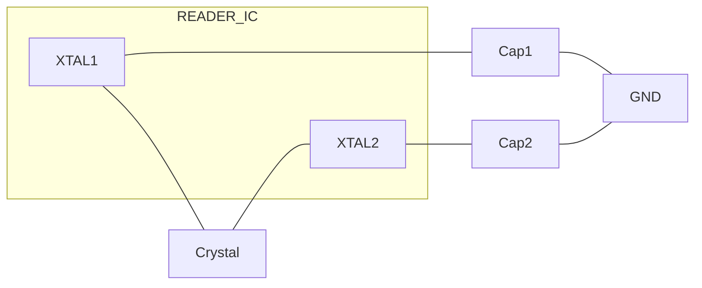

## **7.8 Clock generation**

### **7.8.1 Crystal oscillator**

The clock applied to the CLRC663 acts as time basis for generation of the carrier sent
out at TX and for the quadrature mixer I and Q clock generation as well as for the coder
and decoder of the synchronous system. Therefore stability of the clock frequency is an
important factor for proper performance. To obtain highest performance, clock jitter has
to be as small as possible. This is best achieved by using the internal oscillator buffer
with the recommended circuitry.

这份硬件解析报告严格遵循“事实与推论分离”的原则，对提供的电路图进行精准分析。

**1. 【总览信息】**
本图展示了一个 Reader IC（阅读器芯片）的晶体振荡器（Crystal Oscillator）外围电路连接方案。

**2. 【核心组成部件】**
| 部件名称 | 图中标识 | 规格/数值 | 功能描述 |
| :--- | :--- | :--- | :--- |
| 主控芯片 | READER IC | 未标明 | 提供内部反相放大器，用于构建振荡电路 |
| 晶体谐振器 | Crystal | 27.12 MHz | 提供精准的基准频率 |
| 负载电容 | Capacitor $\times 2$ | 未标明 | 配合晶体实现起振并稳定频率 |
| 接地点 | Ground | 未标明 | 电路参考电位 |

**3. 【数据流向与交互】**

**拓扑连接关系：**

**引脚定义与物理连接表：**
| 信号端点 | 连接对象 | 连接类型 | 备注 |
| :--- | :--- | :--- | :--- |
| **XTAL1** | 晶体(Crystal)端点A | 串联 | 振荡回路输入/输出端 |
| **XTAL1** | 负载电容1 $\rightarrow$ GND | 并联 | 负载电容 |
| **XTAL2** | 晶体(Crystal)端点B | 串联 | 振荡回路输入/输出端 |
| **XTAL2** | 负载电容2 $\rightarrow$ GND | 并联 | 负载电容 |

**4. 【功能总结性陈述】**

**事实描述：**
- 该电路采用典型的皮尔斯（Pierce）振荡电路结构。
- 晶体谐振器的标称频率为 $27.12\text{ MHz}$。
- 晶体两端分别连接至 Reader IC 的 $\text{XTAL1}$ 和 $\text{XTAL2}$ 引脚。
- $\text{XTAL1}$ 和 $\text{XTAL2}$ 分别通过两个未标明数值的电容接地。

**工程推论：**
- **\[工程推论\]** $27.12\text{ MHz}$ 是 $13.56\text{ MHz}$ 的整 2 倍频。由于 $13.56\text{ MHz}$ 是 NFC（近场通信）和 RFID（高频）的全球标准工作频率，可推断该 Reader IC 极大概率是一款 NFC/RFID 阅读器芯片，采用 $27.12\text{ MHz}$ 作为系统主频，随后通过内部的分频器产生 $13.56\text{ MHz}$ 的载波频率。
- **\[工程推论\]** 虽然电容值未标明，但根据该频率段的常规设计，这两个负载电容的典型值通常在 $12\text{pF}$ 至 $22\text{pF}$ 之间，用于补偿晶体的杂散电容并确保在 $27.12\text{ MHz}$ 处精确谐振。

|Symbol|Parameter|Conditions|Min|Typ|max|Unit|
|---|---|---|---|---|---|---|
|fxtal|crystal frequency||-|27.12|-|MHz|
|Δfxtal/fxtal|relative crystal frequency variation||-250|-|+250|ppm|
|ESR|equivalent series resistance||-|50|100|Ω|
|CL|load capacitance||-|10|-|pF|
|Pxtal|crystal power dissipation||-|50|100|μW|

CLRC663 All information provided in this document is subject to legal disclaimers. © NXP B.V. 2018. All rights reserved.
**Product data sheet** **Rev. 4.7 — 12 September 2018**
**COMPANY PUBLIC** **171147** **49 / 171**

**NXP Semiconductors** **CLRC663**

**High performance multi-protocol NFC frontend CLRC663 and CLRC663** _**plus**_

### **7.8.2 IntegerN PLL clock line**

The CLRC663 is able to provide a clock with configurable frequency at CLKOUT from
1 MHz to 24 MHz (PLL_Ctrl and PLL_DIV). There it can serve as a clock source to a
microcontroller which avoids the need of a second crystal oscillator in the reader system.
Clock source for the IntegerN-PLL is the 27.12 MHz crystal oscillator.

Two dividers are determining the output frequency. First a feedback integer-N divider
configures the VCO frequency to be N × fin/2 (control signal pll_set_divfb). As supported
Feedback Divider Ratios are 23, 27 and 28, VCO frequencies can be 23 × fin / 2 (312
MHz), 27 × fin / 2 (366 MHz) and 28 × fin / 2 (380 MHz).

The VCO frequency is divided by a factor which is defined by the output divider
(pll_set_divout). The following table shows the accuracy achieved for various frequencies
(integer multiples of 1 MHz and some typical RS232 frequencies) and the divider ratios to
be used. The register bit ClkOutEn enables the clock at CLKOUT pin.

The following formula can be used to calculate the output frequency:

fout = 13.56 MHz × PLLDiv_FB /PLLDiv_Out

**Table 44. Divider values for selected frequencies using the integerN PLL**

|Frequency \[MHz\]|4|6|8|10|12|20|24|1.8432|3.6864|
|---|---|---|---|---|---|---|---|---|---|
|PLLDiv_FB|23|27|23|28|23|28|23|28|28|
|PLLDiv_Out|78|61|39|38|26|19|16|206|103|
|accuracy \[%\]|0.04|0.03|0.04|0.08|0.04|0.08|0.04|0.01|0.01|

### **7.8.3 Low Frequency Oscillator (LFO)**

The CLRC663 family implements an Low-Frequency Oscillator (LFO). Timer T4 can be
configured to use a clock generated by this LFO as input clock, and can be configured
as wakeup counter. As wakeup counter, the timer T4 allows to wake up the system in
regular time intervals which allows to design a reader that is regularly polling for card
presence or implements a low-power card detection (LPCD).

The LFO is trimmed during chip production to run at 16 kHz. Unless a high accuracy
of the LFO is required by the application, and the device is operated in an environment
with changing ambient temperatures, trimming of the LFO is not required. For a typical
application making use of the LFO for wake-up from power saving mode, the trim value
set during production can be used.

Optional trimming to achieve a higher accuracy of the 16 kHz LFO clock is supported by
a digital state machine which compares LFO-clock to a reference clock generated by the
connected 27.12Mhz crystal. As reference clock frequency for trimming of the LFO, a
13.56 MHz clock (27.12Mhz divided by 2 ) input clock to one of the timers T0,T1,T2 or T3
is used.

One of the timers T0,T1,T2,T3 with an input clock of 13,56 MHz crystal clock is used to
count one clock period of the LFO. For an LFO Clock running at 16KHz this would result
in 848 wakeup timer clocks of timer Tx (T0, T1, T2, T3). Therefrore, the timer count value
Tx at the end of a trimming cycle is expected to be 176 (wakeup timer is counting down:
1023-848=175, +/- 1 tolerance is accepted). The trim cycle is executed once in the T4
timer cycle. Therefore the T4 autoload value shall be bigger than 0x05 to ensure that
one trimming cycle takes place before T4 expires. The Tx timer value is reloaded to 1023

CLRC663 All information provided in this document is subject to legal disclaimers. © NXP B.V. 2018. All rights reserved.
**Product data sheet** **Rev. 4.7 — 12 September 2018**
**COMPANY PUBLIC** **171147** **50 / 171**

**NXP Semiconductors** **CLRC663**

**High performance multi-protocol NFC frontend CLRC663 and CLRC663** _**plus**_

during the start of an Auto trim cycle. This happens every time, once after the T4 timer
underflows.

At the end of each trim cycle, the timer value is checked:

**•** Timer Tx value < 174: LFO Frequency is too low and the trim value is incremented by 1
on T4 Timer event

**•** Timer Tx value > 176: LFO Frequency is too high and the trim value is decremented by
1 on T4 Timer event

**•** Timer Tx value is within 174 and 176: LFO Frequency = 16 KHz and trimming
procedure is stopped

The cycle proceeds until the autotrimm function is stopped (Timer Tx value is within 174
and 176).

In addition, the trimming cycle can be aborted by sending an IDLE Command from the
host to cancel the current command execution. T3 is not allowed to be used in case
T4AutoLPCD is set in parallel. It is not required to configure a TXStart condition with
underflow. The T0/1/2/3 timer will typically not underflow. It may happen if the LPO clock
is very slow, but it is not required to take an action to generate this event.
