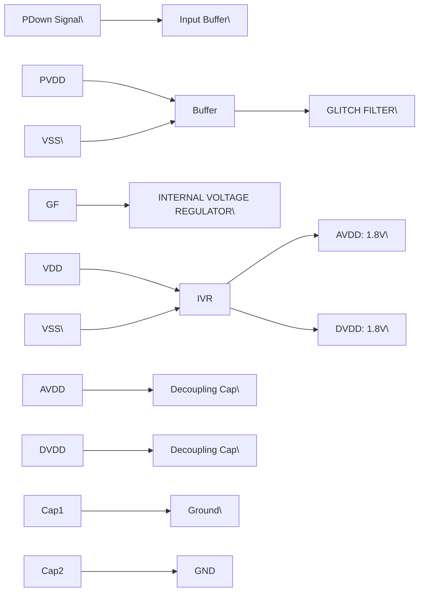

## **7.9 Power management**

### **7.9.1 Supply concept**

The CLRC663 is supplied by VDD (Supply Voltage), PVDD (Pad Supply) and TVDD
(Transmitter Power Supply). These three voltages are independent from each other.

To connect the CLRC663 to a Microcontroller supplied by 3.3 V, PVDD and VDD shall be
at a level of 3.3 V, TVDD can be in a range from 3.3 V to 5.0 V. A higher supply voltage
at TVDD results in a higher field strength.

Independent of the voltage it is recommended to buffer these supplies with blocking
capacitances close to the terminals of the package. VDD and PVDD are recommended to
be blocked with a capacitor of 100 nF min, TVDD is recommended to be blocked with 2
capacitors, 100 nF parallel to 1.0 μF

AVDD and DVDD are not supplied input pins. They are output pins and shall be
connected to blocking capacitors 470 nF each.

### **7.9.2 Power reduction mode**

#### **7.9.2.1 Power-down**

A hard power-down is enabled with HIGH level on pin PDOWN. This turns off the internal
1.8 V voltage regulators for the analog and digital core supply as well as the oscillator.
All digital input buffers are separated from the input pads and clamped internally (except
pin PDOWN itself). The output pins are switched to high impedance. HardPowerDown is
performing a reset of the IC. All registers will be reset, the Fifo will be cleared.

To leave the power-down mode the level at the pin PDOWN as to be set to LOW. This
starts the internal start-up sequence.

CLRC663 All information provided in this document is subject to legal disclaimers. © NXP B.V. 2018. All rights reserved.
**Product data sheet** **Rev. 4.7 — 12 September 2018**
**COMPANY PUBLIC** **171147** **51 / 171**

**NXP Semiconductors** **CLRC663**

**High performance multi-protocol NFC frontend CLRC663 and CLRC663** _**plus**_

#### **7.9.2.2 Standby mode**

The standby mode is entered immediately after setting the bit PowerDown in the register
Command. All internal current sinks are switched off. Voltage references and voltage
regulators are set into standby mode.

In opposition to the power-down mode, the digital input buffers are not separated by the
input pads and keep their functionality. The digital output pins do not change their state.

During standby mode, all registers values, the FIFO’s content and the configuration itself
keeps its current content.

To leave the standby mode, the bit PowerDown in the register Command is cleared. This
triggers the internal start-up sequence. The reader IC is in full operation mode again
when the internal start-up sequence is finalized.

A value of 55h must be sent to the CLRC663 using the RS232 interface to leave the
standby mode. This is must at RS232, but cannot be used for the I \[2\] C/SPI interface. Then
read accesses shall be performed at address 00h until the device returns the content of
this address. The return of the content of address 00h indicates that the device is ready
to receive further commands and the internal start-up sequence is finalized.

#### **7.9.2.3 Modem off mode**

When the ModemOff bit in the register Control is set the antenna transmitter and the
receiver are switched off.

To leave the modem off mode, clears the ModemOff bit in the register Control.

### **7.9.3 Low-Power Card Detection (LPCD)**

The low-power card detection is an energy saving mode in which the CLRC663 is not
fully powered permanently.

The LPCD works in two phases. First the standby phase is controlled by the wake-up
counter (WUC), which defines the duration of the standby of the CLRC663. Second
phase is the detection-phase. In this phase, the values of the I and Q channel are
detected and stored in the register map. (LPCD_I_Result, LPCD_Q_Result).This time
period can be handled with Timer3. The value is compared with the min/max values in
the registers (LPCD_IMin, LPCD_IMax; LPCD_QMin, LPCD_QMax). If it exceeds the
limits, an LPCDIRQ is raised.

After the command LPCD the standby of the CLRC663 is activated, if selected.
The wake-up Timer4 can activate the system after a given time. For the LPCD, it is
recommended to set T4AutoWakeUp and T4AutoRestart, to start the timer and then go
to standby. If a card is detected, the communication can be started. If T4AutoWakeUp is
not set, the IC will not enter Standby mode in case no card is detected.

### **7.9.4 Reset and start-up time**

A 10 μs constant high level at the PDOWN pin starts the internal reset procedure.

The following figure shows the internal voltage regulator:

CLRC663 All information provided in this document is subject to legal disclaimers. © NXP B.V. 2018. All rights reserved.
**Product data sheet** **Rev. 4.7 — 12 September 2018**
**COMPANY PUBLIC** **171147** **52 / 171**

**NXP Semiconductors** **CLRC663**

**High performance multi-protocol NFC frontend CLRC663 and CLRC663** _**plus**_

**【总览信息】**
该图展示了从电源关闭控制信号（PDown）到内部电压调节器（Internal Voltage Regulator）的逻辑控制链路及其输出电源轨。

**【核心组成部件】**
| 部件名称 | 标识/标注 | 功能描述 |
| :--- | :--- | :--- |
| **输入缓冲器** | 三角形符号 | 对 `PDown` 信号进行接收与驱动，由 `PVDD` 和 `VSS` 供电。 |
| **毛刺滤波器** | GLITCH FILTER | 对缓冲器输出的信号进行滤波处理，消除瞬态干扰。 |
| **内部电压调节器** | INTERNAL VOLTAGE REGULATOR | 根据控制信号将 `VDD` 转换为指定的低压输出，由 `VDD` 供电，`VSS` 接地。 |
| **去耦电容** | 电容符号 (x2) | 分别连接在 `AVDD` 和 `DVDD` 输出端至地之间，用于电源滤波。 |

**【数据流向与交互】**

**【功能总结性陈述】**

**事实描述**：
1. **控制链路**：信号路径为 $\text{PDown} \rightarrow \text{缓冲器} \rightarrow \text{GLITCH FILTER} \rightarrow \text{INTERNAL VOLTAGE REGULATOR}$。
2. **电压规格**：电压调节器产生两路输出电压，$\text{AVDD} = 1.8\text{V}$，$\text{DVDD} = 1.8\text{V}$。
3. **供电域**：系统涉及三组电源输入/参考：$\text{PVDD}$（用于输入级）、$\text{VDD}$（用于调节器主电源）以及 $\text{VSS}$（公共地）。
4. **滤波机制**：在控制端设有毛刺滤波器，在输出端 $\text{AVDD}/\text{DVDD}$ 设有对地电容。

**工程推论**：
1. \[工程推论\] **电源域隔离**：$\text{PDown}$ 缓冲器独立使用 $\text{PVDD}$ 供电，暗示该控制信号可能来自不同的电压域（Level Shifting），旨在实现控制逻辑与内部核心电压的电隔离。
2. \[工程推论\] **信号鲁棒性**：引入 `GLITCH FILTER` 表明 $\text{PDown}$ 信号被视为关键电源控制信号，必须防止因电源噪声或电磁干扰（EMI）引起的意外掉电或误启动。
3. \[工程推论\] **模拟/数字分区**：虽然 $\text{AVDD}$ 和 $\text{DVDD}$ 电压值相同（均为 $1.8\text{V}$），但将其在输出端明确分开标注并分别配置去耦电容，是为了降低数字电路开关噪声对模拟电路的干扰（Analog/Digital Isolation）。

When the CLRC663 has finished, the reset phase and the oscillator has entered a stable
working condition the IC is ready to be used.
