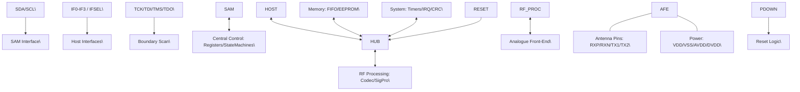

# **7 Functional description**

你好，我是资深硬件工程师。针对您提供的 **CLRC663 详细逻辑框图**，我已完成精准解析。

**1. 【总览信息】**
本图为 CLRC663 芯片的内部详细功能块图，该芯片是一个集成度极高的近场通信（NFC/RFID）读卡控制器，包含模拟前端（AFE）、协议处理核心、多种主机接口及安全访问模块（SAM）接口。

**2. 【核心组成部件】**
| 部件名称 | 包含子模块/参数 | 核心功能 |
| :--- | :--- | :--- |
| **SAM Interface** | $\text{I}^2\text{C}$ Logical, SPI | 连接安全访问模块（Secure Access Module），用于处理密钥和加密认证。 |
| **Host Interfaces** | $\text{I}^2\text{C}$, UART, SPI | 提供多种物理层协议，用于与外部 MCU/处理器通信。 |
| **Central Control** | REGISTERS, STATEMACHINES | 芯片的控制中枢，负责寄存器配置与状态机逻辑调度。 |
| **Memory** | FIFO (512 Bytes), EEPROM (8 kByte) | FIFO 用于数据缓冲，EEPROM 用于存储配置参数或非易失性数据。 |
| **Analogue Front-End (AFE)** | Voltage Regulators, POR, RNG, ADC, LFO, PLL, RX, TX, OSC | 处理射频信号的接收、发送、时钟生成及电源管理。 |
| **RF Processing** | TX CODEC, RX DECOD, SIGIN/SIGOUT CONTROL, SIGPRO | 对射频信号进行编码、解码及信号处理（SIGPRO）。 |
| **System Peripherals** | TIMER 0..3, TIMER 4 (Wake-up), Interrupt Controller, CRC | 提供定时、唤醒、中断管理及数据校验功能。 |
| **Boundary Scan** | TCK, TDI, TMS, TDO | 标准 JTAG 边界扫描接口，用于生产测试和调试。 |
| **Reset Logic** | PDOWN | 实现芯片的掉电控制与复位逻辑。 |

**3. 【数据流向与交互】**

**4. 【功能总结性陈述】**

****事实描述****
1. **接口多样性**：芯片支持 $\text{I}^2\text{C}$、SPI 和 UART 三种主机接口，且通过 `IFSEL0/1` 和 `IF0-IF3` 引脚实现物理引脚的复用/选择。
2. **电源架构**：AFE 内部包含两个电压调节器，可将 3V 或 5V 输入转换为 1.8V，分别供给 DVDD（数字域）和 AVDD（模拟域）。
3. **存储资源**：内置 512 字节的快速缓冲 FIFO 和 8 KB 的非易失性 EEPROM。
4. **时钟与同步**：AFE 包含 PLL、LFO（低频振荡器）和 OSC（振荡器），并具备 `CLKOUT` 输出引脚。
5. **信号链**：外部射频信号经 `RXP/RXN` 进入 AFE，通过 `CL-COPRO` 通路进入 RF Processing 模块进行解码（RX DECOD），最后由状态机处理并由主机接口输出。

****工程推论****
1. **\[工程推论\] 目标应用场景**：基于 `SAM interface` 的存在以及 `TX/RX` 模拟前端，该芯片极大概率用于需要高安全等级的 NFC 读写设备（如支付终端或门禁系统），其中 SAM 模块用于存储根密钥以避免在主 MCU 中明文存储。
2. **\[工程推论\] 电源设计意图**：内部将 3/5V 降压至 1.8V 供电，说明其核心数字逻辑和模拟前端采用了 1.8V 低功耗工艺，以降低功耗并提高集成度，同时保持与 3.3V/5V 外部系统的兼容性。
3. **\[工程推论\] 接口灵活性**：`IFSEL` 机制表明该芯片设计时考虑了极高的 PCB 布局灵活性，允许用户根据主控 MCU 的可用引脚动态配置通信接口。
4. **\[工程推论\] 数据处理模式**：512 字节的 FIFO 规模表明其采用了典型的“块传输”模式，旨在减轻主机 MCU 的中断压力，允许 AFE 在后台完成一帧数据的接收后再通知主机读取。

|Col1|BOUNDARY SCAN|
|---|---|
|||
|||
|||

